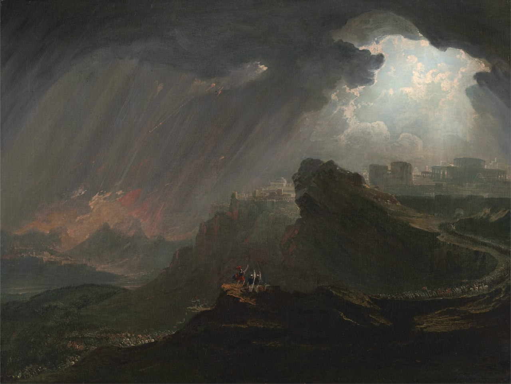

# Joshua

Joshua's Long Day (https://www.nga.gov/collection/art-object-page.129865.htmlhttps://www.nga.gov/collection/art-object-page.129865.html). "The sun, thrown into confusion, had remained low on the horizon, and by not rising had spread terror amongst the great doctors. Two days had been rolled into one.  The morning was lengthened to one-and-a-half times the normal period of effective daylight.  A certain time after this divine phenomenon, the master had an image built to keep further misfortune from the country.

Rameses, our celestial ancestral chief; you who forced these wretched people to work, who ill-treated them, who gave them no help when they were in need: cast them into the sea. They made the moon stop in a small angle at the edge of the horizon.  In a small angle on the edge of the horizon, the sun itself, which had just risen at the spot where the moon was going, instead of crossing the sky stayed where it was.  Whilst the moon, following a narrow path, reduced its speed and climbed slowly, the sun stopped moving and its intensity of light was reduced to the brightness at daybreak.  The waves formed a wall of water against the boats that were in the harbor and those that had left it.  Those fishermen that had ventured onto the deck to watch the waves were washed into the sea.

The tide, which had risen high, overflowed into the plains where the herds were grazing.  The cattle drowned represented half the herds of Lower Egypt.  The remains of abandoned boats broken against the sides of the canals were piled up in places.  Their anchors, which should have protected them, had been ground into them.  Quite out of control, the sea had penetrated deep into the country.  The expanding waters reached the fortified walls constructed by Rameses, the celestial ancestral chief. The sea swept around both sides of the region behind, sterilizing the gardens as it went and causing openings in the dikes. A great country had been turned into a wilderness and brought into poverty."

Egyptian hieroglyphic translation from Verdique Historique de l’Egypte Antique (1984) by Fernand Crombette, as described in Earth's Epochs (2015) by John Jensen Jr.

1. https://archive.org/details/earth-epochs-cataclysms-across-john-m.-jensen-jr

We also find a more familiar account of this event described in the book of Joshua, dated to c. 1500 BC:
"13 And the sun stood still, and the moon stayed, until the people had avenged themselves upon their enemies.  Is not this written in the book of Jasher?  So the sun stood still in the midst of heaven, and hasted not to go down about a whole day."

2. https://www.geocentricity.com/astronomy_of_bible/jld/

Artwork: Joshua Commanding the Sun to Stand Still upon Gibeon (1816), by John Martin.

[3] https://nga.gov/collection/art-object-page.129865.html

## PDF in this folder

Here is a take on the event.  I find it interesting because there are other records around the world (china, americas) that noted the same phenomenon.  The same record from the Egyptians is noted here:

https://www.geocentricity.com/astronomy_of_bible/jld/

Lots of footnotes.  Velikovsky and Patten associated with a planetary interaction.