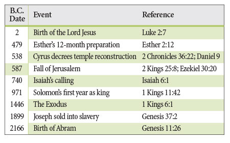

# Noahs Flood (Book of Genesis)

Biblical chronology seems to squarely place Noah's flood in the timeframe of about 3500 - 2300 BC based on Biblical chronology, and Exodus about 900 to 1100 years later.

## Old Testament Dating: Hebrew Masoretic vs Greek Septuagint Dating Schemes [4]

These two primary Old Testament dating timelines cover the period from Adam, through Noah, to Moses.

Greek Septuagint:
- Noah: 3789 - 2839 BC
- Flood: 3189 BC
- Moses: 1692 - 1572 BC
- 1577 years between Flood and Exodus

Hebrew Masoretic:
- Noah: 3009 - 2059 BC
- Flood: 2409 BC
- Moses: 1692 - 1572 BC
- 797 years between Flood and Exodus

These start with Moses being born in 1692 BC, align up till Abraham born in 2117 BC, but then start to quickly diverge, placing significantly different lengths of time between Noah's flood and Abraham.

## Basic Biblical Chronology: 2472, 2304 BC

This one uses an anchor point of the Fall of Jerusalem at 587 BC and works backwards to a flood date of 2472 BC. It places Exodus at 1446 BC - 1026 years later.

2472 BC: https://www.icr.org/article/when-did-noahs-flood-happen

This one uses anchor points of 0 AD (Jesus Christ) and Solomon laying the foundation of the temple at 967 BC. It places Exodus at 1447 BC - 857 years later.

2304 BC: https://creation.com/the-date-of-noahs-flood

## Africanus

Dates Noah's flood to approximately 3269 BC.

## Gerald E. Aardsma book [2]: 3520 BC

This fellow essentially inserts 1000 extra years to the Biblical choronology, at around 1200 BC, justified by a "copy error".

"When the accidentally dropped “and thousand” is restored to 1 Kings 6:1, dates of biblical events prior to the birth of Eli (about 1200 B.C.)— including the Flood—are moved back one thousand years relative to tra- ditional thinking. The validity of this restored reading is evidenced by the harmony between the biblical narrative and secular studies which it consistently produces."

This book also places approximately 1070 years between Exodus and Noah's flood.

Hard copy in this folder.

### Referenced research: Staubwasser, Weiss

"The paper by Staubwasser and Weiss concerns itself only with past abrupt changes in climate and the impact these changes may have had on civilizations in the past. It identifies and discusses three abrupt climate change events at roughly 2200 B.C., 3200 B.C., and 6200 B.C. In all three cases, it finds that populations were reduced to a greater or lesser extent over large geographical areas."

"Staubwasser and Weiss postulate widespread drought as the cause of these depopulation events in all three instances. However, the middle event, the one they date to 3200 B.C., uniquely exhibits the three signa- tures of Noah’s Flood discussed in the previous chapter. They call this event “the late Uruk collapse.” (Refer back to the Figure 5.2 chronology to understand this terminology.) They find it to be (1) a “hemispheric and possibly global”10 event, (2) accompanied by widespread depopula- tion and (3) with very clear evidence, specifically in the archaeology of South Mesopotamia, of the inception of the institution of human govern- ment in an easily recognized, capital punishment-wielding form—that of monarchy."

"The last temples of the late Uruk IV Eanna precinct were abandoned, replaced by terraces and light post and reed constructions."

## Paul H. Seely paper [1]: 3500 - 3000 BC

Conclusion of the paper: Suggests 3500 BC - 3000 BC, with probable caps of 4000 BC to 2300 BC, and a limit of 5000 BC.

"Thus, the probable use of copper (copper-alloy) tools to build the ark indicates that the earliest date for the Flood is c. 5000 B.C."

Uses:
- domesticated fruit tree mentions
- Abraham chronology
- Tools required for Noah's ark
- vineyard archaelogoy

"There is good archaeological evidence that there really was a serious riverine flood in southern Mesopotamia c. 2900 B.C., which is probably the basis for the account in Genesis."

Hard copy at `Noahs_Flood_WTJ2004_1.pdf`.

### Quotes from the paper: Uninterrupted Middle Eastern settlements

Looking at the period from 5000 to 4000 BC, Byblos, for example, was continuously occupied from 6000 to 4100 BC. Tepe Yahya in Iran has a continuous cultural sequence from 5500 to 4000 BC. Ugarit in Syria shows continuous occupation from 5000 to 4000 BC. Merimde in Egypt shows nearly continuous occupation from 5000 to 4000 BC. Jeleilat el-Ghassul and Shiqmim in Palestine both show continuous occupation from 4500 to 4000 BC. Not only were these cities untouched by a flood, but cities right in Mesopotamia were also untouched. There is an unbroken cultural sequence at Oueili in southern Mesopotamia from approximately 5500 to 3800 BC. Tell al-Ubaid has an unbroken cultural sequence from 5000 to 4500 BC. From 4500 to 4000 BC, Ur was untouched. These untouched cities all testify that no serious flood interrupted the civilization of the Near East from 5000 to 4000 BC, even in southern Mesopotamia.

From 4000 to 3000 BC, the picture is no different. Arslantepe, Beycesultan, and Alaca Hüyük in Turkey show continuous occupation from before 4000 until after 3000 BC. Ugarit in Syria continued to be occupied from 4000 to 3000 BC. Occupation at Abydos and at El-Omari in Egypt spans 4000 to 3000 BC. Tepe Yahya continued to be occupied from 4000 to 3300 BC. At Susa in Iran, there is continuous occupation from 4300 to 3100 BC. Uruk in Mesopotamia, and perhaps more importantly the many cities of the "Uruk Expansion" from Iran to Turkey, were untouched from 4150 to 3100 BC. Although there is a partial flood deposit at Ur, the city was apparently never completely covered by flood waters at any time between 4000 and 3000 BC. Jemdet Nasr in southern Mesopotamia was occupied from approximately 4000 to 2800 BC.

There are then a number of cities in the Near East which together spanned the period from 5000 to 3000 BC with continuous occupation. In Mesopotamia itself, Eridu in the south was continuously occupied from around 5200 to 3400 BC, and Tepe Gawra in the north shows a nearly continuous cultural sequence from 5000 to 3100 BC. Nippur in south-central Mesopotamia was occupied from before 5000 until after 3000 BC. Armstrong thus says of ancient Mesopotamia: "We can say, however, that from Ubaid 0 [6200 BC] on, there is a demonstrable continuity of material culture, particularly evident in the architectural and ceramic remains, into historical times."

## The mountain Noah's ark rested on

Could have possibly been, but I believe the site that Noah's ark rested was 6500 ft / 1970 m in elevation.  So if it was local, it had to pushed it pretty high.  

https://earth.google.com/web/search/noah%27s+ark+visitor+center,+turkey/@39.44175658,44.23453826,1959.07684188a,657.01193241d,35y,-163.91974169h,42.90700775t,-0r/data=CigiJgokCW_33wg_5UNAEfc68MD90ENAGVu5-xFGMEZAIW-4IpWPHUZAOgMKATA

This is the location the Turkish government recognizes (with a visitor's center) and I believe has the most solid evidence.  Not an Mt. Ararat, but in the mountains of Urartu.

## ChatGPT: Generally Accepted Duration Between Noah's Flood and Moses' Exodus

ChatGPT summarizes the time difference between Noah's Flood and Exodus as approximately 900 - 1100 years.

### Traditional Ussher Chronology
- **Noah’s Flood**: Approximately 2348 BC
- **Moses’ Exodus**: Approximately 1446 BC
- **Time Difference**: 2348 - 1446 = 902 years

### Alternative Dating for the Exodus
- **Noah’s Flood**: Approximately 2348 BC
- **Moses’ Exodus**: Approximately 1250 BC (based on some archaeological interpretations)
- **Time Difference**: 2348 - 1250 = 1098 years

## Alternative date: Black Sea Filling - 5200 BC? [3]

This page proposes a date around 5200 BCE by correlating a Black Sea filling around 5200 BC to Noah's flood.

"The Yahwist And The Flood Of The Black Sea":
- "The flood story is one of the most well known and most repeated apocalyptic stories throughout time.  Though, there is no evidence of an event at the time other than the sudden filling of the Black Sea basin by water flowing into it at an unimaginable rate, **archeology suggests that this event was the cause of much change about 5200 BC.** This flooding of the Black Sea may have been the basis of the flood story in Genesis."

The duration of the flood is not clear; 40 days or 150 days depending on the account. [1]

I view this as unlikely; Christian historians all place Creation around this time, not Noah's flood.

## Genesi 7:11

When Noah was 600 years old, on the seventeenth day of the second month, all the underground waters erupted from the earth, and the rain fell in mighty torrents from the sky.

## Citations

1. https://www.academia.edu/7883319/_Noahs_Flood_WTJ2004_1_
2. https://www.biblicalchronologist.org/products/Noah%27s_Flood_Happened_3520_BC.PDF
3. https://www.123helpme.com/essay/The-Yahwist-And-The-Flood-Of-The-4C0E4F9453D8E980
4. https://bibletopicexpo.wordpress.com/2017/01/03/chronology-septuagint-versus-masoretic-text/

# TODO

The dating inconsistency between Exodus at 1300 BC and Africanus' account that it was contemporary to Ogyges. Must be some anomaly that causes this