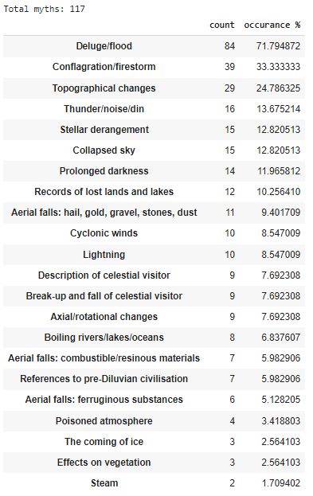
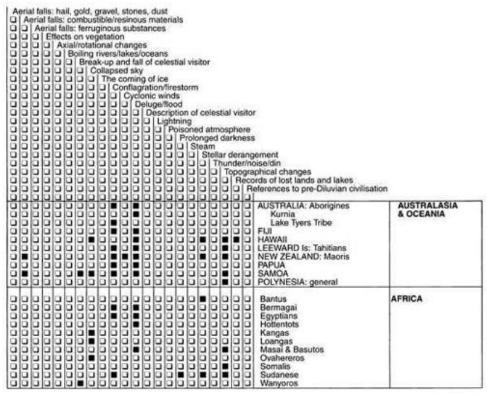
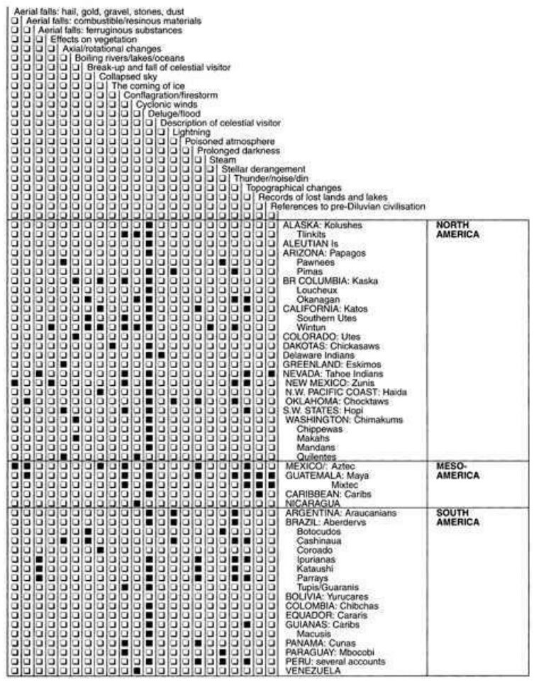
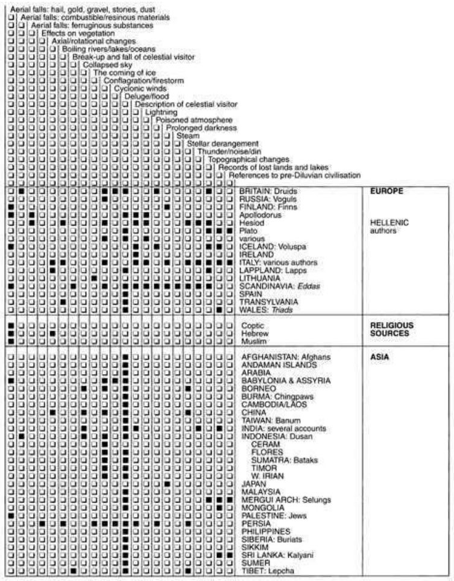

# Cataclysmic Myth Dataset

- From the book `Cataclysm! by D. S. Allan, J. B. Delair` : https://archive.org/details/cataclysmcompell00alla
- Converted the table given to a dataset: https://docs.google.com/spreadsheets/d/1R_jc9vmtxT6vQJYIilbiajKkTFjSBOSK0W1PcoXp7oI/edit?usp=sharing
- You can download this data and use to do your own analysis or can give suggestions as commentor access is public.

## Analysis [1]

- Colab notebook: https://colab.research.google.com/drive/1wBdG8uHHVu4Go5Xds3ccT54PU2qpqVZy?usp=sharing

## Myth tables

## Citations

1. [aa-hermit](https://github.com/aa-hermit)