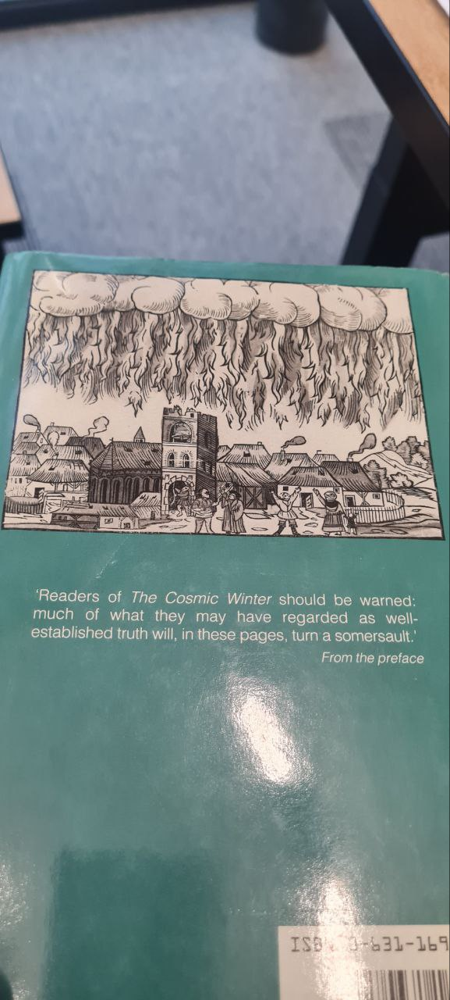

# Europe Ancient Flood Myths

## kataklysmos and ekpyrosis

Within the ancient mythologies of the world, we see a recurring theme of the destruction of the world, by flood (kataklysmos) and fire (ekpyrosis).

I recall many years ago reading something about how each cycle alternates between destruction by flood or by fire, with it being said that Atlantis was destroyed by flood and Lemuria before it destroyed by fire, and thus our cycle will end in fire. If memory serves, that was from some Theosophical writing, which I always take with a grain of salt, but I was young and it gripped my imagination at the time.

In ancient astrology, one comes across the Thema Mundi, sometimes translated as the nativity of the cosmos or the nativity of God. In other words, a birth chart of the universe. The Thema Mundi places Cancer on the ascendant and it's a common question as to why that is. What sort of significance did it have? I love questions like that, but they usually take me down a rabbit hole and such was the case here.

I came across Berossus, a Babylonian priest and astrologer, who said that when all planets are aligned in Cancer, the world will be destroyed by fire, and when all are aligned in Capricorn, the world will be destroyed by flood. There are many concepts of what is known as the Great Year in ancient texts, sometimes called by other names, and it is this Great Year in which these disasters are said to occur. The criteria for this varies a bit from source to source and I won't go into all the variations here.

The main theme is that the Great Year is marked by cosmic disruptions. If we consider that the material universe is a reflection of the metaphysical, the floods and fires are then a reflection of some kind of disturbance in the realm of the gods. 

In a paper called "A Possible Babylonian Precursor to the Theory of ekpyrosis" by Van der Sluijs, there is a discussion of the story of Marduk, the supreme god, who temporarily vacates his celestial throne and it is usurped by the wrathful and rebellious Erra. Marduk reminds Erra the the stability of the country is dependent upon Marduk remaining on the throne and says that disasters will occur otherwise, which, of course, they do. (It will probably not be lost on any viewers of the Revolt series the parallel that this draws to the idea of the regal and divine king upon whom the stability of his country depends.)

This indicates to us that the flood and fire in the cosmic winter and cosmic summer are indicative of a heavenly disturbance of some kind and we do find elsewhere in other texts references to the stars shifting position, falling, shaking, or otherwise moving from their assigned places and orbits. Perhaps the planetary alignments referred to are not part of any natural cycle but a "shaking up" of the heavens caused by a chaotic element gaining the upper hand in some kind of celestial battle.

Many conclusions could be drawn from this and the ancient texts are littered with rich symbolism to give your imagination a workout.

https://www.astrologicat.com/blog/by-fire-and-flood

## Minoan civilization, Crete, 1750 BC

The Minoan civilization, which existed on Crete and other islands in the Mediterranean, seems to have ended without clear traces of invasion or other remnants. It is suspected that natural disasters, more extreme than a simple earthquake, were the cause of the downfall of Minoan civilization.

Velikovsky, in his account on Crete in Earth in Upheaval, references two sources:
- Sir Arthur Evans (see `LITERATURE-MEDIA/sir-arthur-evans`) who excavated the Minoan palace of Knossos on Crete references two catastrophes.
- Marinatos' wrote a work on two catastrophes that destroyed Minoan civilization; which included a large volcanic eruption and subsequent deluge, evidenced by houses that were unearthed on the north of Crete. (hard copy in this folder)

The Minoan Eruption of Santorini Volcano is estimated to have been around 1600 BC. This has been linked to a tsunami which hit the region around the same time: *"A Minoan and a Neolithic tsunami recorded in coastal sediments of Ios Island, Aegean Sea, Greece"*:
- https://uca.hal.science/hal-03792797/document (hard copy in this folder)

The timeline for these goes somewhat like this [1]:
- Close of Middle Minoan II: 1700 BC
- Half a century later: 1650 BC
- Late Minoan II: 1400 BC

https://x.com/nobulart/status/1835632165037486497

### Ancient Crete: Double dose destruction

Ancient Crete: Double Dose Destruction. Three papers detailing additional evidence of Crete's destruction around 1700 BC: "It seems almost certain, therefore, that the central Cretan destruction levels were caused by an earthquake - the intense burning presumably resulting from… https://t.co/0zzVrNnMjY https://t.co/9jdc6EZGJ8

[1] https://sci-hub.ru/10.2307/3968638

## Plato

"Many great deluges have taken place during the nine thousand years" since Athens and Atlantis were preeminent. Destruction by fire and other catastrophes was also common. In these floods, water rose from below, destroying city dwellers but not mountain people. The floods, especially the third great flood before Deucalion, washed away most of Athens' fertile soil." [3] - actually said by Critias, in the dialogue Critias

"And if any event has occurred that is noble or great or in any way conspicuous, whether it be in your country or in ours or in some other place of which we know by report, all such events are recorded from of old and preserved here in our temples; whereas your people and the others are but newly equipped, every time, with letters and all such arts as civilized States require and when, after the usual interval of years, like a plague, the flood from heaven comes sweeping down afresh upon your people, [23b] it leaves none of you but the unlettered and uncultured, so that you become young as ever, with no knowledge of all that happened in old times in this land or in your own." [2]

### Atlantis (~9600 BC)

"But afterwards there occurred violent earthquakes and floods; and in a single day and night of misfortune all your warlike men in a body sank into the earth, and the island of Atlantis in like manner disappeared in the depths of the sea. For which reason the sea in those parts is impassable and impenetrable, because there is a shoal of mud in the way; and this was caused by the subsidence of the island."

https://en.wikipedia.org/wiki/Atlantis

## Greek Myths

Deucalion, Ogyges, and Dardanus. All seem to have occurred very close to each other temporally.

### Deucalion Greek Flood Myth (1528 BC)

*"For some time during the Middle Ages, many European Christian scholars continued to accept Greek mythical history at face value, thus asserting that Deucalion's flood was a regional flood, that occurred a few centuries later than the global one survived by Noah's family. On the basis of the archaeological stele known as the Parian Chronicle, Deucalion's Flood was usually fixed as occurring some time around 1528 BC. Deucalion's flood may be dated in the chronology of Saint Jerome to c. 1460 BC. According to Augustine of Hippo (City of God XVIII,8,10,&11), Deucalion and his father Prometheus were contemporaries of Moses. According to Clement of Alexandria in his Stromata, "...in the time of Crotopus occurred the burning of Phaethon, and the deluges of Deucalion."*

https://en.wikipedia.org/wiki/Deucalion#Deluge_accounts

### Ogyges (Thebes) Deluge

"The first worldwide flood in Greek mythology, the Ogygian deluge occurred during his reign and derives its name from him, though some sources regard it as a local flood, such as an inundation of Lake Copais, a large lake once in the center of Boeotia.[11] Other sources see it as a flood associated with Attica.[12] This latter view was accepted by Africanus, who says "that great and first flood occurred in Attica, when Phoroneus was king of Argos, as Acusilaus relates."" [4]

"According to Africanus, Ogygus lived at the time of the Exodus of the House of Israel from Egypt... Various dates have been assigned to the event, including 2136 BCE (Varro), and 1793 BCE (Africanus)." [4]

Exodus is apparently dated to around 1500 - 1300 BC.

#### Ogyges vs Deucalion - Frazer (see LITERATURE) [10]

"Still more precise is the statement of Julius Africanus, a Christian author who drew up a chronicle of the world from the Creation down to the year 221 A.D. He affirms that the deluge of Ogyges happened just one thousand and twenty years before the first Olympiad, from which the Greeks dated their exact reckoning; and as the first Olympiad fell in the year 776 B.C., we arrive at the year 1796 B.C. as the date to which the Christian chronicle referred the great Ogygian flood"

"He adds for our further information that Ogyges, who survived the deluge to which he gave his name, was a contemporary of Moses and flourished about the time when that great prophet led the children of Israel out of Egypt".

"According to the Church historian Eusebius, the great flood in the time of Ogyges occurred about two thousand two hundred years after the Noachian deluge and two hundred and fifty years before the similar catastrophe in the days of Deucalion."

### Dardanus, king of Arcadia, founder of Troy, 1519 BC

"Dardanus, first king of Arcadia, was driven from his land by a great flood which submerged the lowlands, rendering them unfit for cultivation. The people retreated to the mountains, but they soon decided that the land left was not enough to support them all. Some stayed with Dimas, son of Dardanus, as their king; Dardanus led the rest to the island of Samothrace." [3]

Dated to 1519 BC. [8,9]

## Kataklysmos and Ekpyrosis

Censorinus makes mention of this water/fire sequence as being coincident to a planetary cycle in De Die Natali (238 AD): "There is a period called 'the supreme year' by Aristotle, at the end of which the sun, moon and all the planets return to their original position. This 'supreme year' has a great winter, called by the Greeks 'kataklysmos', which means deluge, and a great summer, called by the Greeks 'ekpyrosis' or combustion of the world. The world, actually, seems to be inundated and burned alternately in each of these epochs".

## 400 BC Helike event

Helike (/ˈhɛlɪkiː/; Greek: Ἑλίκη, pronounced [heˈlikɛː], modern Greek pronunciation: [eˈlici]) was an ancient Greek polis (city-state)[1] that was submerged by a tsunami in the winter of 373 BC. Lines up with Alexander the Great 400 BC https://en.wikipedia.org/wiki/Helike

### Encke causing Ekpyrosis?

Could this be ekpyrosis following katakysmos a few years later? The idea of us passing directly through the main stream is a serious consideration.

From what I have surmised through these years, there are 3 main impacts that occur every 12k years. Water inundation (deluge), a cme and a regular impact. Just to finish so to speak before the start of a new age. It is my conjecture that the deluge comes after this extraterrestrial impact-this explains that we find remnants of old ages under the soil (mud burial) and under the sea (think bimini, yonaguni, kumari kandam, dwarka). So yes.

## 562 AD England comet?

Sorry to bang on about British Abbeys but you have to go with your instincts and I feel like this is a part of history, like most others, that we have been lied to about. Would the dissolution of the monasteries by Henry VIII really result in the colossal wrecks we see today (See link)? A part of British history that is hidden is that the British State and much of its population was destroyed by debris from a comet in AD 562. I wonder if these Abbeys are much older than we are led to believe and were actually destroyed in this 6th century cataclysm. https://britainandbritishness.com/10-of-the-best-medieval-abbeys-of-britain/

Note - "several years" of darkness.

### History

The Tysilio chronology published by Petrie in his Neglected British History Essay is the most reliable and truthful British chronology IMHO and has a big hole in it from 540 - 590 AD.

## Ville III, Delos, Greece was...

Ville III, Delos, Greece was destroyed 1759 BCE, the same time that Crete was deluged: "great tidal waves moved towards the island from the north and swept over it". [1] https://t.co/NXVluAkkl4 [2] https://t.co/rwmdPSInRY

## Nordic myths

The Serpent at the North Pole:

During Ragnarök, the Nordic apocalypse [excursion event?], Jörmungandr the serpent will rise from the sea, unleashing chaos and destruction. 

Breaking free the serpent will release its tail from its mouth, causing the oceans to swell and flood the land. This act marks one of the signs of Ragnarök's onset.(2/10)🧵

https://x.com/OMApproach/status/1849409762183586129?s=35

A 🧵 worth reading:

The position of the serpent in the ocean is very strange because it’s at the North Pole and coincides with the shifting of the poles and the geomagnetic excursion, which could eventually lead to rapid climate change and possibly cause changes in the Earth's rotation, resulting in global floods—just like Jörmungandr.

This event is cyclical; it happened in the past, it is described in all ancient religions, and we know it as the Great Flood.

The North Pole is moving like a serpent toward Russia. The serpent beneath the ocean is in the same position. (3/10) 🧵

The cosmic egg motif is a major symbol in creation myths, occurring in all parts of the world.

Ancient Egyptians saw the cosmic egg as the soul of the primeval waters out of which creation arose. In one story the sun god emerged from the primeval mound, itself a version of the cosmic egg resting in  the original sea.

## Nuremburg Chronicle

The Nuremberg Chronicle, also known as Liber Chronicarum or the Chronicle of the World, is a landmark historical work published in 1493 in Nuremberg, Germany. It is renowned for being one of the most ambitious and richly illustrated books of its time, blending historical narrative with a vast collection of woodcut illustrations.

Interesting. This one is "The Destruction of Jerusalem"

"The Destruction of Jerusalem","The Universe" and "Sodom and Gomorrah" from the Liber Chronicarum ("Book of Chronicles") aka. the Nuremberg Chronicle (1493 CE). Continued in comments...
[1] https://en.wikipedia.org/wiki/Nuremberg_Chronicle

The concentric rings in the geogentric depiction are labelled (from center):

1. Terra – Earth
2. Sphaera aquae – Sphere of water
3. Sphaera aeris – Sphere of air
4. Sphaera ignis – Sphere of fire
5. Sphaera Lunae – Sphere of the Moon
6. Sphaera Mercurii – Sphere of Mercury
7. Sphaera Veneris – Sphere of Venus
8. Sphaera Solis – Sphere of the Sun
9. Sphaera Martis – Sphere of Mars
10. Sphaera Iovis – Sphere of Jupiter
11. Sphaera Saturni – Sphere of Saturn
12. Sphaera stellarum fixarum – Sphere of fixed stars
13. Cursus planetarum – Course of the planets (outer sphere encompassing the planetary spheres)
14. Primum Mobile – The "First Mover" or Prime Mover, the outermost sphere in medieval cosmology.
15. Empyreum mobile – The highest heaven or the "Empyrean," representing the realm of God and the angels.

That is interesting to see their notion of 12, the stellarum fixarum (aka firmament) and 15. Goes to show their medieval understanding of the levels of the heavens.

It has a possible astronomical configuration encoded. The position of each of the listed planets against the ecliptic background.

This is what brought it to my attention. The back of The Cosmic Winter.

## Citations

1. Minoan: http://www.minoancrete.com/chron.htm
2. Plato: https://www.perseus.tufts.edu/hopper/text?doc=Perseus%3Atext%3A1999.01.0180%3Atext%3DTim.%3Apage%3D23
3. Greek flood myths: https://www.curioustaxonomy.net/home/FloodMyths/01Euro/greek.html
4. Ogyges: https://en.wikipedia.org/wiki/Ogyges
5. -
6. https://www.worldhistory.org/Thebes_(Greece)/
7. https://ancientgreecereloaded.com/files/ancient_greece_reloaded_website/mythology_in_a_nutshell/the_three_great_floods.php
8. Dardanus: https://www.geni.com/people/Dardanus-king-of-Dardania/6000000006375582740
9. Dardanus: https://www.genealogieonline.nl/en/stamboom-homs/I6000000006375582740.php
10. Sir JAMES GEORGE FRAZER, FOLK-LORE IN THE OLD TESTAMENT (1919)
11. -
12. https://rationalwiki.org/wiki/K%C3%B6fels_impact_event

# TODO

Extreme physical phenomena during the Trojan War: https://www.maajournal.com/index.php/maa/article/view/541

British/Irish history: https://youtu.be/YUiKAv17rdY?si=PeuiXkfuYY2DrLMS