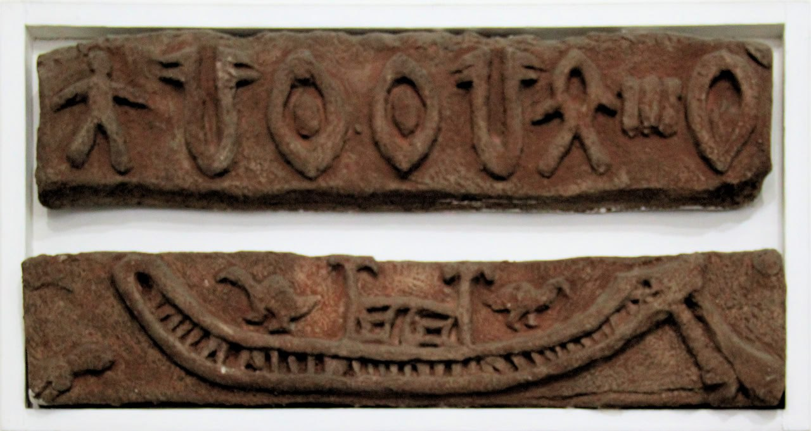
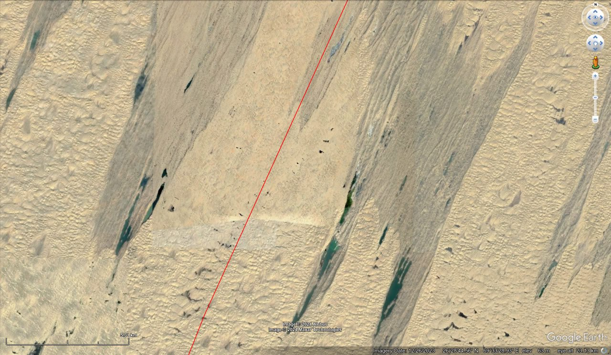
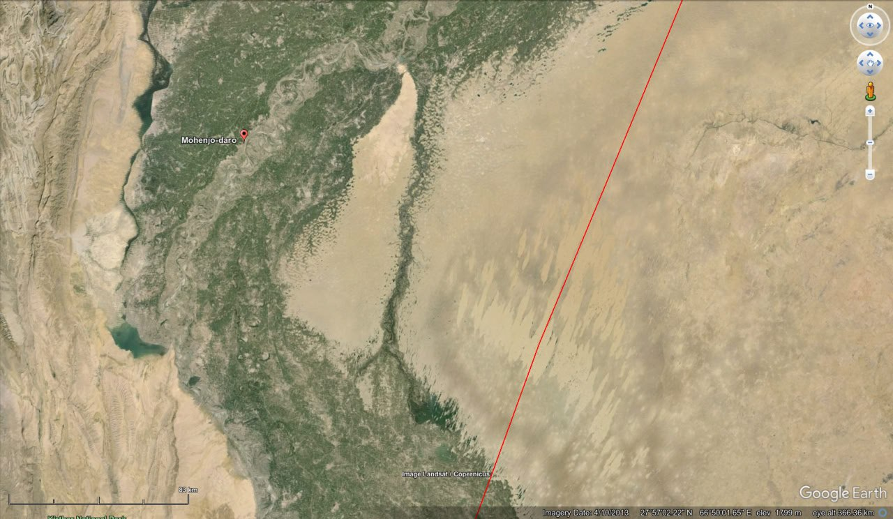
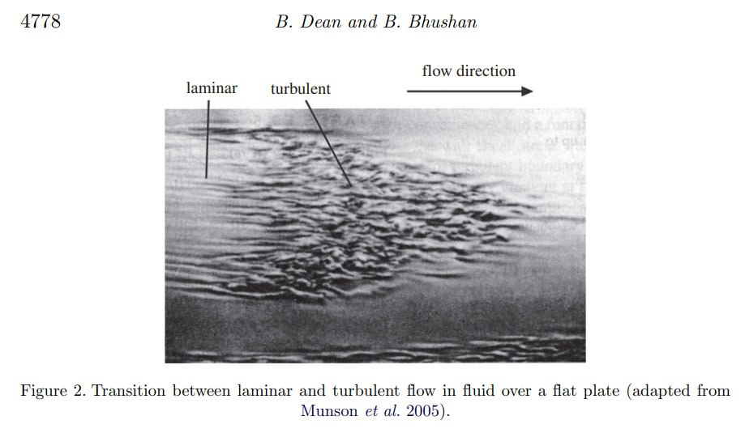
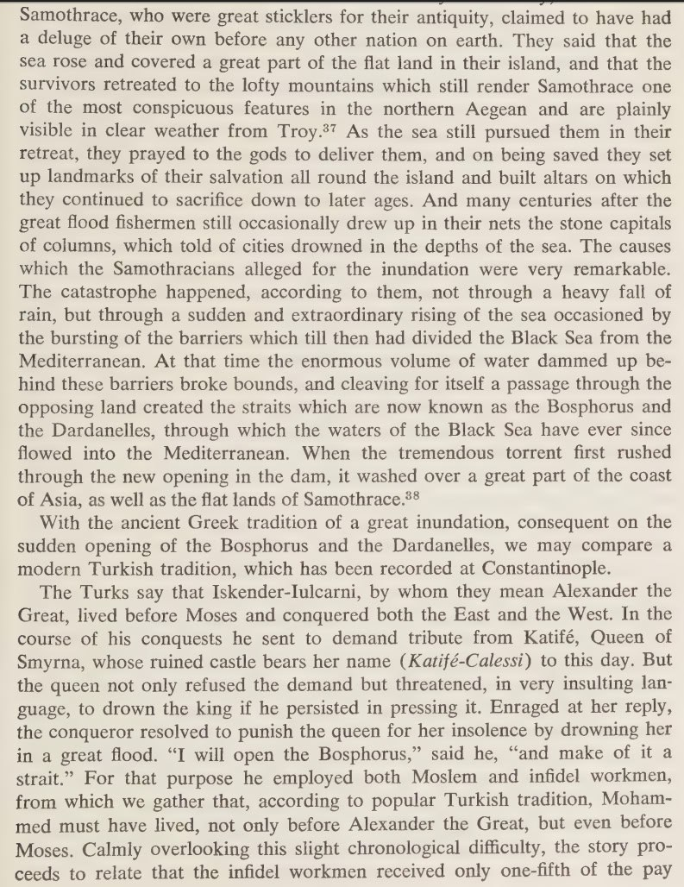
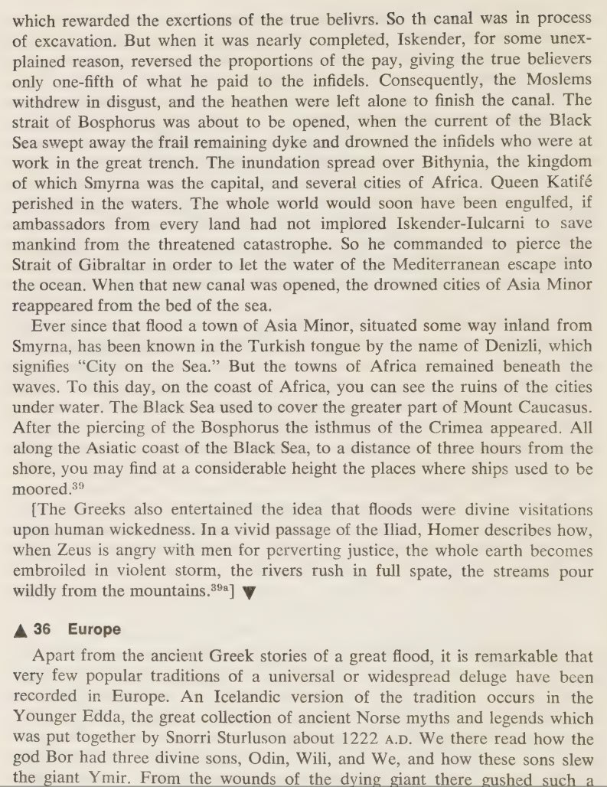
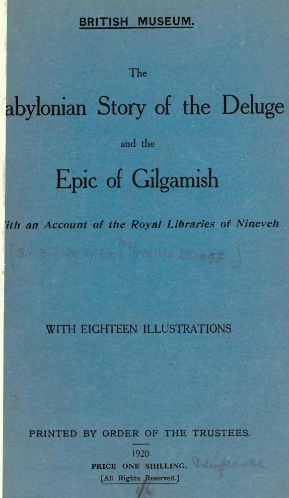
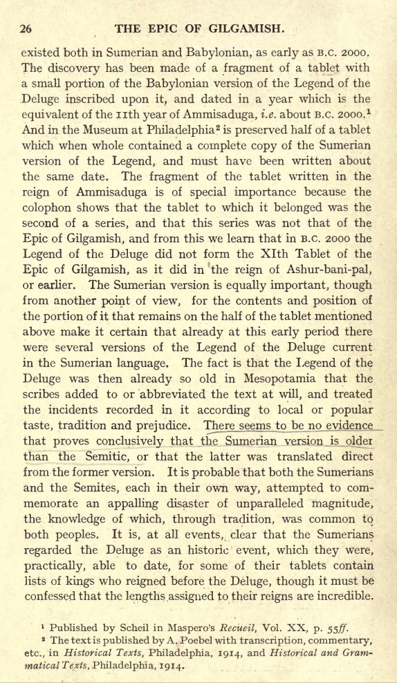

# Middle East Flood Myths

Paper about flood history of middle east in this folder. [11]

## Mohenjo-Daro, Pakistan, abandoned 1900 - 1700 BC - Fire & Water [3]

"Built c. 2500 BCE, it was the largest settlement of the ancient Indus Valley Civilization, and one of the world's earliest major cities, contemporaneous with the civilizations of ancient Egypt, Mesopotamia, Minoan Crete, and Norte Chico. With an estimated population of at least 40,000 people, Mohenjo-daro prospered for several centuries, but by c. 1700 BCE had been abandoned, along with other large cities of the Indus Valley Civilization. The city also had large platforms perhaps intended as defense against flooding. According to a theory first advanced by Wheeler, the city could have been flooded and silted over, perhaps six times, and later rebuilt in the same location. For some archaeologists, it was believed that a final flood that helped engulf the city in a sea of mud brought about the abandonment of the site." [1]

"The city itself did not suddenly evacuate. Around 1900 BCE, you see a shift happen, fewer traces of people living in the city start to emerge in the material record. It's not that everyone is gone, but there are certain neighbourhoods that you begin to see in disrepair. These later time periods do not have the same density of population as earlier time periods. You see the slow movement of folks leaving the city," she said. [5]

Mohenjo-Daro's abandonment is temporally coincident with the recorded destruction of Crete by deluge (c. 1750 BCE) and fire (c. 1700 BCE) [2]

There are thousands of square kilometers of significant stratification formations underlying the sand dunes starting 100km to the east of the site which precisely align with the ECDO [3] moment of inertia (the red line), and which are morphologically characteristic of the unperturbed laminar flow which would occur during S2>S1 in this area. [4]

1. https://en.wikipedia.org/wiki/Mohenjo-daro
2. https://x.com/nobulart/status/1812105085939261728
3. https://theethicalskeptic.com/2024/05/23/master-exothermic-core-mantle-decoupling-dzhanibekov-oscillation-theory/
4. https://maps.app.goo.gl/9g6gz1vSAgqMXnoT8
5. https://www.bbc.com/travel/article/20221114-pakistans-lost-city-of-40000-people

## Eridu Genesis, Sumerian Creation Myth, 3000 BCE

Just the physical tablets containing the tale date back to 1600 BC, meaning the actual event is likely much older: "The story is known from three fragments representing different versions of the narrative. One is a tablet excavated from the ancient Sumerian city known as Nippur. This tablet was discovered during the Expedition of the University of Pennsylvania in 1893, and the creation story was recognized by Arno Poebel in 1912. It is written in the Sumerian language and is dated to around 1600 BC.[1] The second fragment is from Ur, also written in Sumerian and from the same time period. The third is a bilingual Sumerian-Akkadian fragment from the Library of Ashurbanipal ca. 600" [7]

### Sumerian History - Sumerian King List

Sumerian civilization seems to be dated using a combination of dating written records and archaelogical remains, and cross-referencing nearby regions.

"The people called Sumerians, whose language became the prevailing language of the territory, probably came from around Anatolia, arriving in Sumer about 3300 BCE... An extant document, The Sumerian King List, records that eight kings reigned before the great Flood. After the Flood, various city-states and their dynasties of kings temporarily gained power over the others. The first king to unite the separate city-states was Etana, ruler of Kish (c. 2800 BCE)." [9]

The Sumerian King List's earliest version is dated to about 2000 BC. [12]

### Sumer 2900 BCE-dated Flood Remnants

"Some modern scholars believe the Sumerian deluge story corresponds to localized river flooding at Shuruppak (modern Tell Fara, Iraq) and various other cities as far north as Kish, as revealed by a layer of riverine sediments, radiocarbon dated to c. 2900 BCE, which interrupt the continuity of settlement. Polychrome pottery from the Jemdet Nasr period (c. 3000–2900 BCE) was discovered immediately below this Shuruppak flood stratum. None of the predynastic antediluvian rulers have been verified as historical by archaeological excavations, epigraphical inscriptions or otherwise, but the Sumerians purported them to have lived in the mythical era before the great deluge." [7]

## Atra-Hasis, Akkadian (Mesopotamian) epic

"Written down in the mid-17th century BCE, the Atrahasis can be dated by the colophon to the reign of the Babylonian King Hammurabi's great-grandson, Ammi-Saduqa (1646-1626 BCE) though the tale itself is considered much older, passed down through oral transmission." [10]

"Tablet II begins with more human overpopulation. To reduce this population, Enlil sends famine and drought at formulaic intervals of 1200 years." [8]

In this account, Enki is the kind god who tells the human protagonist Atrahasis about the flood.

## Gilgamesh

"The Epic of Gilgamesh was written c. 2150-1400 BCE but the Sumerian Flood story it relates is older, passed down orally until it appeared in writing." [10]

Mesopotamian flood myth - Utnapishtim builds a boat and survives the flood.

- https://en.wikipedia.org/wiki/Gilgamesh_flood_myth
- https://www.worldhistory.org/article/227/the-atrahasis-epic-the-great-flood--the-meaning-of/

## Turkey flood myth (400 BC)

- https://talkorigins.org/faqs/flood-myths.html
	- Gaster, Theodor H. Myth, Legend, and Custom in the Old Testament, Harper & Row, New York, 1969. (Most of the flood stories in this work are taken from Frazer, 1919.)
		- Frazer, Sir James G. Folk-Lore in the Old Testament, vol. 1, Macmillan & Co., London, 1919.
			- chapter 4: the great flood
	- This one cites the time as being around that of Alexander the Great (4th century BC), so the timing is a bit of an issue, but being a "story" its possibly incorrectly attributed to his time. There is however, another link to something happening in this area at the time Alex was around.
		- https://x.com/nobulart/status/1803411938451374121?s=46
		- https://x.com/nobulart/status/1801746221809209701?s=46

## Turkey deluge account

Not only does it describe a deluge, it specifically describes an oceanic displacement.

[1] Myth, Legend and Custom in the Old Testament, Gaster (1969)

## Babylonian Story of the Deluge

From "The Babylonian Story of the Deluge" (Sir E.A Wallis Budge, 1920)

## Earthquakes

There's a middle eastern earthquake index history PDF in this folder.

Ton from 400 BC.

2000 BC:
- Bab el-Dhra, 2100-1700 BC destruction
- Jericho 1400 BC earthquake
- Sodom 2100-1700 BC earthquake
- Cities of the Plain, 2100-1700 BC earthquake
- Egypt 1181 BC earthquake
- Gomorrah, 2100-1700 BC earthquake
- Mizpeh 1070 BC earthquake
- Nineveh 1274-1234 BC earthquake, 1187-1150 BC earthquake
- Numeira, 2100-1700 BC destruction
- Zoar, 2100-1700 BC earthquake

## Citations

1. https://en.wikipedia.org/wiki/Hittites
2. https://en.wikipedia.org/wiki/K%C3%BCltepe\
3. [Craig Stone](https://nobulart.com)
4. https://lexundria.com/hdt/2.142/mcly#:~:text=Thus%20in%20the%20period%20of,kind%20had%20come%20to%20pass
5. https://en.wikipedia.org/wiki/Seti_I
6. https://www.shorthistory.org/ancient-civilizations/ancient-egypt/marriage-in-ancient-egypt/#:~:text=Generally%2C%20Ancient%20Egyptians%20have%20married,or%20immediately%20after%20the%20puberty.
7. Eridu Genesis: https://en.wikipedia.org/wiki/Eridu_Genesis
8. Atra Hasis: https://en.wikipedia.org/wiki/Atra-Hasis
9. Sumer: https://www.britannica.com/place/Sumer
10. Atra-hasis: https://www.worldhistory.org/article/227/the-atrahasis-epic-the-great-flood--the-meaning-of/
11. https://repository.ihu.edu.gr/xmlui/bitstream/handle/11544/29135/Thesis%20Trompakas%20Kostas%20BS.pdf
12. https://en.wikipedia.org/wiki/Sumerian_King_List

# TODO additional leads

Turkey:
- 6800 BCE Black Sea flood: https://en.wikipedia.org/wiki/Black_Sea_deluge_hypothesis