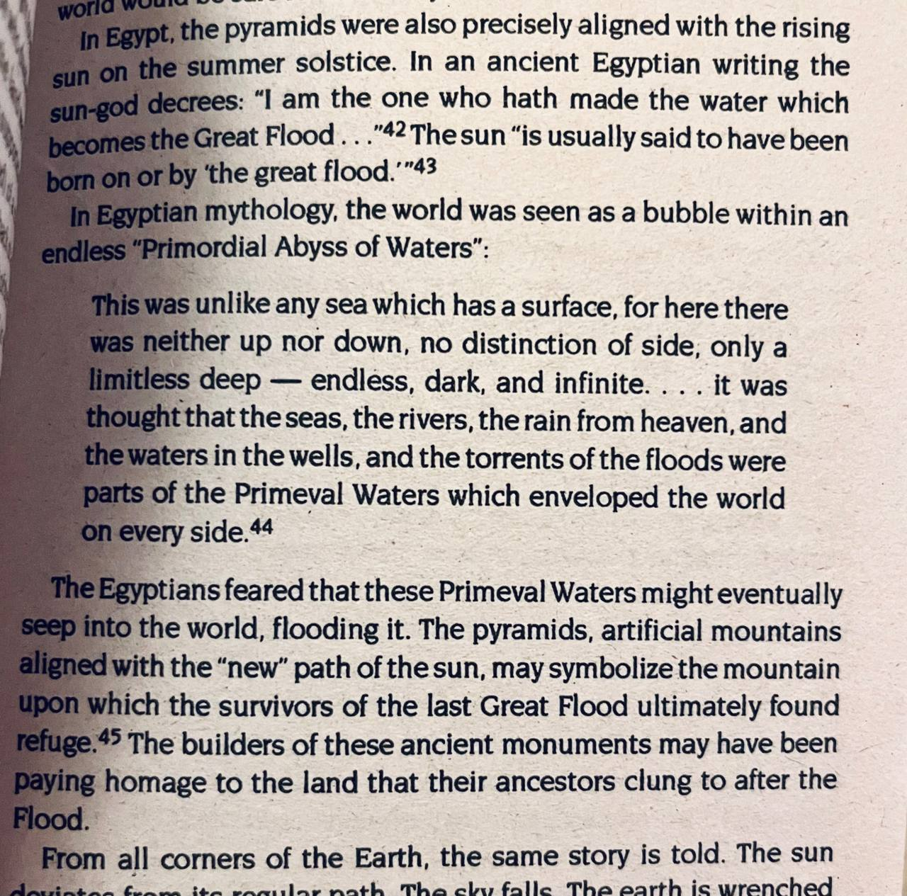

# Egypt

## Herodotus, Greek historian, 440 BC account of Egypt solar flips

*"So far in the story the Egyptians and the priests were they who made the report, declaring that from the first king down to this priest of Hephaistos who reigned last, there had been three hundred and forty-one generations of men, and that in them there had been the same number of chief-priests and of kings: but three hundred generations of men are equal to ten thousand years, for a hundred years is three generations of men; and in the one-and-forty generations which remain, those I mean which were added to the three hundred, there are one thousand three hundred and forty years. Thus in the period of eleven thousand three hundred and forty years they said that there had arisen no god in human form; nor even before that time or afterwards among the remaining kings who arose in Egypt, did they report that anything of that kind had come to pass. In this time they said that the sun had moved four times from his accustomed place of rising, and where he now sets he had thence twice had his rising, and in the place from whence he now rises he had twice had his setting;[127] and in the meantime nothing in Egypt had been changed from its usual state, neither that which comes from the earth nor that which comes to them from the river nor that which concerns diseases or deaths."* [4]

- Herodotus (Greek Historian), An Account of Egypt, 440 BCE

After him there came to the throne the priest of Hephaistos, whose name was Sethos. [4, 2.141]

Sethos ruled around 700 BC. Later in his book, Herodotus says this:

"After him there came to the throne the priest of Hephaistos, whose name was Sethos. This man, they said, neglected and held in no regard the warrior class of the Egyptians, considering that he would have no need of them; and besides other slights which he put upon them, he also took from them the yokes of corn-land which had been given to them as a special gift in the reigns of the former kings, twelve yokes to each man. After this, Sanacharib king of the Arabians and of the Assyrians marched a great host against Egypt. Then the warriors of the Egyptians refused to come to the rescue, and the priest, being driven into a strait, entered into the sanctuary of the temple and bewailed to the image of the god the danger which was impending over him; and as he was thus lamenting, sleep came upon him, and it seemed to him in his vision that the god came and stood by him and encouraged him, saying that he should suffer no evil if he went forth to meet the army of the Arabians; for he would himself send him helpers. Trusting in these things seen in sleep, he took with him, they said, those of the Egyptians who were willing to follow him, and encamped in Pelusion, for by this way the invasion came: and not one of the warrior class followed him, but shop-keepers and artisans and men of the market. Then after they came, there swarmed by night upon their enemies mice of the fields, and ate up their quivers and their bows, and moreover the handles of their shields, so that on the next day they fled, and being without defence of arms great numbers fell. And at the present time this king stands in the temple of Hephaistos in stone, holding upon his hand a mouse, and by letters inscribed he says these words: "Let him who looks upon me learn to fear the gods.""

Sennacherib seems well dated to the late 8th, early 7th century BCE.

Nice place to see the full account: http://losttrails.com/pages/Tales/Inquiries/Herodotus_13.html

This is monolithic one: https://www.gutenberg.org/files/2131/2131-h/2131-h.htm

### Could this be shorter than 3 generations per 100 years?

341 generations of men, 30 years per generation? It could be less.

"Generally, Ancient Egyptians have married inside their social classes. The man was usually married between the ages of 16 and 20, or as soon as he chooses potential craft with the aim to earn money for his family. Women usually married at the age of about 13 years, or immediately after the puberty." [6]

Women's marriage age defines the age of generations. 341 generations of men, at 14 years per generation, gives 4774 years.

Then, from the period of 6000 BC to 1290 BC, there were two flips. Which aligns with a Noahic deluge and the 1750 BC events timeline.

### Could this be longer than 3 generations per 100 years?

What if those ancient accounts of Noah living 600 years, or the Sumerian King List of kings living ridiculous amounts of time, are exxagerations on a reality that humans lived longer in the past?

What if this timeline is, say, double the length? 60 years per generation of man, on average? And the flips are once every 12k years?

## Egypt flood mythology

## Egypt

https://youtu.be/VF1dCJf4Byo?si=S1MHLniB1biCijN5

I hadn't heard of the book of Kolbrin. Some interesting descriptions about what goes on in the heavens and the land with clear parallels to the Noah story. Sounds like a destroyer arrives (Encke?), there is a micronova and earth flip causing the deluge and stars to rotate. The heat could then be from the CME arriving days later. The oceans do not rise up but crash over the mountains and fill the valleys but only lie 3 cubits above the earth. After the tumult the water drains back over 7 days. Apparently the book dates back 3,600 years.

Paper about Kolbrin in this folder.

## History

Egypt has a long string of history. There are plenty of archaelogical remains from very long ago, before the Younger Dryas.

"The period from 9000 to 6000 BC has left very little in the way of archaeological evidence. Around 6200 BC, Neolithic settlements appear all over Egypt." [3]

"At the end of prehistory, "Predynastic Egypt" is traditionally defined as the period from the final part of the Neolithic period beginning c. 6200 BC to the end of the Naqada III period c. 3000 BC." [3]

The vast majority of Predynastic archaeological finds have been in Upper Egypt, because the silt of the Nile River was more heavily deposited at the Delta region, completely burying most Delta sites long before modern times. [3]

So, Upper Egypt, right in the path of the Mediterranean, was able to preserve its artifacts in flood sediment? Not clear.

Then it goes from First Dynasty to Second Dynasty and so on, until the 32nd Dynasty, when it was conquered by Rome around 30 BCE.

## Velikovsky

While Egypt's cataclysm accounts are scant, Velikovsky managed to scrounge up some very tough-to-find cataclysm accounts. See the beginning of chapter 5 of WIC.

## Second Dynasty - 3000 BC event?

"The Second Dynasty of ancient Egypt (or Dynasty II, c. 2890 – c. 2686 BC[1]) is the latter of the two dynasties of the Egyptian Archaic Period, when the seat of government was centred at Thinis. It is most known for its last ruler, Khasekhemwy, but is otherwise one of the most obscure periods in Egyptian history." [1]

"Nynetjer (also known as Ninetjer and Banetjer) is the Horus name of the third pharaoh of the Second Dynasty of Egypt during the Early Dynastic Period. Archaeologically, Nynetjer is the best attested king of the entire dynasty. Direct evidence shows that he succeeded Raneb on the throne. What happened after him is much less clear as historical sources and archaeological evidences point to some breakdown or partition of the state. Nynetjer's reign is difficult to date precisely, with most experts proposing that he flourished some time during the late 29th century BC to the early 27th century BC." [2]

## Seventh Dynasty - 2200 BC event?

The Seventh Dynasty of Egypt would mark the beginning of the First Intermediate Period in the early 22nd century BC but its actual existence is debated. The only historical account on the Seventh Dynasty was in Manetho's Aegyptiaca, a history of Egypt written in the 3rd century BC, where the Seventh Dynasty appears essentially as a metaphor for chaos. Since next to nothing is known of this dynasty beyond Manetho's account, Egyptologists such as Jürgen von Beckerath and Toby Wilkinson have usually considered it to be fictitious. [4]

## Eighth Dynasty ca. 2181 BC–ca. 2160 BC

The Eighth Dynasty of ancient Egypt (Dynasty VIII) is a poorly known and short-lived line of pharaohs reigning in rapid succession in the early 22nd century BC, likely with their seat of power in Memphis. [5]

## Ninth Dynasty c. 2160 BC–c. 2130 BC

The dynasty that seems to have supplanted the Eighth Dynasty is extremely obscure. The takeover by the rulers of Herakleopolis was violent and is reflected in Manetho's description of Achthoes, the founder of the dynasty, as 'more terrible than his predecessors', who 'wrought evil things for those in all Egypt". [6]

## 13th Dynasty 1803 BC–1649 BC [7,8]

However, the dynasty marked a period of decline and instability, with Dynasty XIV rising concurrently and the Hyksos Dynasty XV taking control shortly after.

In later texts, this dynasty is usually described as an era of chaos and disorder.

Merneferre Ay (1701–1677 BC or 1714–1691 BC) .. Reigned 23 years, the longest reign of the dynasty. Last king to be attested in both Lower and Upper Egypt... Following these kings, the remaining rulers of the 13th Dynasty are only attested by finds from Upper Egypt. This may indicate the abandonment of the old capital Itjtawy in favor of Thebes.[9] Daphna Ben Tor believes that this event was triggered by the invasion of the eastern Delta and the Memphite region by Canaanite rulers. For some authors, this marks the end of the Middle Kingdom and the beginning of the Second Intermediate Period.

Merneferre Ay is the last pharaoh of the 13th Dynasty to be attested outside Upper Egypt. In spite of his long reign, the number of artefacts attributable to him is comparatively small. This may point to problems in Egypt at the time and indeed, by the end of his reign, "the administration [of the Egyptian state] seems to have completely collapsed".[1][3] It is possible that the capital of Egypt since the early Middle Kingdom, Itjtawy was abandoned during or shortly after Ay's reign. For this reason, some scholars consider Merneferre Ay to be the last pharaoh of the Middle Kingdom of Egypt.

## Citations

1. https://en.wikipedia.org/wiki/Second_Dynasty_of_Egypt
2. https://en.wikipedia.org/wiki/Nynetjer
3. https://en.wikipedia.org/wiki/Prehistoric_Egypt
4. https://en.wikipedia.org/wiki/Seventh_Dynasty_of_Egypt
5. https://en.wikipedia.org/wiki/Eighth_Dynasty_of_Egypt
6. https://en.wikipedia.org/wiki/Ninth_Dynasty_of_Egypt
7. https://en.wikipedia.org/wiki/Thirteenth_Dynasty_of_Egypt
8. https://en.wikipedia.org/wiki/Merneferre_Ay