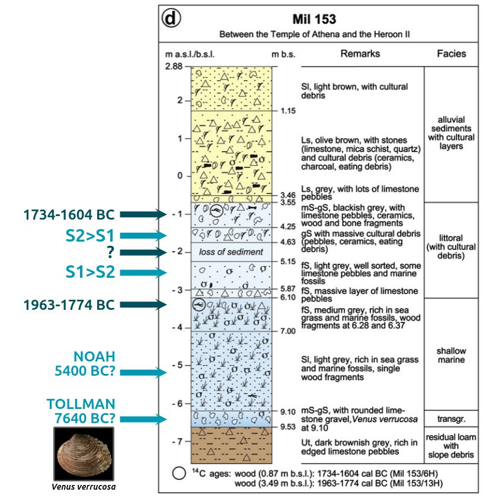

# Cataclysm Remnants

## Comet event 3100-3000 BC?

https://x.com/GemsOfINDOLOGY/status/1594307136905162753

## Black Sea Outflow, 6200 BC - 5500 BC

### William Ryan

Apparently the OG Black Sea deluge researcher. He has produced research from 1997 all the way up till very recently. His original thesis was around 5600 BC, he which he revised to 6200 BC in 2003.

1997 paper (hard copy here): https://sci-hub.ru/10.1016/s0025-3227(97)00007-8

"influx commencing later at 7150 yr BP and initiated by a cascade of saltwater pouring into a partly-emptied Black Sea lake following the breaching of an intervening barrier."

William Ryan, Black Sea, 2001: https://sci-hub.ru/10.1016/s0025-3227(02)00340-7 (Hard copy in here)

William Ryan, Black Sea, 2003: Catastrophic Flooding of the Black Sea (hard copy in this folder)

"There is a compelling, but not irrefutable, possibility that the Black Sea experienced a catastrophic saltwater flood at 8.4 ky BP."

### Other

Bruckner, Black sea, 2009: https://sci-hub.ru/10.1016/j.quaint.2008.11.016 (hard copy in this folder)

Marmara Sea, 8000 YBP (citations 16, 17, 18) [1]

## Mediterannean Refilling

A meta-analysis of Mediterranean sea levels seems to show a dramatic refilling post 7400 BP, and  lesser one around 3700BP.

Back Sea multiproxy sealevel analysis from the same paper. Massive changes around 7400 and the period of the Tollman impact hypothesis (9640 BP).

This reminds me of our Mediterranean sea level discussion between S1 and S2. The various sites got deeper in the north and shallower in the south.

On loss of sediment: I asked GPT: "In the context of this stratigraphic chart, "loss of sediment" refers to a gap in the sedimentary record at that specific depth (around 2 meters below sea level). This could indicate that a portion of the sedimentary sequence was eroded or removed by natural processes such as water flow, wave action, or human activity before subsequent layers were deposited. The missing sediment disrupts the continuous stratigraphic record, potentially creating a time gap that complicates interpretations of the site's geological and archaeological history."

https://sci-hub.ru/10.1016/j.quaint.2008.11.016

## Kilen Fjord

Noahic Deluge (7400BC) and maybe 1700BC (300 years out).

"Three shifts in state at Kilen are identified over the study period: a deep, periodically stratified fjord with medium high salinity (and high productivity) between ca 7500-5000 BP, followed by a gradual transition to a shallow benthic system with more oceanic conditions (i.e. higher salinity, lower productivity, slower sedimentary accumulation rate and poorer fossil preservation) after ca 5000 BP and no stratification after ca 4400 BP, and lastly, within this shallow phase, an abrupt shift to brackish conditions around 2000 BP."

https://sci-hub.ru/10.1016/j.quascirev.2013.05.020

## Sumer flood 3500 - 2600 BC

https://www.cambridge.org/core/journals/iraq/article/abs/physical-evidence-for-noahs-flood/226A2701813C09C5CD25BCA17C8E5074

## 6 forests stacked vertically

In coal mines of Illinois, Indiana, and Kentucky, there are massive fossil forests stacked on top of each other.

https://youtube.com/watch?v=Hrxfq8V6itQ&si=wAszW-e3F2naUp5y

## Latvian lake 6500 - 5400 BC

An account of the first formation of a lake with fish in it. Latvia c.±7800 BP. https://sci-hub.ru/10.1177/0959683616683255

## Sediment data: 18.5k cycle (Milankovitch cycle) effects on climate

https://oceanrep.geomar.de/id/eprint/31064/1/Fl%C3%B6gel_Diss.pdf

## 7400 BP Fennoscandia Earthquake

https://sci-hub.ru/10.1016/j.tecto.2018.06.015

## Vredefort Impact Structure

https://en.wikipedia.org/wiki/Vredefort_impact_structure

The unusually mineral rich composition of the crust here probably has something to do with the LLSVP intrusion and the Vredefort crater which exposed some of what was below. Agreed on the alternate concepts - I find valuable knowledge in most areas of inquiry, especially if its something new to me. 

## Opal (Australia)

Like all fine things, gem opal is exceedingly rare. Much of the world's precious opal is mined in the harsh outback of Australia, where a unique combination of geological conditions permitted the formation of opal near the margins of an ancient inland sea.

https://www.opalsdownunder.com.au/learn/australian-opal-mining-fields/

## Citations

1. https://en.wikipedia.org/wiki/Black_Sea_deluge_hypothesis#cite_note-RyanOthers2003a-8

# TODO

Tibet:
- Typical Soft-Sediment Deformation Structures Induced by Freeze/Thaw Cycles: A Case Study of Quaternary Alluvial Deposits in the Northern Qiangtang Basin, Tibetan Plateau: https://ui.adsabs.harvard.edu/search/q=author%3A%22Jiang%2C%20Hanchao%22&sort=date%20desc%2C%20bibcode%20desc&p_=0
- Magnetostratigraphy of Tertiary Sediments From the Wulanwula Lake Basin: Implications for the Cenozoic Tectonic History of the Tibetan Plateau: https://ui.adsabs.harvard.edu/abs/2002AGUFMGP71A0980Z/abstract
- Himalayas: https://himalayacarbongeomorphology.wordpress.com/

William Ryan's more recent work

Goldmine: https://www.iafi.org/was-j-harlan-bretz-near-your-house/