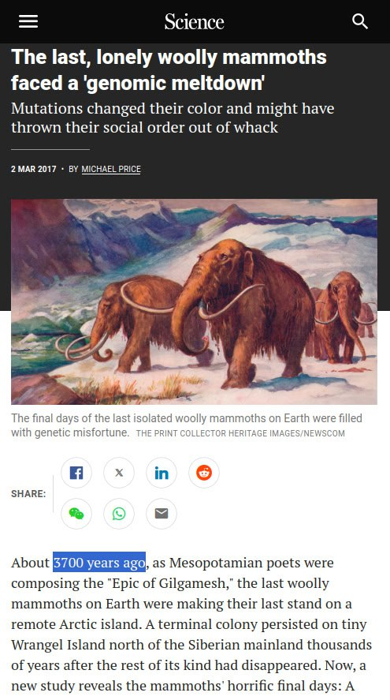

# Mammoths

## Fairbanks Mammoth 1948

Mining team uncovered the frozen remains of a young mammoth in Fairbanks. Lush vegetation in its mouth showed that the animal died during the growing season in an apparently warm climate.

Secondly the animal had been frozen immediately after death, since its flesh was said to be edible.

So a mammoth foraging in the summertime was almost instantaneously frozen and remained so for 20 millenia.

Source: https://nobulart.com/the-flip-of-the-earth/

## Frozen Mammoth

Viable DNA from the last cataclysm?

https://www.livescience.com/animals/extinct-species/siberian-gold-miners-accidentally-find-ancient-woolly-rhino-mummy-with-horn-and-soft-tissues-still-intact

That was Chan proposed mechanism - flash frozen due to supersonic wind speeds and water due to the rotation.

## Mammoths 3700 years ago

"About 3700 years ago, as Mesopotamian poets were composing the "Epic of Gilgamesh," the last woolly mammoths on Earth were making their last stand on a remote Arctic island. A terminal colony persisted on tiny Wrangel Island north of the Siberian mainland thousands of years after the rest of its kind had disappeared. Now, a new study reveals the mammoths' horrific final days: A series of harmful genetic mutations appears to have led to what authors call a "genomic meltdown" in the population."

https://www.science.org/content/article/last-lonely-woolly-mammoths-faced-genomic-meltdown