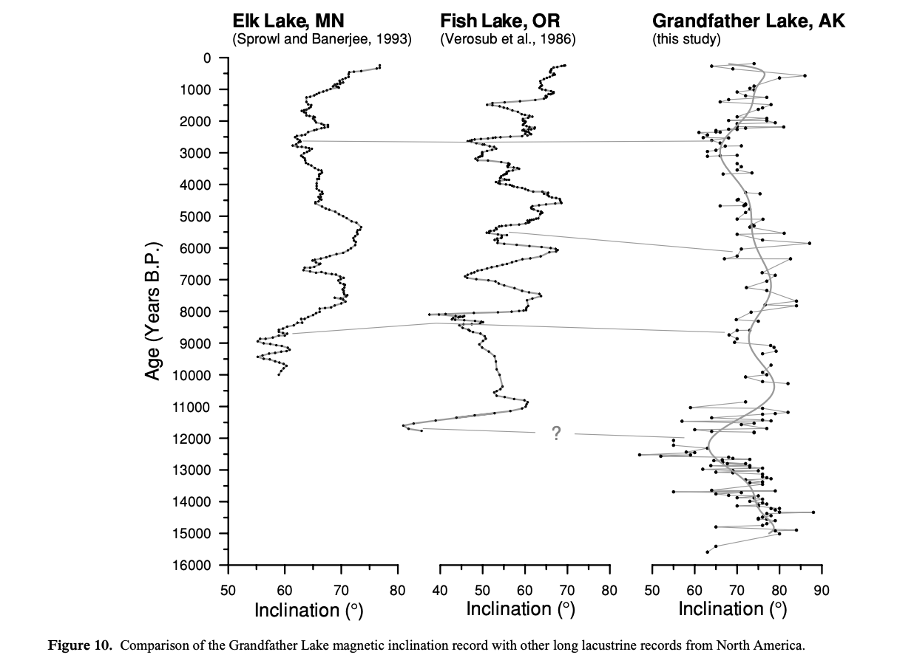
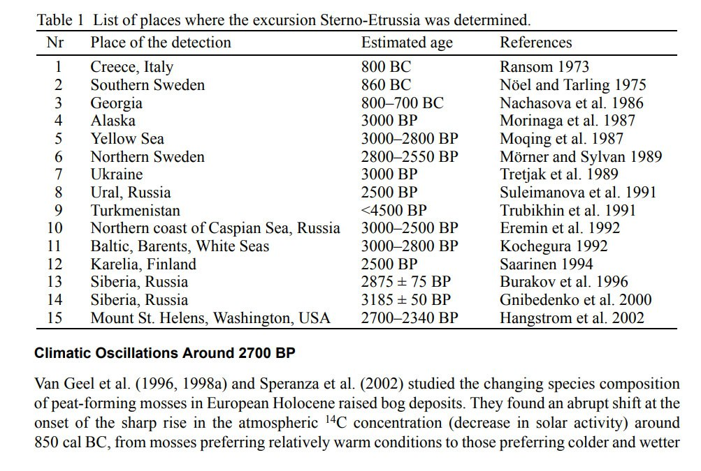

# Paleomagnetic studies for recent dates

## North America Holocene Paleomagnetic Data

Hard copy in this folder (2003_GJI.pdf). https://commons.trincoll.edu/cgeiss/files/2015/10/2003_GJI.pdf

The inclinations don't reverse to negative as they would during an ECDO event but if S2 is as short as we predict it would be a microscopic fraction of time in the sample and hard to capture.

## Levantine Iron Age Anomaly (LIAA)

Levantine Iron Age anomaly
- https://agupubs.onlinelibrary.wiley.com/doi/full/10.1002/2016GL071494
- https://www.researchgate.net/publication/314070285_Further_evidence_of_the_Levantine_Iron_Age_geomagnetic_anomaly_from_Georgian_pottery_High_geomagnetic_field_in_Georgia_900BCE

"Here we report archaeointensity data from Georgia showing high field values (VADM > 150 Z Am2) in the tenth or ninth century B.C.E., low field values (VADM < 60 Z Am2) in the twelfth century B.C.E., and fast field variation in the fifth and fourth centuries B.C.E. High field values in the time frame of LIAA have been observed so far only in three localities near the Levant: Eastern Anatolia, Turkmenistan, and now Georgia, all located east of longitude 30°E. West of this, in the Balkans, field values in the same time are moderate to low. These constraints put geographic limits on the extent of the LIAA and support the hypothesis of an unusually intense regional geomagnetic anomaly during the beginning of the first half of the first millennium B.C.E., comparable in area and magnitude (but of opposite sign) to the presently active South Atlantic anomaly."

Six centuries of geomagnetic intensity variations recorded by royal Judean stamped jar handles https://www.pnas.org/doi/10.1073/pnas.1615797114

"In addition, the study provides further evidence of extremely strong field in the late eighth century BCE (“geomagnetic spike”), and of rapid rates of change (>20% over three decades)."

## Geomagnetic excursion 2500 ybp

"The most recent magnetic excursion occurred 2 500 years ago, during which the North Magnetic Pole moved to southern latitudes before returning to its original position. This event is indirectly supported by research from Japanese scientists. In 2019, they published a study based on ancient Assyrian clay tablets that contained records of the northern lights seen over Assyria 2 500 years ago. These sightings occurred at 30 – 40 degrees north latitude, where auroras are not seen today due to the current position of Earth’s magnetic poles."

https://watchers.news/2024/09/18/geomagnetic-excursions-over-the-last-10-000-years/

Really would like to find the research paper cited in this article but it's behind a paywall: https://link.springer.com/article/10.1134/S1819714024700143

## UK Recent Paleomagnetic

It's a problem with shorter term proxies. They're generally softer and less stable than older material. More difficult to obtain good data from. I haven't seen many palaeomagentic proxies on that timescale at all. This one is from the UK.

## Setrno-Etrussia 2700 BP

"THE ‘STERNO-ETRUSSIA’ GEOMAGNETIC EXCURSION AROUND 2700 BP AND CHANGES OF SOLAR ACTIVITY, COSMIC RAY INTENSITY, AND CLIMATE"

https://journals.uair.arizona.edu/index.php/radiocarbon/article/viewFile/4201/3626