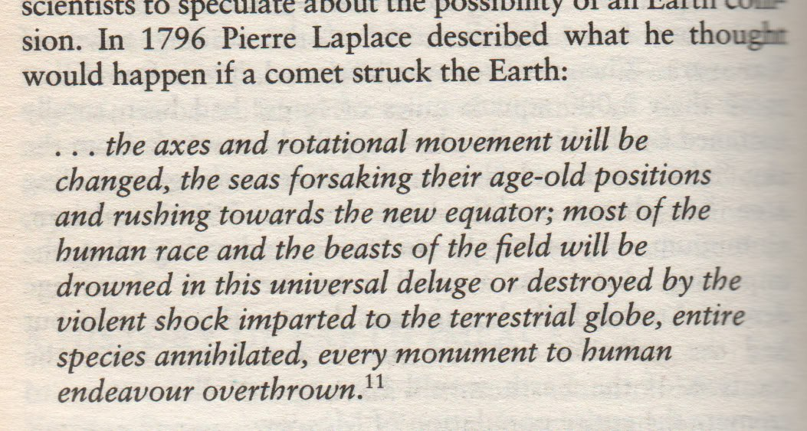

# Cataclysm Stories

This folder is for myths, stories, and accounts of floods and cataclysms.

See `EVIDENCE/bible` for Bible flood myths.

## Contents

- `cataclysm-allan-declair`: Analysis of a large cataclysm compilation.
- `hard-copies`: Hard copies of flood myth compilations.

## Sources

- Massive flood myth compilation: https://talkorigins.org/faqs/flood-myths.html (Hard copy in `hard-copies`)
- Allan and Dellair's Cataclysm: https://archive.org/details/cataclysmcompell00alla

## Uriel's Machine

Uriel's Machine is dense. Every page contains gems. See `img/uriel1.pdf`.

https://annas-archive.org/md5/3a6852245dd6f4f84e095532cb22cd58

# TODO leads to look into

Organize myths by date here.

- Tiahuanaco
	- The Great Idol of Tiahuanaco, 1959, by Arthur Posnansky
- Easter island
	- Island off west coast of SA with many large rock statues

Great flood history of middle east: https://repository.ihu.edu.gr/xmlui/bitstream/handle/11544/29135/Thesis%20Trompakas%20Kostas%20BS.pdf (hard copy `Thesis Trompakas Kostas BS` in `hard-copies`)

South America:
- Peru, story of the Sun standing still in the sky. (If the Sun was near noon when the rotation started it may have appeared stationary).
- In South America myths of the sun setting in the wrong place.

- The Bible, Egyptian legends and other stories from antiquity describe a solar event, often involving a black sun.
- Altai megafloods
- Deucalion flood (1500 BCE)
- Hawaiian flood (1000-1500 CE)
- Popol Vuh, Maya flood (500-800 CE)
- Atra-Hasis Epic Mesopotamia (1800-1700 BCE)
	- Sumerian Flood Story (Eridu Genesis)

Malaysian and Sumatran stories describe a long night they feared would never end.