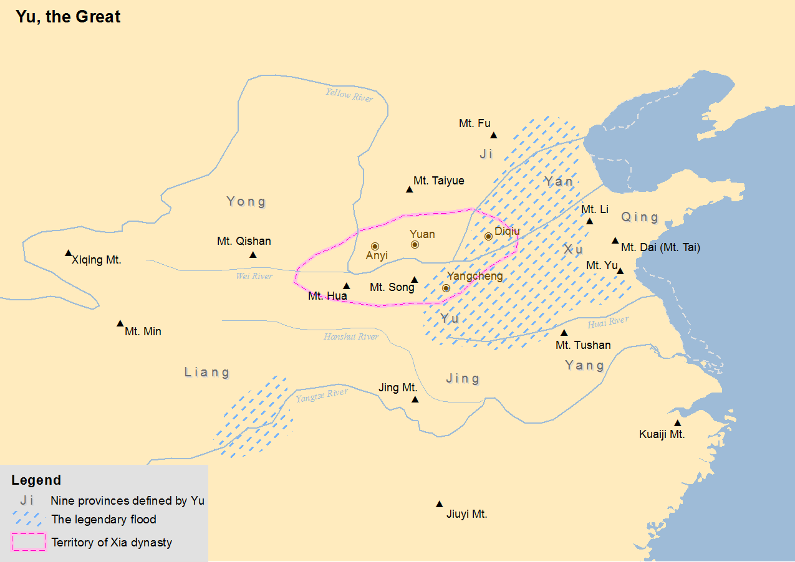

# China

## Great Flood (2300 BCE?)

Not so much a myth as an account, it lines up with Korea's founding myth, that of Dangun.

*"The Great Flood of Gun-Yu, also known as the Gun-Yu myth, was a major flood in ancient China that allegedly continued for at least two generations, which resulted in great population displacements among other disasters, such as storms and famine. People left their homes to live on the high hills and mountains, or nest on the trees. According to mythological and historical sources, it is traditionally dated to the third millennium BCE, or about 2300–2200 BCE, during the reign of Emperor Yao."* [1]

The flood level depicted is approximately 65m in modern-day China.

Velikovsky's Worlds in Collision (`LITERATURE-MEDIA/velikovsky`), Chapter 4 page 100, has a compilation of the accounts of this flood during Emperor Yao's reign:

*“At that time the miracle is said to have happened that the sun during a span of ten days did not set, the forests were ignited, and a multitude of abominable vermin was brought forth.” 2 “In the life-time of Yao [Yahou] the sun did not set for ten full days and the entire land was flooded.” An immense wave “that reached the sky” fell down on the land of China. “The water was well up on the high mountains, and the foot-hills could not be seen at all.”* [Velikovsky Page 101]

On the dating of this event, Velikovsky has this to say: *"Calculations were undertaken to establish the dates of the Emperor Yahou. On the basis of a remark that the constellation Niao, thought to be the constellation Hydra, culminated at sunset on the day of the vernal equinox in the time of Yahou, it was reckoned that the flood occurred in the twenty-third century before the present era, but this date has been questioned by many."* [Velikovsky Page 103]

### Xia Dynasty dates (established 2070 BC?)

The Xia Dynasty was established by Gun-Yu, who "stopped" the flood. Therefore the flood must have occurred within a lifetime of the establishment of the Xia Dynasty, which is estimated to be established in 2070 BC. That already creates a clear discrepancy with the flood's hypothesized date of 2300 BC.

There is also contention on the dates of the Xia Dynasty:

*"According to the traditional chronology, based upon calculations by Liu Xin, the Xia ruled between 2205 and 1766 BC. According to the chronology based on the "current text" Bamboo Annals, it ruled between 1989 and 1558 BC. Comparing the same text with dates of five-planet conjunctions, David Pankenier, supported by David Nivison, proposed dates of 1953 and 1555 BC. The Xia–Shang–Zhou Chronology Project, commissioned by the Chinese government in 1996, proposed that the Xia existed between 2070 and 1600 BC."* [2]

Still, all the estimates put the flood at 2000 BC at the earliest.

### Length of the flood - 22 years

The flood seemed to have lasted 22 years - 9 years of Gun-Yu's father attempting to stop it, and 13 years until Gun-Yu managed to "stop" the flood.

This could be a potential lead on the length of S2.

### Research paper on Yellow River 1920 BCE flood

There is a research paper which proposes that there is evidence for a 1920 BCE flood of the Yellow River. The researchers estimate that the waters reached an elevation of 240m above current river levels and reached settlements as far as 1,300 miles downstream. They also believe that the dam burst (hypothesized to have caused the flood) would have caused long-lasting flooding on the lower plains.

Source: https://www.science.org/doi/10.1126/science.aaf0842

PDF included in this folder.

## Chinese Nuwa Inundation Myth

There is a Chinese inundation myth which matches China's expected rotation from S1 to S2.

*"When the water god Gong Gong saw that he was losing, he smashed his head against Mount Buzhou, a pillar holding up the sky. The pillar collapsed and caused the sky to tilt towards the northwest and the earth to shift to the southeast."*

https://en.wikibooks.org/wiki/Chinese_Stories/N%C3%BCwa

## Citations

1. https://en.wikipedia.org/wiki/Great_Flood_(China)
2. https://en.wikipedia.org/wiki/Xia_dynasty#Gun,_Yu,_and_the_flood
3. https://theculturetrip.com/asia/china/articles/chinas-4000-year-old-great-flood-myth-verified-by-science

## TODO

"Chinese historian dates exploded supernova to time of legendary Emperor Yao as told in ancient annals": https://www.scmp.com/news/china/science/article/3204241/chinese-historian-dates-exploded-supernova-time-legendary-emperor-yao-told-ancient-annals