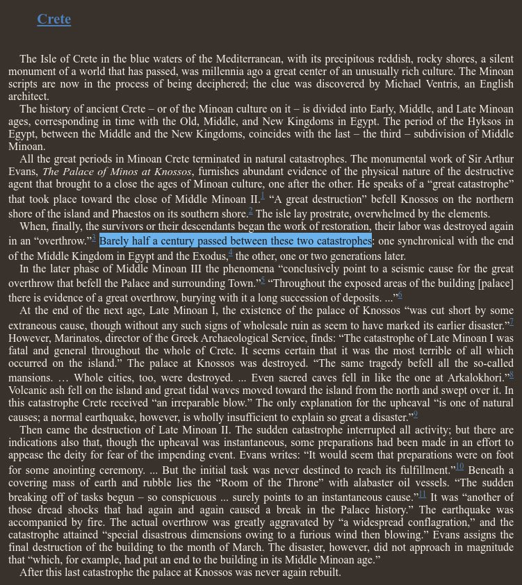

# Europe Ancient Flood Myths

## Crete (Greece), 1750 BC

The Minoan civilization, which existed on Crete and other islands in the Mediterranean, seems to have ended without clear traces of invasion or other remnants. It is suspected that natural disasters, more extreme than a simple earthquake, were the cause of the downfall of Minoan civilization.

Velikovsky, in his account on Crete in Earth in Upheaval, references two sources:
- Sir Arthur Evans (see `LITERATURE-MEDIA/sir-arthur-evans`) who excavated the Minoan palace of Knossos on Crete references two catastrophes.
- Marinatos' wrote a work on two catastrophes that destroyed Minoan civilization; which included a large volcanic eruption and subsequent deluge, evidenced by houses that were unearthed on the north of Crete. (hard copy in this folder)

The Minoan Eruption of Santorini Volcano is estimated to have been around 1600 BC. This has been linked to a tsunami which hit the region around the same time: *"A Minoan and a Neolithic tsunami recorded in coastal sediments of Ios Island, Aegean Sea, Greece"*:
- https://uca.hal.science/hal-03792797/document (hard copy in this folder)

The timeline for these goes somewhat like this [1]:
- Close of Middle Minoan II: 1700 BC
- Half a century later: 1650 BC
- Late Minoan II: 1400 BC

https://x.com/nobulart/status/1835632165037486497

## Deucalion Greek Flood Myth (1528 BC)

*"For some time during the Middle Ages, many European Christian scholars continued to accept Greek mythical history at face value, thus asserting that Deucalion's flood was a regional flood, that occurred a few centuries later than the global one survived by Noah's family. On the basis of the archaeological stele known as the Parian Chronicle, Deucalion's Flood was usually fixed as occurring some time around 1528 BC. Deucalion's flood may be dated in the chronology of Saint Jerome to c. 1460 BC."*

https://en.wikipedia.org/wiki/Deucalion#Deluge_accounts

## Plato

"Many great deluges have taken place during the nine thousand years" since Athens and Atlantis were preeminent. Destruction by fire and other catastrophes was also common. In these floods, water rose from below, destroying city dwellers but not mountain people. The floods, especially the third great flood before Deucalion, washed away most of Athens' fertile soil." [3]

"And if any event has occurred that is noble or great or in any way conspicuous, whether it be in your country or in ours or in some other place of which we know by report, all such events are recorded from of old and preserved here in our temples; whereas your people and the others are but newly equipped, every time, with letters and all such arts as civilized States require and when, after the usual interval of years, like a plague, the flood from heaven comes sweeping down afresh upon your people, [23b] it leaves none of you but the unlettered and uncultured, so that you become young as ever, with no knowledge of all that happened in old times in this land or in your own." [2]

### Atlantis (~9600 BC)

"But afterwards there occurred violent earthquakes and floods; and in a single day and night of misfortune all your warlike men in a body sank into the earth, and the island of Atlantis in like manner disappeared in the depths of the sea. For which reason the sea in those parts is impassable and impenetrable, because there is a shoal of mud in the way; and this was caused by the subsidence of the island."

https://en.wikipedia.org/wiki/Atlantis

### Ogyges (Thebes) Deluge

"An earlier flood was reported to have occurred in the time of Ogyges, founder and king of Thebes. The flood covered the whole world and was so devastating that the country remained without kings until the reign of Cecrops." [3]

"The first worldwide flood in Greek mythology, the Ogygian deluge occurred during his reign and derives its name from him, though some sources regard it as a local flood, such as an inundation of Lake Copais, a large lake once in the center of Boeotia.[11] Other sources see it as a flood associated with Attica.[12] This latter view was accepted by Africanus, who says "that great and first flood occurred in Attica, when Phoroneus was king of Argos, as Acusilaus relates."" [4]

"Thus, Ogyges is a semi-mythical figure linked to a period that could be placed anywhere from the third millennium BCE to around 2000 BCE, while Thebes as a city likely existed as early as 3000 BCE and certainly by the Mycenaean era (1600 BCE)." [5]

"Thebes (also known as Kadmeia) was first inhabited around 3000 BCE." [6]

## Kataklysmos and Ekpyrosis

Censorinus makes mention of this water/fire sequence as being coincident to a planetary cycle in De Die Natali (238 AD): "There is a period called 'the supreme year' by Aristotle, at the end of which the sun, moon and all the planets return to their original position. This 'supreme year' has a great winter, called by the Greeks 'kataklysmos', which means deluge, and a great summer, called by the Greeks 'ekpyrosis' or combustion of the world. The world, actually, seems to be inundated and burned alternately in each of these epochs".

### Encke causing Ekpyrosis?

Could this be ekpyrosis following katakysmos a few years later? The idea of us passing directly through the main stream is a serious consideration.

From what I have surmised through these years, there are 3 main impacts that occur every 12k years. Water inundation (deluge), a cme and a regular impact. Just to finish so to speak before the start of a new age. It is my conjecture that the deluge comes after this extraterrestrial impact-this explains that we find remnants of old ages under the soil (mud burial) and under the sea (think bimini, yonaguni, kumari kandam, dwarka). So yes.

## Citations

1. http://www.minoancrete.com/chron.htm
2. https://www.perseus.tufts.edu/hopper/text?doc=Perseus%3Atext%3A1999.01.0180%3Atext%3DTim.%3Apage%3D23
3. https://www.curioustaxonomy.net/home/FloodMyths/01Euro/greek.html
4. https://en.wikipedia.org/wiki/Ogyges
5. ChatGPT
6. https://www.worldhistory.org/Thebes_(Greece)/