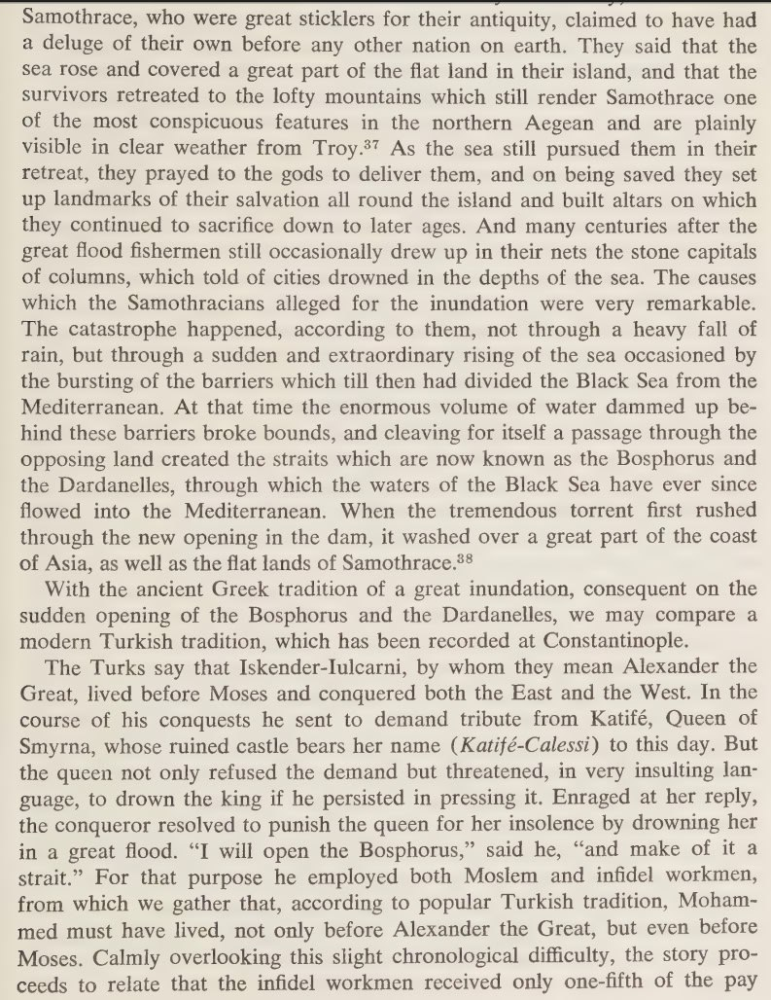
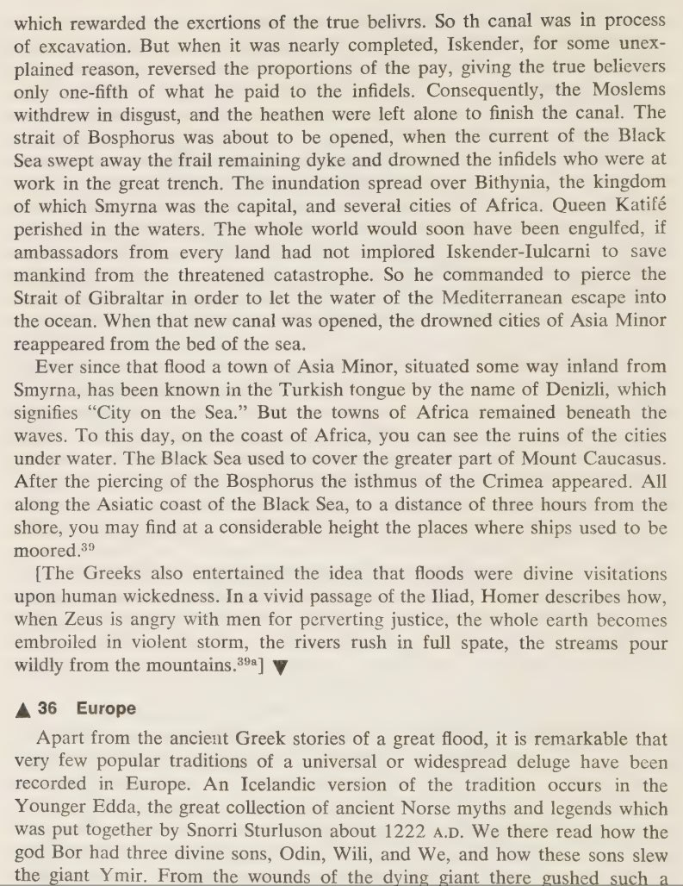

# Middle East Flood Myths

## Mohenjo-Daro, Pakistan - Fire & Water

"Built c. 2500 BCE, it was the largest settlement of the ancient Indus Valley Civilization, and one of the world's earliest major cities, contemporaneous with the civilizations of ancient Egypt, Mesopotamia, Minoan Crete, and Norte Chico. With an estimated population of at least 40,000 people, Mohenjo-daro prospered for several centuries, but by c. 1700 BCE had been abandoned, along with other large cities of the Indus Valley Civilization. The city also had large platforms perhaps intended as defense against flooding. According to a theory first advanced by Wheeler, the city could have been flooded and silted over, perhaps six times, and later rebuilt in the same location. For some archaeologists, it was believed that a final flood that helped engulf the city in a sea of mud brought about the abandonment of the site." [1] (continued in the comments...)

Mohenjo-Daro's abandonment is temporally coincident with the recorded destruction of Crete by deluge (c. 1750 BCE) and fire (c. 1700 BCE) [2]

There are thousands of square kilometers of significant stratification formations underlying the sand dunes starting 100km to the east of the site which precisely align with the ECDO [3] moment of inertia (the red line), and which are morphologically characteristic of the unperturbed laminar flow which would occur during S2>S1 in this area. [4]

[1] https://en.wikipedia.org/wiki/Mohenjo-daro
[2] https://x.com/nobulart/status/1812105085939261728
[3] https://theethicalskeptic.com/2024/05/23/master-exothermic-core-mantle-decoupling-dzhanibekov-oscillation-theory/
[4] https://maps.app.goo.gl/9g6gz1vSAgqMXnoT8

## Atra-Hasis Flood Account

It is the same story as Gilgamesh. It was written down in the mid-17th century BCE, but the tale itself is considered much older.

Links:
- https://en.wikipedia.org/wiki/Atra-Hasis
- https://www.worldhistory.org/article/227/the-atrahasis-epic-the-great-flood--the-meaning-of/

## Gilgamesh (2000 BC - 1200 BC)

Mesopotamian flood myth. Utnapishtim builds a boat and survives the flood. Apparently written 2150-1400 BCE.

- https://en.wikipedia.org/wiki/Gilgamesh_flood_myth
- https://www.worldhistory.org/article/227/the-atrahasis-epic-the-great-flood--the-meaning-of/

## Turkey deluge account

Not only does it describe a deluge, it specifically describes an oceanic displacement.

[1] Myth, Legend and Custom in the Old Testament, Gaster (1969)

## Turkey flood myth

- https://talkorigins.org/faqs/flood-myths.html
	- This one cites the time as being around that of Alexander the Great (4th century BC), so the timing is a bit of an issue, but being a "story" its possibly incorrectly attributed to his time. There is however, another link to something happening in this area at the time Alex was around.
		- https://x.com/nobulart/status/1803411938451374121?s=46
		- https://x.com/nobulart/status/1801746221809209701?s=46

## Citations

1. https://en.wikipedia.org/wiki/Hittites
2. https://en.wikipedia.org/wiki/K%C3%BCltepe

# TODO additional leads

Research Paper "Noah's Flood: The New Scientific Discoveries About the Event that Changed History" by William Ryan and Walter Pitman

Turkey:
- 6800 BCE Black Sea flood: https://en.wikipedia.org/wiki/Black_Sea_deluge_hypothesis