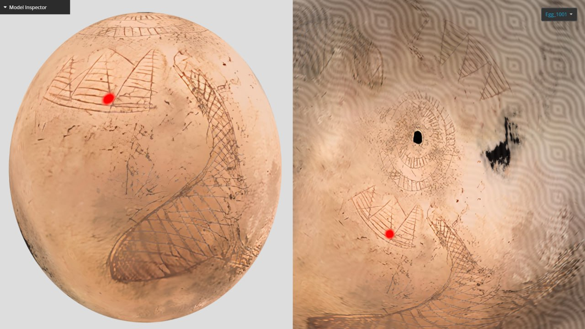
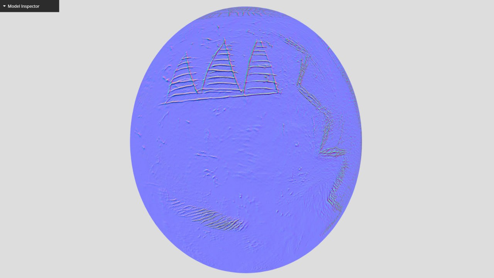
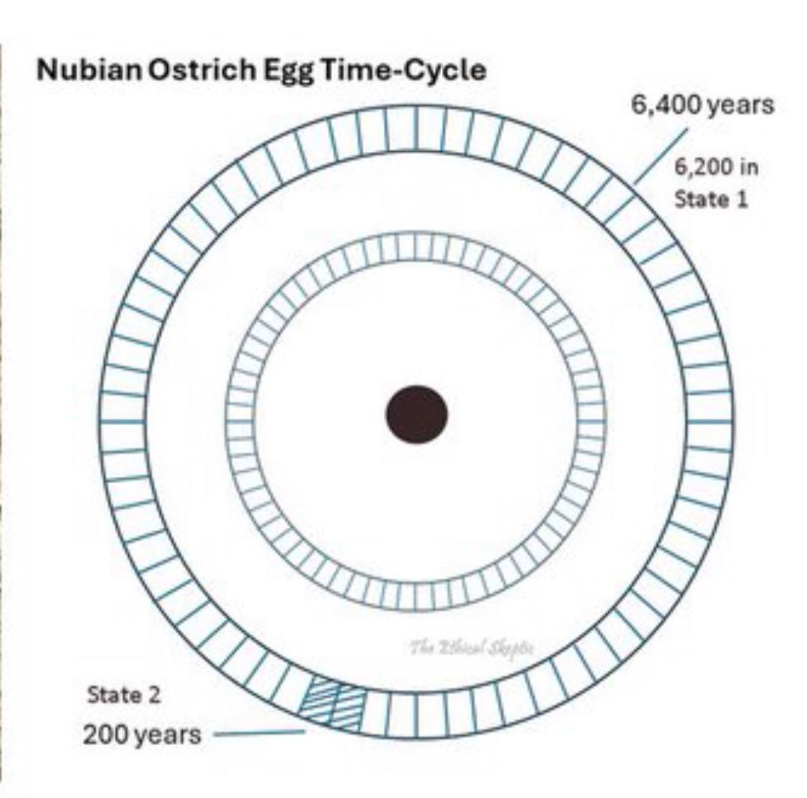

# Important Human-Created Artifacts

## Ancient Ostrich Egg

Depicts floodwaters receding from Egypt. [2]

https://sketchfab.com/3d-models/6000-years-old-egg-depicts-the-pyramids-and-nile-477696fb6bd14f58a5213edd3ef4e5da

6400 year cycle, 6200 in S1, 200 in S2. [2]

*"Taking into account two ECDO S1>S2>S1 events since the pyramids were built means there had to be a third event before they were built in order to observe the 104 degrees of rotation. This had to have happened for the pyramid to have been designed the way it was... In reality though, one experienced event would not be enough to be certain that it was going to happen the same way again. They probably would have had to have experienced two to be certain of the sequence of events."*

Several ancient calendars used an year of six months, however. See `FOUNDATION-THEORY/ecdo-frequency/date-anomalies`.

## Citations

1. https://x.com/EthicalSkeptic/status/1832538729275117895?s=19
2. https://x.com/ethicalskeptic/status/1833646432189919326?s=46