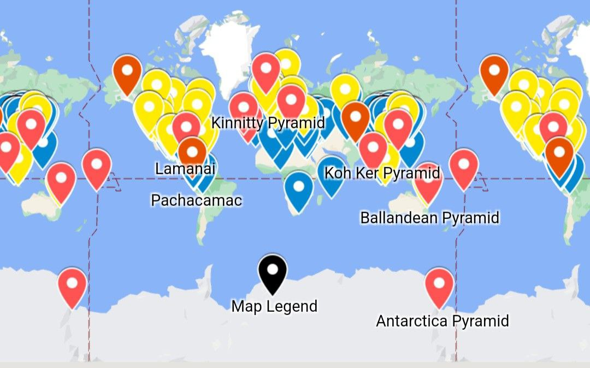
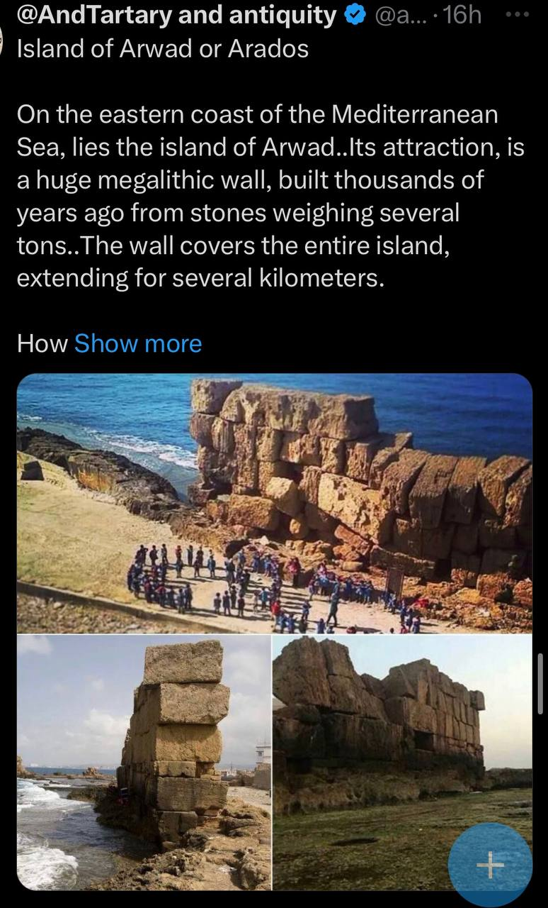

# Human Built ECDO-related Structures

This folder is for important structures humans have built that are potentially related to ECDO events.

Khafre/Khufu Pyramids, structures that are central to the ECDO thesis, are in `khafre-khufu`.

## All the pyramids in the world

Map of all the pyramids in the world: https://www.google.com/maps/d/viewer?mid=1a7ESLhx-k-r0zTW22XiENshhHwf-QXM

## Derinkuyu underground city

https://www.ancient-origins.net/ancient-places-asia/derinkuyu-0073

## Underground cities: Kaymakli, Ozkonak

https://cappadociatravelpass.com/a-cappadocian-mystery-kaymakli-underground-city

## Babylon

*"The walls of the mighty Babylon and the eight-volved Tower of Babel or cloud-encompassed Bel were never constructed to resist any mortal foe. NO. Those city walls, which were 60 miles in circumference, 200 feet high, 578 feet thick, were not made to defy the strength of armies, but to resist the fearful forces of Nature, the floods that swept the plains of Shinar, from the mountains of Armenia, every spring during this Age of Horror. The tremendous embankments and river walls constructed by the Ancients are monuments of human skill and enterprise belonging to an epoch that antedates by thousands of years the Age of their supposed builders."* - Thomas H. Burgoyne, The Light of Egypt - Vol. I (1889)

*"This accounts for and fully explains the existence of fossil remains of the seal, walrus and polar bear in the burning plains of Africa and Hindustan, and of the tropical remains now being discovered in the Arctic regions."*

This would very likely have been expunged from recent records. His source would predate 1889.

https://nobulart.com/the-hermetic-key/

## Great Circle Artifacts

Angkor Wat and Nazca lie on the great circle centred at Stonehenge (red trace). Another great circle connects Easter Island, Machu Picchu, Giza and Mohenjo-daro (blue trace). Intersections at Peru and Cambodia may account for the high density of megaliths, geoglyphs and curious artefacts found there. The planes defined by these great circles intersect along an axis approximately connecting Angkor Wat to Nazca/Paracas, inclined to one another at sin −1 (0.9) the gradian/degree ratio being 9/10.

https://www.youtube.com/watch?v=PiQL5yVpWig

## Khara Hora Underground Cave

https://m.youtube.com/watch?v=akmKO2pgdTY&t=2s

## Island of Arwad Megawall

They built a 10m high wall around the entire island. I’m guessing it wasn’t to keep the crabs off the beaches. 

https://x.com/andtartary2/status/1834082117552406642?s=46

## Pyramid - Eight Parts

https://x.com/dgr8awakening/status/1834394949179097510?s=46

## Bosnian Pyramids Vedic Cycles

See PDF `Evidence of Vedic Cosmology...` in this folder.

# TODO Potential Leads

Curious on the difference between 1700 BC and 1300-1200 BC dating for some of these events.

- Temple at Dendera
	- https://x.com/DGr8Awakening/status/1824267280303194435

"Ancient Superhighways: 12,000-Year-Old Massive Underground Tunnels Stretch From Scotland To Turkey": https://ancient-archaeology.com/2024/05/ancient-superhighways-12000-year-old-massive-underground-tunnels-stretch-from-scotland-to-turkey/

Search for (ancient) underground cities

Vrtra Underground Pyramid, Alaska http://www.human-resonance.org/Vrtra_Underground_Pyramid.pdf

Bosnian Pyramids

chinese pyramids https://thebrainchamber.com/chinese-pyramids/

brain chamber pyramid map: https://www.google.com/maps/d/viewer?mid=1a7ESLhx-k-r0zTW22XiENshhHwf-QXM
