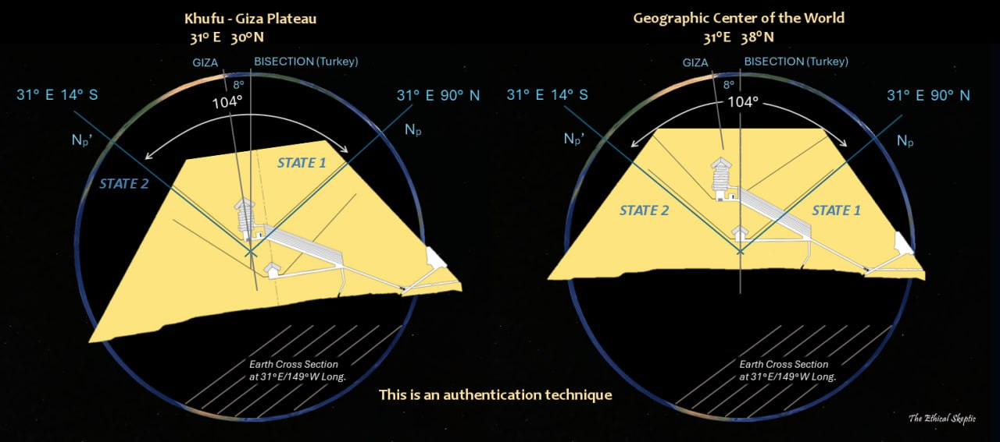
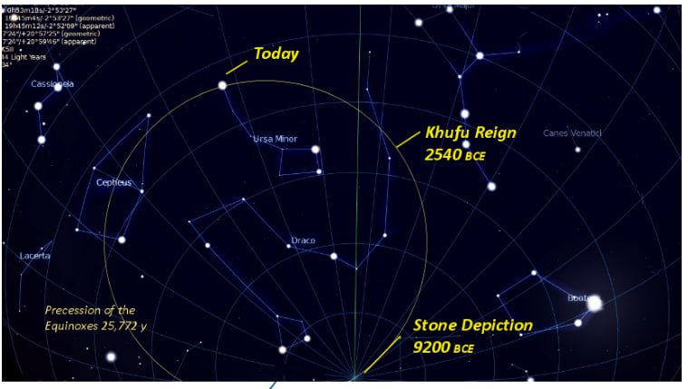
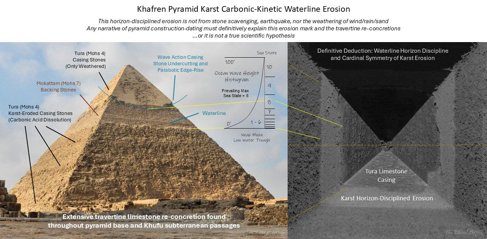
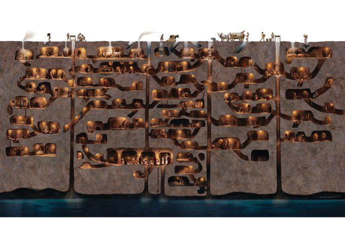
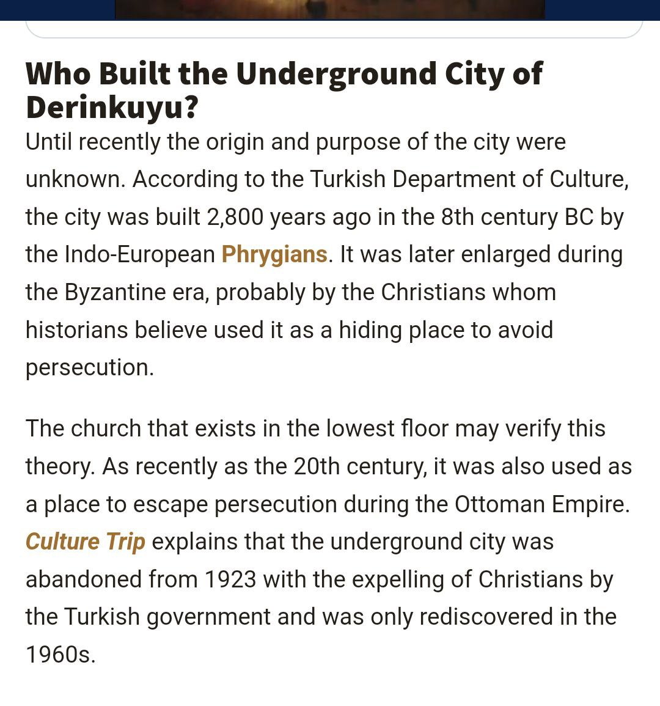

# Human Built ECDO-related Structures

This folder is for important structures humans have built that are potentially related to ECDO events.

## Khafre Pyramid

Arguably the centerpoint of TES's ECDO theory, I cover his comments on the function of this structure below.

### Khafre Pyramid Function - Tripartite Observatory [2]

This pyramid is hypothesized by TES to be a tripartite observatory designed to monitor the ECDO.

*"King’s Chamber – Celestial Pole Nutation Monitoring: The north celestial pole monitoring shafts are oriented to a specific celestial reference, running directly to the pyramid’s surface and pointing accurately at both Np (State 1) and Np‘ (State 2) for Giza. These shafts are designed to monitor the nutation (wobble and wander) of the celestial north pole..."*

*"Queen’s Chamber – Geomagnetic Moment and Ionospheric Monitoring: Geomagnetic moment/flux field orientation monitoring – by means of copper cable pairs (seen in Exhibit M), that were allegedly confiscated in part by former Egyptian Antiquities Minister, Zahi Hawass.48 49 These copper cables were contained inside shafts that do not run completely to the exterior of the pyramid, are capped off (neither for ‘air’ nor ‘stars’), and are oriented to the pyramid structure itself. The limestone blocks of the pyramid served as a natural isolation mechanism, insulating the copper cables and shielding them from extraneous electromagnetic interference, while simultaneously allowing transparency to the critical Earth geomagnetic frequencies essential to the mission. The 90-degree relative angle to the pyramid’s sky-facing sides (no accident – annotated as the right angle in Exhibit K) might have been designed to focus and channel electromagnetic resonances, enhancing the sensitivity and accuracy of the geomagnetic monitoring system in the Queen’s Chamber."*

*"Remnants of the copper cables (click on photo to right) were found by the Gantenbrink Upuaut Project in March 1990 in the Queen’s Chamber south air shaft (and later the North Shaft as well). These cables have long since been removed by both tomb robbers, as evidenced by the Dixon Relics found by Waynman Dixon at the bottom of the north shaft in 1872, and by obfuscation (alleged) on the part of Zahi Hawass."*

*"Subterranean Chamber – H-Layer P-Wave Infrasound Monitoring: Deep-earth seismometry/core-mantle H-layer/LLVP dynamics monitoring fluid-based sensor. In similar effect to the geomagnetic monitoring, the pyramid’s structure could have been optimized to both isolate and focus seismic signals towards the Subterranean Chamber, allowing it to effectively monitor seismic activity and internal Earth dynamics free of noise from surface, device, or other nearby activity. The chamber itself would use water to detect the infrasound frequencies involved."*

*"Moreover, there is an independent determination that the rock-cut dead-end south passage inside the chamber might well have functioned as a sound resonance tube, generating or receiving infrasound with a base frequency in the range of 5 and 10 Hz – and that constant low frequency noise can be heard/sensed in the chamber.59 60 This corresponds well to the design of the pyramid itself – which is wavelength optimized to 5 Hz, per Exhibit K3 below."*

### Khufu dual-orientation authentication mechanism [2]

*"More importantly, the two angles defined by these sets of shafts (King and Queen’s shaft sets), match an alignment to the Dzhanibekov rotation as viewed from the the two critical locations defined in Exhibit H2: The Giza Plateau and the Geographic Center of the World... What the duplication in shafts and offset chambers serve to communicate, is an authentication of the change in celestial north pole location, during two different time periods. An intelligence which cannot be communicated by a single set of shafts, nor certainly by shaft combinations which do not agree."*

### Khufu construction timeframe [2]

*"In one of the star/air shafts extending upward from the Queen’s Chamber, there resides a curious set of non-hieroglyphic markings which were photograped by the Upuaut Project.66 On the ceiling, just at the final stone before the block that terminates this shaft, a depiction of the night sky is carved. This artistic representation includes the constellations Ursa Minor and Ursa Major, Draco, Lacerta, Bootes, Cepheus, and Cassiopeia, unmistakably identifying this specific section of the sky and its orientation."*

*"This depiction suggests a construction timeframe for the star shaft of around 9200 to 9600 BCE, as evidenced by comparing Exhibits M and N. Many of the stars represented in this carving would have been below the horizon in 2540 BCE and thus invisible in this depiction, to observers of that era. A Starry NightTM rendering of the northern sky at Giza as it appeared in 9200 BCE, which precisely matches the arrangement carved into the stone shown in Exhibit M, is shown below, along with the sextant-like alignment technique entailed."*

### Khafre erosion [2]

"I don't know how to make this clearer: Any story regarding the construction/dating of Khufu and Khafre must definitively address this karst erosion feature—otherwise, it is not a scientific hypothesis, rather narrative dogma." - Ethical Skeptic

## Derinkuyu

https://www.ancient-origins.net/ancient-places-asia/derinkuyu-0073

## Underground cities: Kaymakli, Ozkonak

https://cappadociatravelpass.com/a-cappadocian-mystery-kaymakli-underground-city

## Babylon

*"The walls of the mighty Babylon and the eight-volved Tower of Babel or cloud-encompassed Bel were never constructed to resist any mortal foe. NO. Those city walls, which were 60 miles in circumference, 200 feet high, 578 feet thick, were not made to defy the strength of armies, but to resist the fearful forces of Nature, the floods that swept the plains of Shinar, from the mountains of Armenia, every spring during this Age of Horror. The tremendous embankments and river walls constructed by the Ancients are monuments of human skill and enterprise belonging to an epoch that antedates by thousands of years the Age of their supposed builders."* - Thomas H. Burgoyne, The Light of Egypt - Vol. I (1889)

*"This accounts for and fully explains the existence of fossil remains of the seal, walrus and polar bear in the burning plains of Africa and Hindustan, and of the tropical remains now being discovered in the Arctic regions."*

This would very likely have been expunged from recent records. His source would predate 1889.

https://nobulart.com/the-hermetic-key/

## Gobekli Tepe [1]

Confirming TES' speculated built date in the period after the YDB. I'm thinking Gobleke Tepe was built during the previous stable period. So there was an event that triggered the constuction of GT as an observatory, which is starting to make it look as though the 'YDB Event' might more properly be called the BAI Event.

My thinking is that it was built to watch for whatever we encountered around 12,800 BC that upset the apple cart. It's possible that the focus on interpreting GT should be expanded to include consideration of the stars at that earlier time. It would have possibly been more likely to have been built during the warmer insterstadia than the cooler YD.

## Gobekli Tepe's relation to comets

An interesting paper, with a convincing argument that GT was astronomically linked to observing (predicting?) the progenitor of Encke and the taurids in much the same way as the pyramids were constructed to monitor the aftermath of the YDB event.

- https://web.archive.org/web/20230605190759/http://www.maajournal.com/Issues/2017/Vol17-1/Sweatman%20and%20Tsikritsis%2017(1).pdf
- https://www.tandfonline.com/doi/full/10.1080/1751696X.2024.2373876

## Great Circle Artifacts

Angkor Wat and Nazca lie on the great circle centred at Stonehenge (red trace). Another great circle connects Easter Island, Machu Picchu, Giza and Mohenjo-daro (blue trace). Intersections at Peru and Cambodia may account for the high density of megaliths, geoglyphs and curious artefacts found there. The planes defined by these great circles intersect along an axis approximately connecting Angkor Wat to Nazca/Paracas, inclined to one another at sin −1 (0.9) the gradian/degree ratio being 9/10.

https://www.youtube.com/watch?v=PiQL5yVpWig

## Khara Hora Underground Cave

https://m.youtube.com/watch?v=akmKO2pgdTY&t=2s

## Citations

1. [Craig Stone](https://nobulart.com)
2. https://theethicalskeptic.com/2024/05/12/exothermic-core-mantle-decoupling-dzhanibekov-oscillation-ecdo-theory/

# TODO Potential Leads

Curious on the difference between 1700 BC and 1300-1200 BC dating for some of these events.

- Khafre pyramid (as detailed in Ethical Skeptic's thesis)
- Derinkuyu underground city: https://en.wikipedia.org/wiki/Derinkuyu_underground_city
- Temple at Dendera
	- https://x.com/DGr8Awakening/status/1824267280303194435

"Ancient Superhighways: 12,000-Year-Old Massive Underground Tunnels Stretch From Scotland To Turkey": https://ancient-archaeology.com/2024/05/ancient-superhighways-12000-year-old-massive-underground-tunnels-stretch-from-scotland-to-turkey/

Search for (ancient) underground cities

Vrtra Underground Pyramid, Alaska http://www.human-resonance.org/Vrtra_Underground_Pyramid.pdf

Bosnian Pyramids
