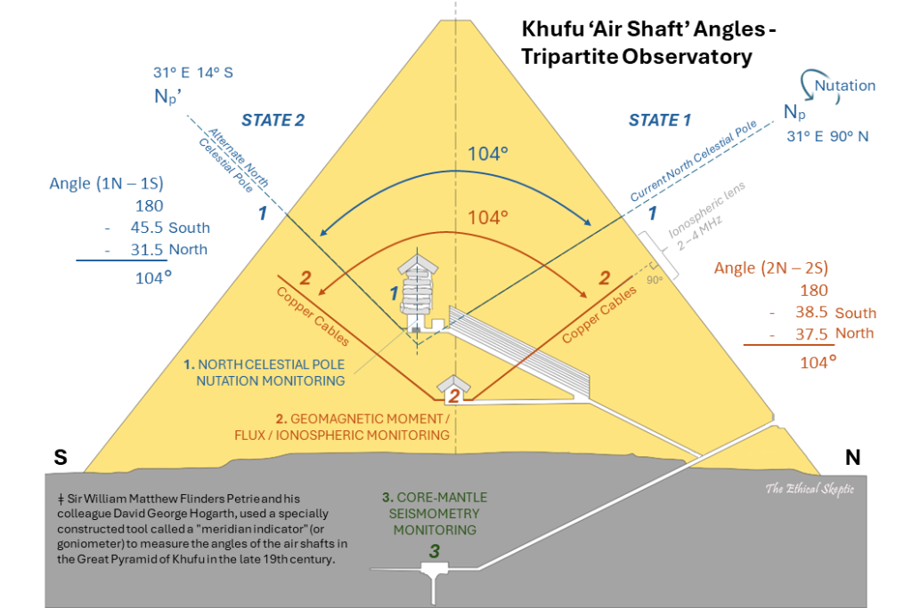
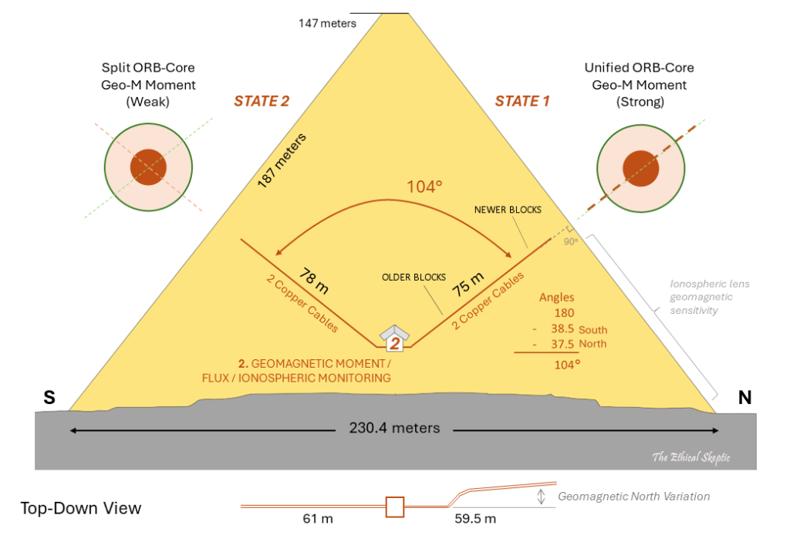
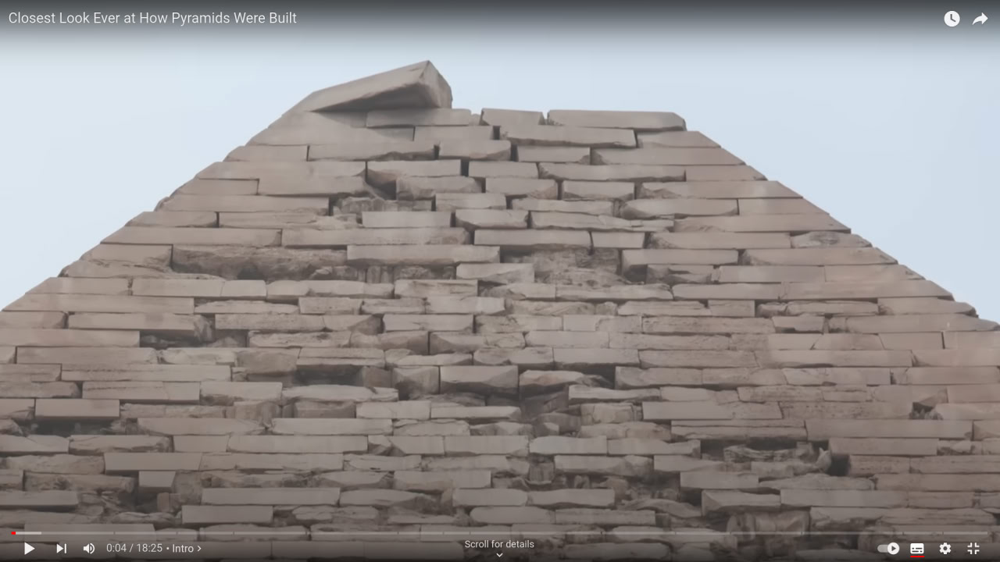
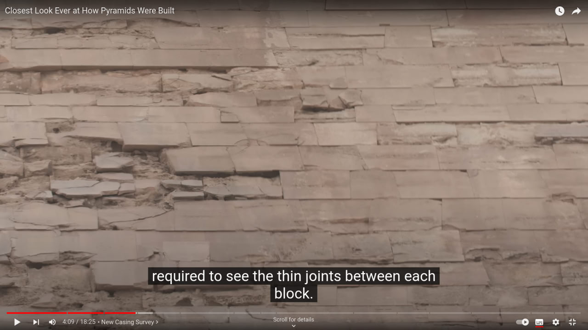
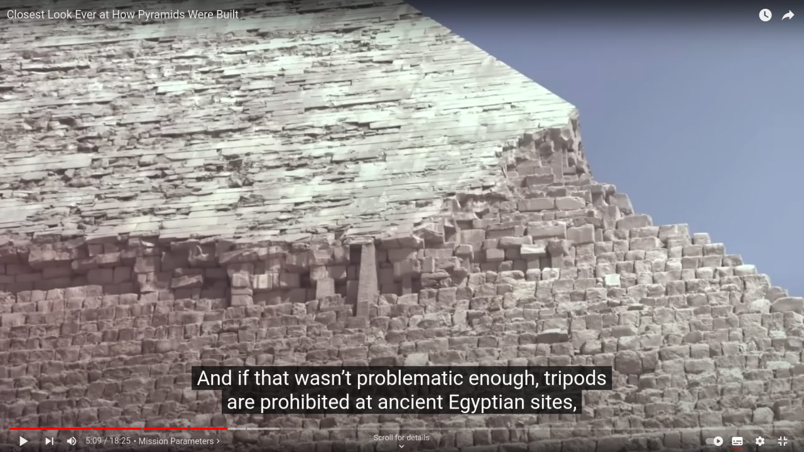

# Khafre Pyramid

Arguably the centerpoint of TES's ECDO theory. Many of his comments cited below.

### Khafre Pyramid Function - Tripartite Observatory [1]

This pyramid is hypothesized by TES to be a tripartite observatory designed to monitor the ECDO.

*"King’s Chamber – Celestial Pole Nutation Monitoring: The north celestial pole monitoring shafts are oriented to a specific celestial reference, running directly to the pyramid’s surface and pointing accurately at both Np (State 1) and Np‘ (State 2) for Giza. These shafts are designed to monitor the nutation (wobble and wander) of the celestial north pole..."*

*"Queen’s Chamber – Geomagnetic Moment and Ionospheric Monitoring: Geomagnetic moment/flux field orientation monitoring – by means of copper cable pairs (seen in Exhibit M), that were allegedly confiscated in part by former Egyptian Antiquities Minister, Zahi Hawass.48 49 These copper cables were contained inside shafts that do not run completely to the exterior of the pyramid, are capped off (neither for ‘air’ nor ‘stars’), and are oriented to the pyramid structure itself. The limestone blocks of the pyramid served as a natural isolation mechanism, insulating the copper cables and shielding them from extraneous electromagnetic interference, while simultaneously allowing transparency to the critical Earth geomagnetic frequencies essential to the mission. The 90-degree relative angle to the pyramid’s sky-facing sides (no accident – annotated as the right angle in Exhibit K) might have been designed to focus and channel electromagnetic resonances, enhancing the sensitivity and accuracy of the geomagnetic monitoring system in the Queen’s Chamber."*

*"Remnants of the copper cables (click on photo to right) were found by the Gantenbrink Upuaut Project in March 1990 in the Queen’s Chamber south air shaft (and later the North Shaft as well). These cables have long since been removed by both tomb robbers, as evidenced by the Dixon Relics found by Waynman Dixon at the bottom of the north shaft in 1872, and by obfuscation (alleged) on the part of Zahi Hawass."*

*"Subterranean Chamber – H-Layer P-Wave Infrasound Monitoring: Deep-earth seismometry/core-mantle H-layer/LLVP dynamics monitoring fluid-based sensor. In similar effect to the geomagnetic monitoring, the pyramid’s structure could have been optimized to both isolate and focus seismic signals towards the Subterranean Chamber, allowing it to effectively monitor seismic activity and internal Earth dynamics free of noise from surface, device, or other nearby activity. The chamber itself would use water to detect the infrasound frequencies involved."*

*"Moreover, there is an independent determination that the rock-cut dead-end south passage inside the chamber might well have functioned as a sound resonance tube, generating or receiving infrasound with a base frequency in the range of 5 and 10 Hz – and that constant low frequency noise can be heard/sensed in the chamber.59 60 This corresponds well to the design of the pyramid itself – which is wavelength optimized to 5 Hz, per Exhibit K3 below."*

### Khufu dual-orientation authentication mechanism [1]

*"More importantly, the two angles defined by these sets of shafts (King and Queen’s shaft sets), match an alignment to the Dzhanibekov rotation as viewed from the the two critical locations defined in Exhibit H2: The Giza Plateau and the Geographic Center of the World... What the duplication in shafts and offset chambers serve to communicate, is an authentication of the change in celestial north pole location, during two different time periods. An intelligence which cannot be communicated by a single set of shafts, nor certainly by shaft combinations which do not agree."*

### Khufu construction timeframe [1]

*"In one of the star/air shafts extending upward from the Queen’s Chamber, there resides a curious set of non-hieroglyphic markings which were photograped by the Upuaut Project.66 On the ceiling, just at the final stone before the block that terminates this shaft, a depiction of the night sky is carved. This artistic representation includes the constellations Ursa Minor and Ursa Major, Draco, Lacerta, Bootes, Cepheus, and Cassiopeia, unmistakably identifying this specific section of the sky and its orientation."*

*"This depiction suggests a construction timeframe for the star shaft of around 9200 to 9600 BCE, as evidenced by comparing Exhibits M and N. Many of the stars represented in this carving would have been below the horizon in 2540 BCE and thus invisible in this depiction, to observers of that era. A Starry NightTM rendering of the northern sky at Giza as it appeared in 9200 BCE, which precisely matches the arrangement carved into the stone shown in Exhibit M, is shown below, along with the sextant-like alignment technique entailed."*

### Khafre erosion [1]

"I don't know how to make this clearer: Any story regarding the construction/dating of Khufu and Khafre must definitively address this karst erosion feature—otherwise, it is not a scientific hypothesis, rather narrative dogma." - Ethical Skeptic

## Khafre Dislodged Bricks

Observation: The most likely thing that could have dislodged, chipped and broken these casing stones in such a distributed and random fashion is a brute of an earthquake. [2]

Taken from: https://youtu.be/43V9RTpnxbk

## Citations

1. https://theethicalskeptic.com/2024/05/12/exothermic-core-mantle-decoupling-dzhanibekov-oscillation-ecdo-theory/
2. [Craig Stone](https://nobulart.com)