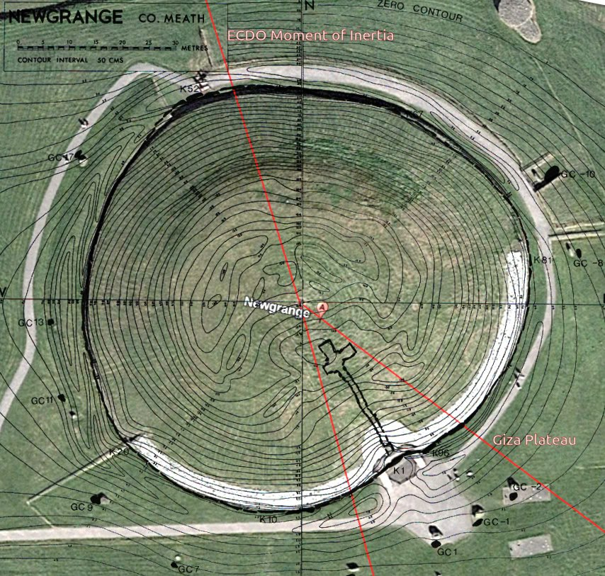
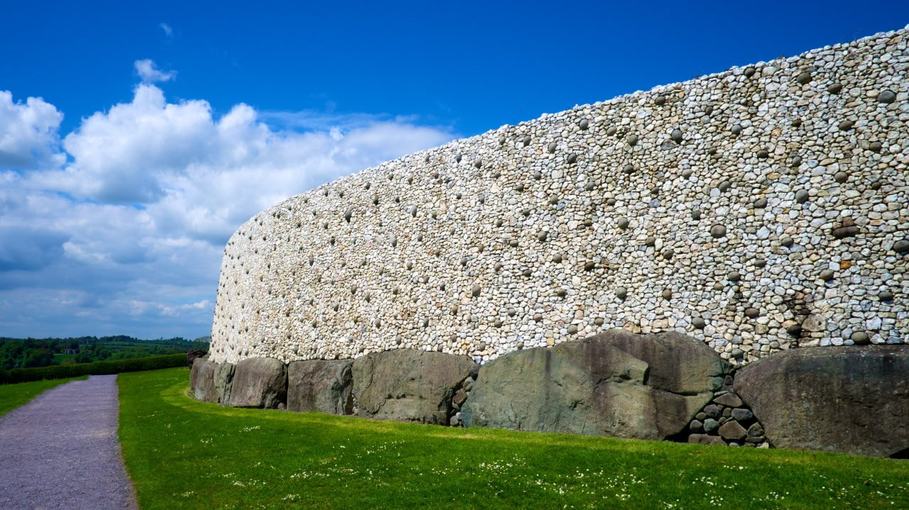
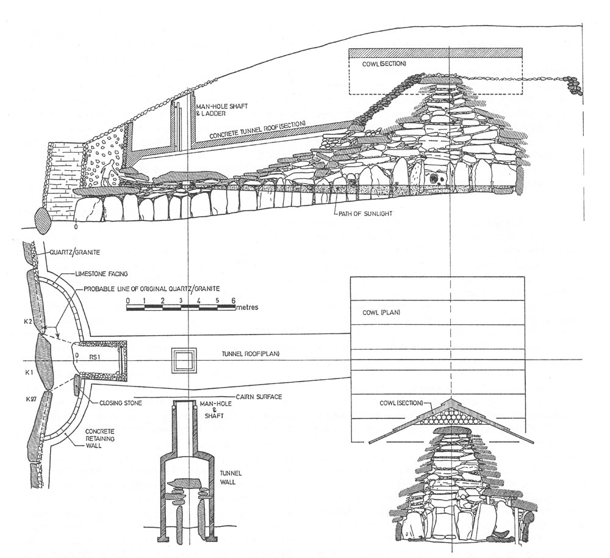

# White Wall of Newgrange (Ireland) [1]

The White Wall of Newgrange (Brugh-na-Boinne), Ireland. Built 3,200 BC or earlier[1]. Buried, excavated and (questionably) rebuilt starting in the 60's. Modern archaeology, with spectacular consistency, consider this to have been a burial place. As with most Neolithic "burial" mounds or "passage tombs", the entrance at Newgrange faces southeast [2], though not all of them are strictly aligned to the Winter Solstice sun, suggesting that the choice of orientation may have another purpose.

During an ECDO State 1 to State 2 event [3], the water would come from the NNW. The interior of the mound is elevated approximately 1.5-2.0m which, in combination with the "closing stone" now lying flat at the entrance, may have been intended to reduce flooding of the interior. I have my doubts that these would have been sufficient measures, hence the human remains found inside.

Dated cross-sections of the "slip" layers which only appear in front of the cairn on the SSE side look remarkably like waterborne deposits in their tapering teardrop forms, almost as though water traversed the structure from the NNW to the SSE depositing diluvium in the lee of the mound.[4] Could these structures have been built to shelter the living rather than the dead?

1. https://en.wikipedia.org/wiki/Newgrange
2. https://newgrange.com/newgrange-plans.htm
3. https://theethicalskeptic.com/2024/05/12/exothermic-core-mantle-decoupling-dzhanibekov-oscillation-ecdo-theory/
4. https://knowth.com/newgrange-book.htm .

## Investigative Process

The White Wall of Newgrange (Ireland). Built sometime before 3,200 BC. Entirely buried. Excavated and rebuilt starting in the 60's. This thing looks like a bunker.

[1] https://en.wikipedia.org/wiki/Newgrange

The mere fact that something so enormous was completely buried at some point is interesting in itself.

Looking a little more at Newgrange. The water would come from the NNW. The entrance is well oriented to reduce inundation whilst still serving as an annual time marker. The interior of the mound is elevated above ground level. Any water which gained the entrance would have to be forced uphill to flood the chamber.

1. http://www.carrowkeel.com/sites/boyne/newgrange2d.html
2. https://www.newgrange.com/newgrange-plans.htm

Crossections of the deposit layers in front of the cairn. The layer under all of it dating to ±2100 BC (4100 BP)

The stone slides look remarkably like diluvial deposits in their tapering form. People do not lay material down like this.

The cairn included a "closing stone" seen lying flat in front of the entrance.

Seems that most of these mounds were sited with southeasterly facing entrances, but they're not all strictly oriented to the sun, suggesting that this may not have been the reason for the choice of alignment.

Are those mega current ripples right across Ireland to the north and west of Newgrange? Can anyone find some decent LiDAR for these areas?

Excellent observation. When I was researching that post I had the thought that the mound reminded me of the Enki submarine. The story of Gilgamesh actually seems to describe a sealed land ark. Not a boat.

As alluded to by @rararuri [2], Newgrange is quite reminiscent of the circular Enki submarine described by @EthicalSkeptic [3]. The current (rebuilt) mound averages 270 feet in diameter, but there is much conjecture about the diameter of the original mound.

"Gilgamesh’s friend Enkidu, who shares many adventures with him, is called ‘son of the fish’ by a monster called the Huwawa. After they had founded the Sumerian civilization the fish-men, or Oannes as they were called, were said to have gone to the secret hideaway of the god Enki, who lived in a perfect cube under the sea. The patron god of the Seven Sages was Enki, who warned Ziusudra to construct an ark in which to save the seed of mankind. The ark is built as a replica of Enki’s secret house beneath the seas, so was also in the form of a perfect cube. Here are the instructions Enki gave to Ziusudra, taken from Robert Temple’s translation: Tear down your hut of reeds, build of them an ark. Abandon things, seek life, give up possessions, keep your soul alive and take into the ark the seed of all living creatures. The ark you will build will have dimensions carefully measured. Its length and its width shall be equal and roof it as I have my subterranean watery abyss." - Uriel's Machine [4]

## Citations

1. [Craig Stone](https://nobulart.com)
2. https://x.com/rurarurira/status/1834789858466054394
3. https://theethicalskeptic.com/2024/05/12/exothermic-core-mantle-decoupling-dzhanibekov-oscillation-ecdo-theory/
4 https://archive.org/details/urielsmachinepre0000knig