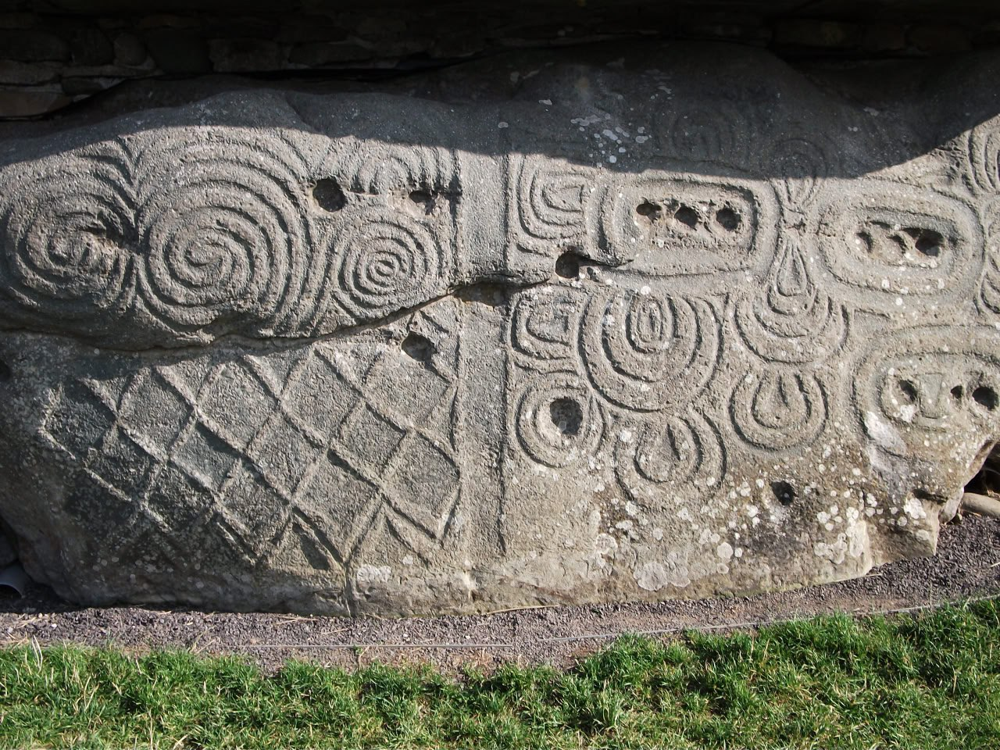

# White Wall of Newgrange (Ireland) [1]

The White Wall of Newgrange (Ireland). Built sometime before 3,200 BC. Entirely buried. Excavated and rebuilt starting in the 60's. This thing looks like a bunker.

[1] https://en.wikipedia.org/wiki/Newgrange

The mere fact that something so enormous was completely buried at some point is interesting in itself.

Looking a little more at Newgrange. The water would come from the NNW. The entrance is well oriented to reduce inundation whilst still serving as an annual time marker. The interior of the mound is elevated above ground level. Any water which gained the entrance would have to be forced uphill to flood the chamber.

1. http://www.carrowkeel.com/sites/boyne/newgrange2d.html
2. https://www.newgrange.com/newgrange-plans.htm

Crossections of the deposit layers in front of the cairn. The layer under all of it dating to ±2100 BC (4100 BP)

The stone slides look remarkably like diluvial deposits in their tapering form. People do not lay material down like this.

The cairn included a "closing stone" seen lying flat in front of the entrance.

Seems that most of these mounds were sited with southeasterly facing entrances, but they're not all strictly oriented to the sun, suggesting that this may not have been the reason for the choice of alignment.

Are those mega current ripples right across Ireland to the north and west of Newgrange? Can anyone find some decent LiDAR for these areas?

## Citations

1. [Craig Stone](https://nobulart.com)