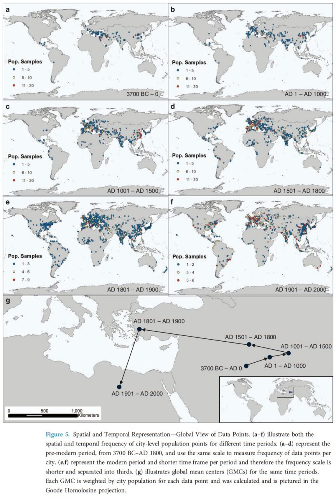
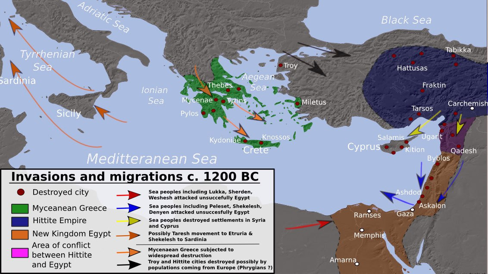
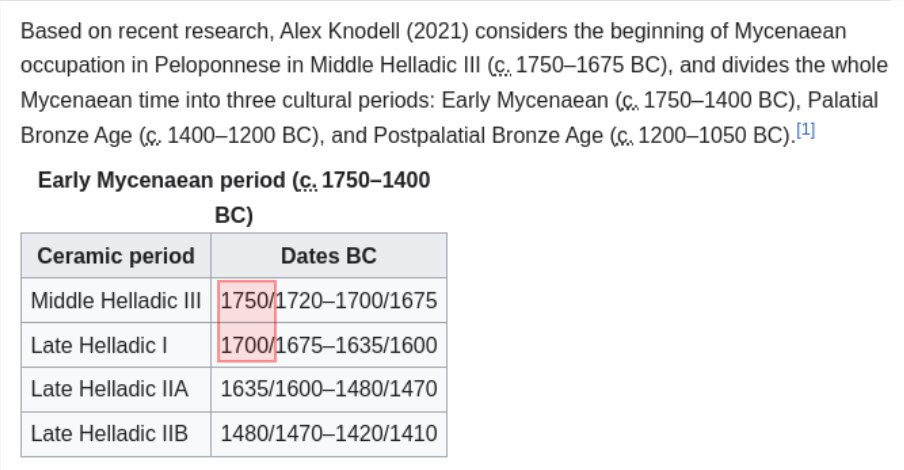
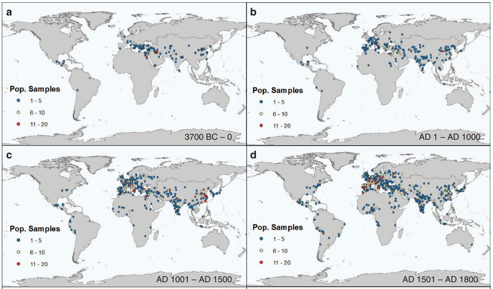
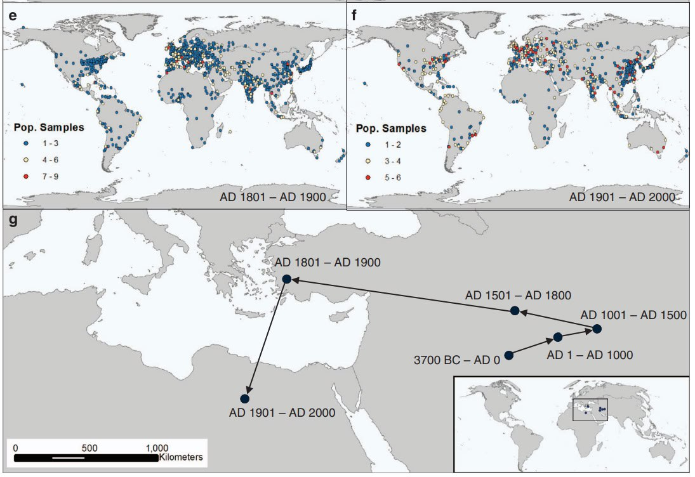
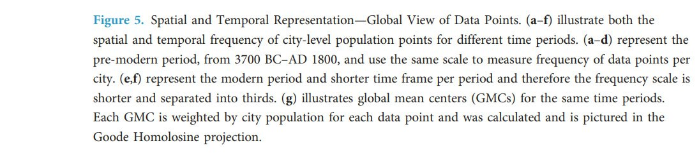
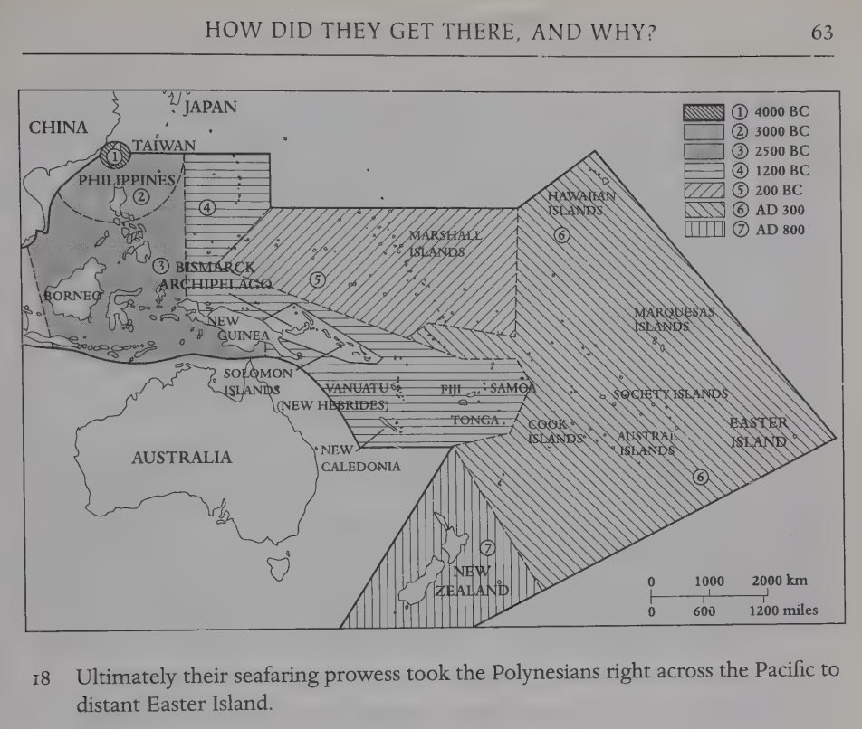

# Human Civilization and History

Human history, cities, and structures.

## Contents

Macro:
- `important-structures`: Human-built structures, such as the Khufu Pyramid, potentially related to the ECDO.
- `ancient-cities`: Cities that were destroyed or abandoned.
- `ancient-bunkers`: "Burial mounds" that seem more like bunkers.

Micro:
- `human-remains`, `important-artifacts`

Misc:
- `advanced-prehistoric-civilizations`: Did advanced prehistoric civilizations exist? How did they end?
- `oldest-cities-study`: The cities with the oldest history of inhabitation from present.

# Analysis

## Greek Dark Ages (Late Bronze Age collapse, 1200 BC)

The Greek Dark Ages (c. 1200–800 BC) "At the beginning of the Postpalatial Bronze Age, the so-called Late Bronze Age collapse of civilisation in the Eastern Mediterranean world in c. 1200–1150 BC took place, as the great palaces and cities of the Mycenaeans were destroyed or abandoned. At around the same time, the Hittite civilization also suffered serious disruption, with cities from Troy to Gaza being destroyed. In Egypt, the New Kingdom fell into disarray, leading to the Third Intermediate Period of Egypt. Following the collapse, there were fewer, smaller settlements, suggesting widespread famine and depopulation." 

The maps illustrate population distributions over the past 6ky, spanning the Greek Dark Ages period. Clear correlation where populations appear to have emerged from the same regions as the longest continuously inhabited cities.[3]

1. https://en.wikipedia.org/wiki/Greek_Dark_Ages
2. https://annas-archive.org/scidb/10.1038/sdata.2016.34
3. https://x.com/nobulart/status/1807050060376457676

## Europe Migration (Late Bronze Age collapse)

Could this have been the aftermath of an ECDO event?

Dates that come up often when investigating the ECDO. Check `EVIDENCE/cataclysm-chronology`.

## Population Sample Data

Reset @ 3,700 YBP?

https://annas-archive.org/scidb/10.1038/sdata.2016.34

## Haplogroup data

"It makes sense that lineages that have likely originated in the same or nearby region at around the same time may have experienced similar catastrophes or events / interactions that impact male line demographics and drive migrations to particular regions at particular times."

https://phylogeographer.com/20-haplogroup-heatmaps-from-various-regions-of-the-world/

## Assyrian Dark Ages (1800 BC - 1400 BC)

*"The time between the collapse of Shamshi-Adad's kingdom in the 18th century BC and the rise of Assyria in the 14th century BC is often regarded by modern scholars as an Assyrian "Dark Age" due to the lack of sufficient historical evidence to clearly establish events during this time."*

https://en.wikipedia.org/wiki/Old_Assyrian_period#Assyrian_Dark_Age

## Gap in Chinese history

"If counting from the following Shang dynasty which has been universally recognized by historians, China has only about 3,700 years of recorded history, which is still a big gap from 5,000 years."

https://en.wikipedia.org/wiki/Five_thousand_years_of_Chinese_civilization

## Polynesia History

Spread of the Polynesian seafaring nations. Note how tightly confined they were to the area around Taiwan until sometime between 4,000BC and 3,000BC. Almost as though a few survivors of the Noahic deluge sprang forth from there.
- [1] The enigmas of Easter Island, Flenley and Bahn (2003) https://archive.org/details/enigmasofeasteri0000flen

## Iberian Agriculture 5400 BC

Iberian agriculture "suddenly" appears ±5400 BC. https://sci-hub.ru/10.1016/j.jas.2015.05.007

## RT The YONAGUNI underwater monument...

RT The YONAGUNI underwater monument debate. 📍Is this a form of natural erosion? 📍Or, an ancient stone quarry from the l…