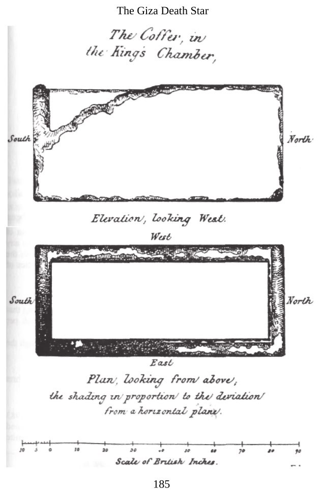
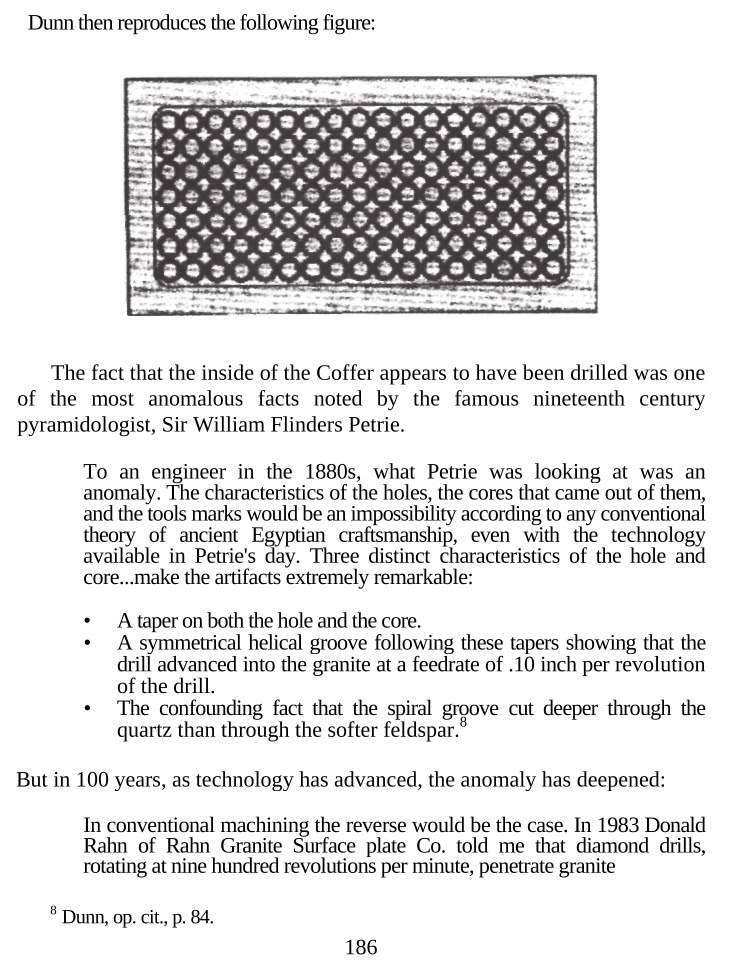
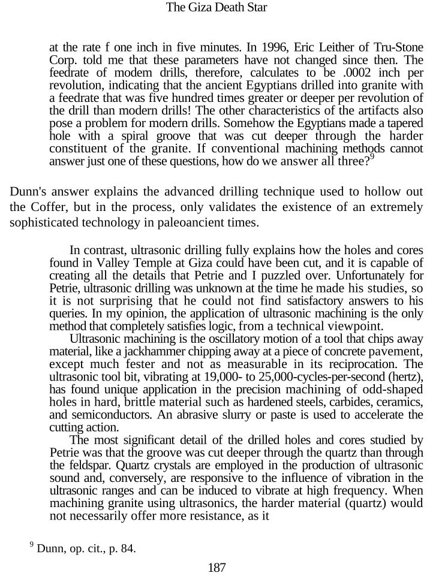
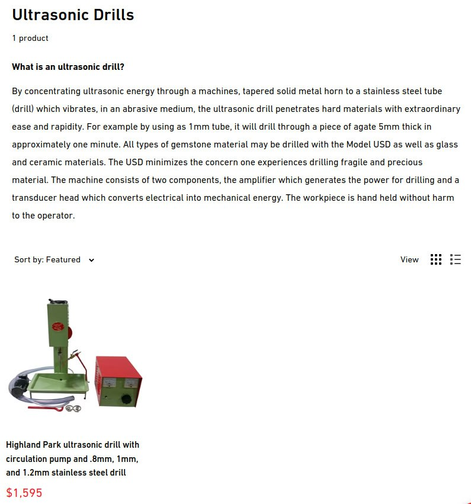
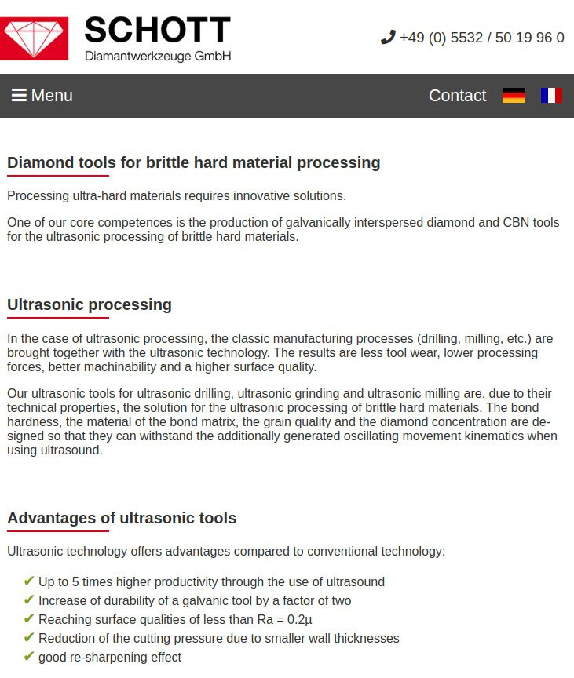
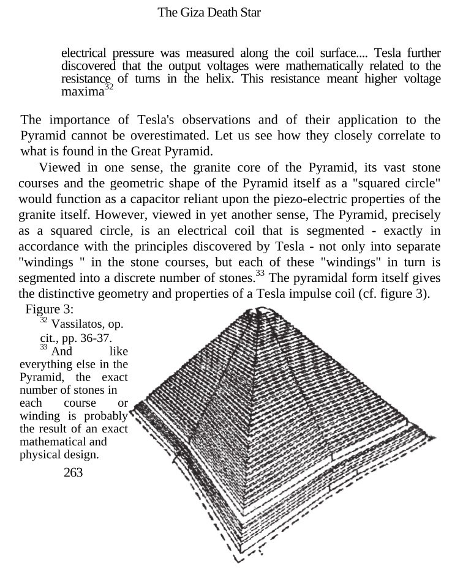
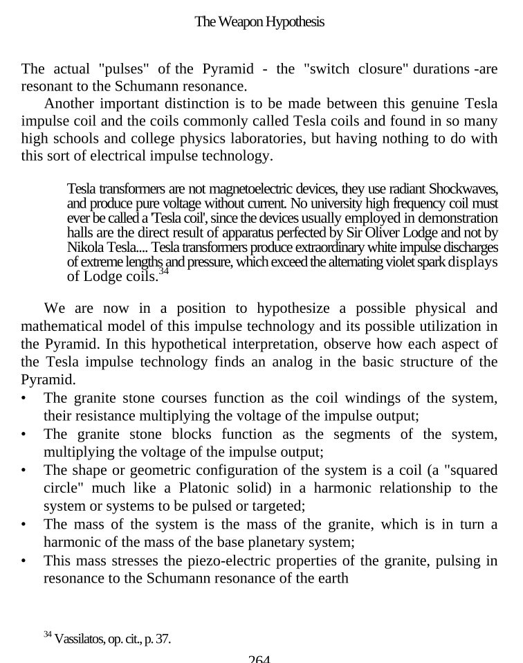

# Prehistoric Civilizations

Are prehistoric civilizations real? Or are we really the first and only advanced human civilization to ever have been on planet Earth?

## Giza Death Star Ultrasonic Drilling [1]

Seems Farrell may have been on the mark with ultrasonic drilling when he wrote that 25 years ago. This caught my attention because of our earlier discussion of the sarcophagi.

1. https://hplapidary.com/collections/ultrasonic-drills
2. https://www.schott-diamantwerkzeuge.com/brittle-hard-materials.html

## South American Mega Structures

See this [video](https://www.youtube.com/watch?v=zFl3bo0JO7E).

Website page [here](https://www.theancientconnection.com/megaliths/peru/ollantaytambo-incredible-megalithic-structures/).

## Ancient Egyptian Stonework

Advanced [Egyptian stonework](https://www.theglobaleducationproject.org/egypt/articles/hrdfact3.php), for which the methods of making have been lost.

## Indian Temples

All these ancient buildings have been cut out of one giant granite stone.

Now if you know anything about granite, you know that it's one of the strongest rocks on Earth, it's very difficult to cut granite with our machines today, not to mention lazer like precision. You can notice similar patents that were also used on the pyramids and other megalithic sites as well.

According to the Main Stream Science, Neolithic cave monkeys banged that together with their rock tools.

What do you mean that doesn't make any sense? Don't you trust science?

Let me completely clarify this for you, there is no way, not in million years that cattle people created this using some Neolithic knives and forks.

Nobulart response: Always worth checking sources. "The Lost Past" is just fishing for clicks by putting out anything that sounds interesting. They're mostly built from soft carved sandstone blocks, which were lifted and fitted without mortar. They're not neolithic. The neolithic age ended 3000 years before these were built.

## Megalithic Stone: RockRAM

Trying to create stone using the materials caveman would have. 

Basically: water glass+ash = stone.

https://natrontheory.com/

Could explain a lot of megalithic construction mysteries & questions.

Also RockRAM™

https://x.com/FoMaHun/status/1846964695330443503?s=35

And there is a Natron source: in the vulcano EMI KOUSSI https://commons.wikimedia.org/wiki/File:Emi_Koussi_crater_natron.jpg

## Ancient Water Pump Casings?

Glanced at these and thought water pump casings... 

http://youtube.com/post/UgkxW6X1ThLzHKYcz8Ijv2mufMoxdMTzTaBK?si=3ti0Shi4b3ivv1vb

# TODO

Khafre/Khufu pyramids

Giza Death Star ultrasonic drilling (see `important-structures`)

Strange artifacts, giant lords, and ancient mounds of north america: https://www.youtube.com/watch?v=qIyvBMxfCp8