# Atlantis

## Azores = Atlantis?

Azores = Atlantis?

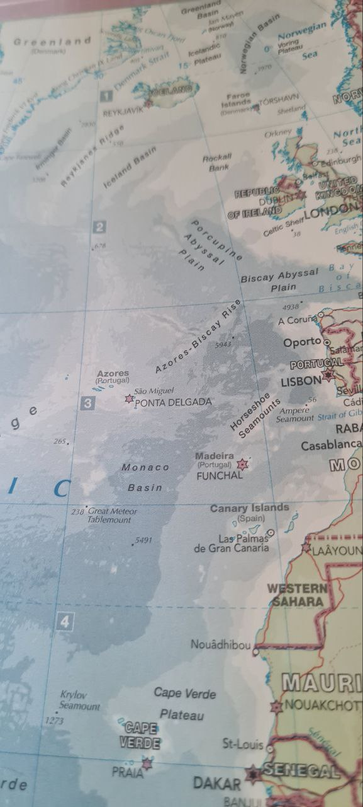

https://www.researchgate.net/publication/276500015_Megalithic_Constructions_Discovered_in_the_Azores_Portugal

"Great Meteor Tablemount". Gotta love a bit of analogue/book research. Google tells me it's the highest underwater mountain in the Atlantic named after the German ship that found it.

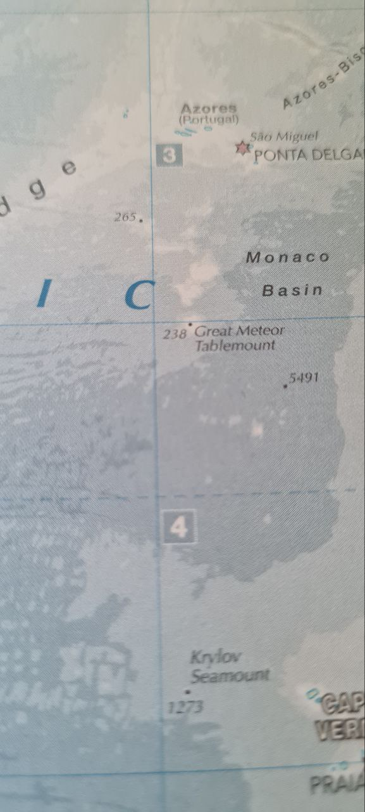

The is official narrative, a mix of Plato´s writing : including(behind hercoles columns… under water…etc…) and excluding that water went away (mud…) and adding lies : (hercoles columns = Gibraltar, Atlantis is in atlantic océan)…

There is a Book from Sergio FRAU re-questionning the positions of the hercoles columns.

## Voyage of the Atlantis

Voyage of the Atlantis. "Some of the things we found on this second cruise create new scientific puzzles. One was the discovery of prehistoric beach sand in two core samples of the bottom, brought up in one case from a depth of two and in the other nearly three and one-half miles, far from any place where beaches exist today. Sometime in the distant past this sand found deep beneath the ocean must have been located on a beach, at or near the surface of the sea. Either the land must have sunk two to three miles, or the sea must have been two to three miles lower than now." 🧵 continues in the comments...
- New Discoveries on the Mid-Atlantic Ridge, Maurice Ewing, National Geographic (November 1959)
[1] https://archive.org/details/nationalgeograph96nati

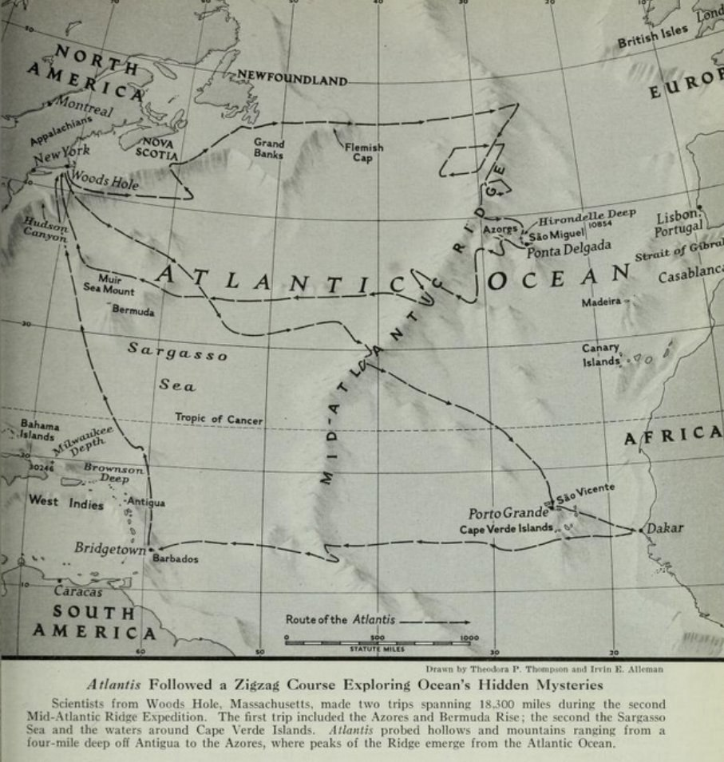

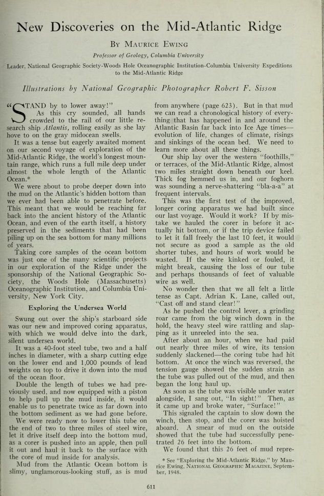

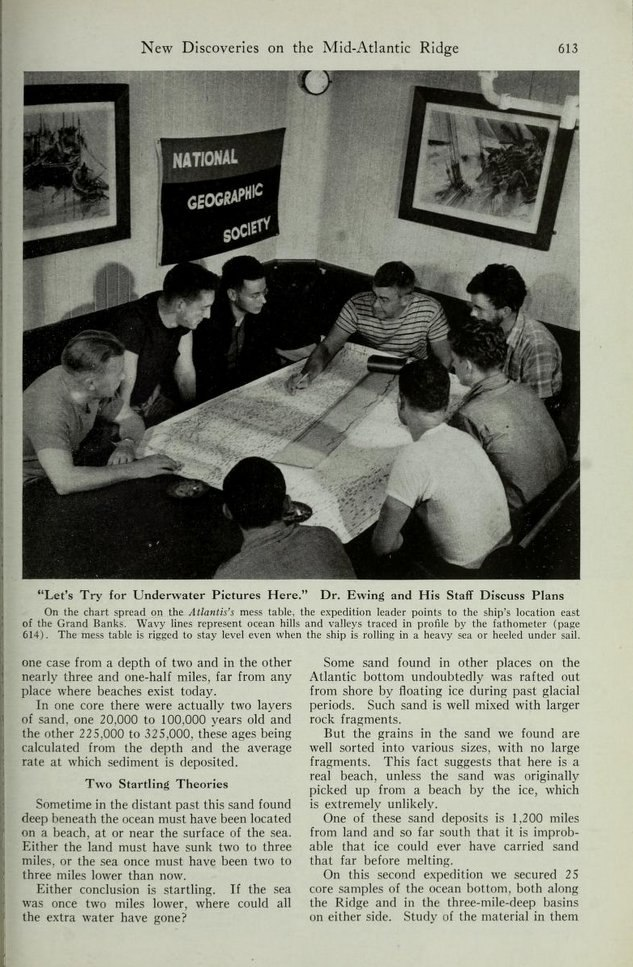

"Either conclusion is startling. If the sea was once two miles lower, where could all the extra water have gone? Some sand found in other places on the Atlantic bottom undoubtedly was rafted out from shore by floating ice during past glacial periods. Such sand is well mixed with larger rock fragments. But the grains in the sand we found are well sorted into various sizes, with no large fragments. This fact suggests that here is a real beach, unless the sand was originally picked up from a beach by ice, which is extremely unlikely. One of these sand deposits is 1,200 miles from land and so far south that it is improbable that ice could ever have carried sand that far before melting."

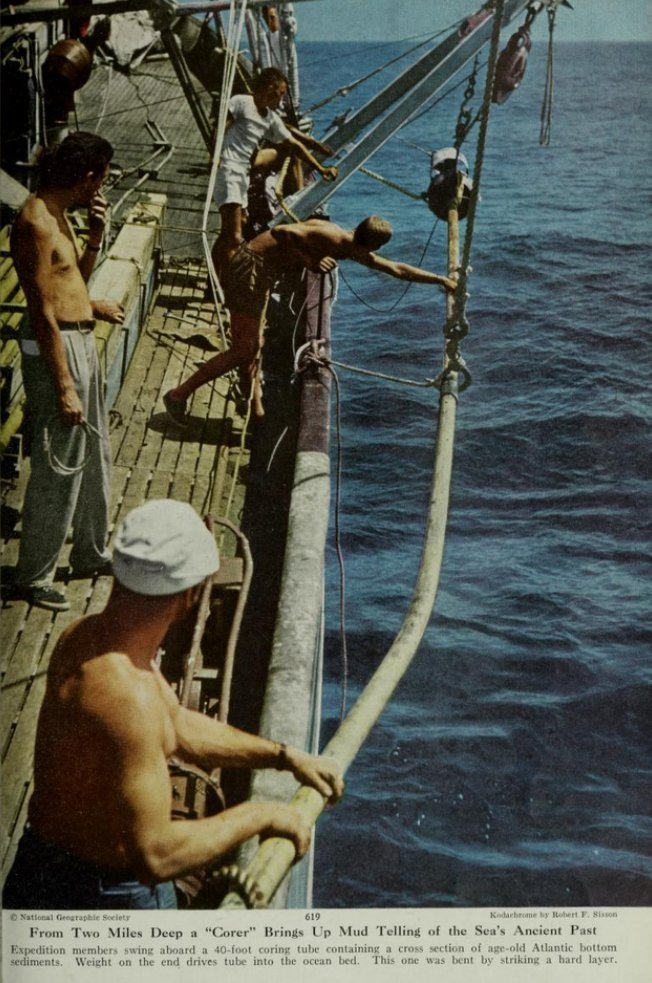

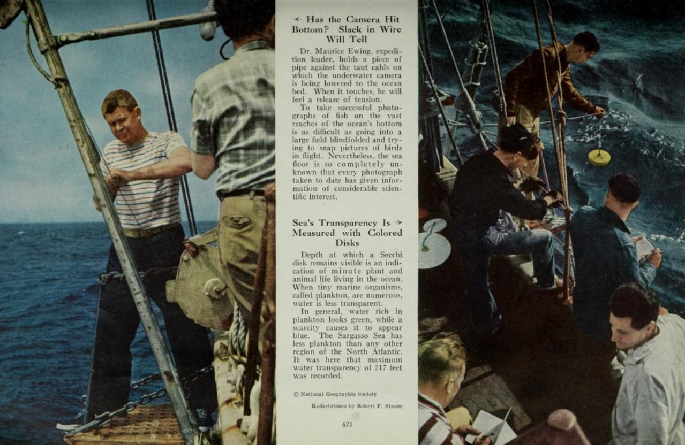

"In more than 3,000 different places over vast areas of the Atlantic we have now measured with sound echoes the depth of the sediment on top of the bedrock of the ocean floor. These measurements clearly indicate thousands of feet of sediments on the foothills of the Ridge. Surprisingly, however, we have found that in the great flat basins on either side of the Ridge this sediment appears to be less than 100 feet thick, a fact so startling that it needs further checking."

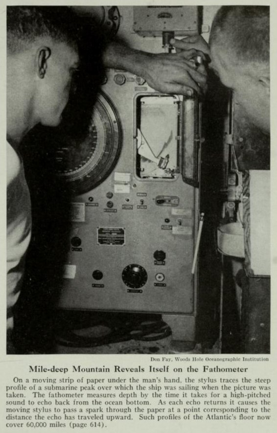

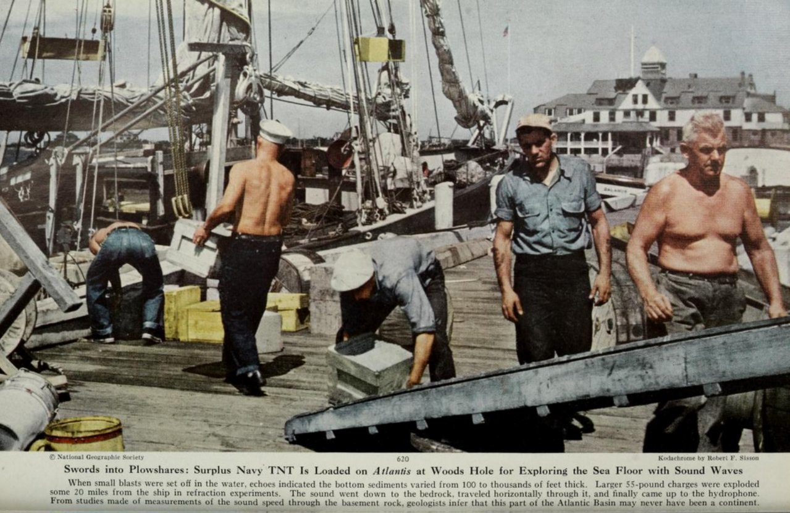

"An interesting recent discovery made with our fathometer was that the submerged canyon of the Hudson River, a continuation of the Hudson Valley, extends 100 miles farther out under the sea than anyone had known before. A few years ago the Hudson Valley was charted out under water to the edge of the continental shelf, 120 miles offshore. But on this trip our fathometer found a slight dip even farther out. We have now traced this canyon for another 100 miles across a lower, second slope on the edge of the continent, in water one and a half to two miles deep. Here the valley is two to three miles wide and 300 to 1,800 feet below the level of the shelf through which it cuts.
    If all this valley was originally carved out by the river on dry land, as seems probable, it means either that the ocean floor of the eastern seaboard of North America once must have stood about two miles above its present level and has since subsided, or else that the level of the sea was once about two miles lower than now."

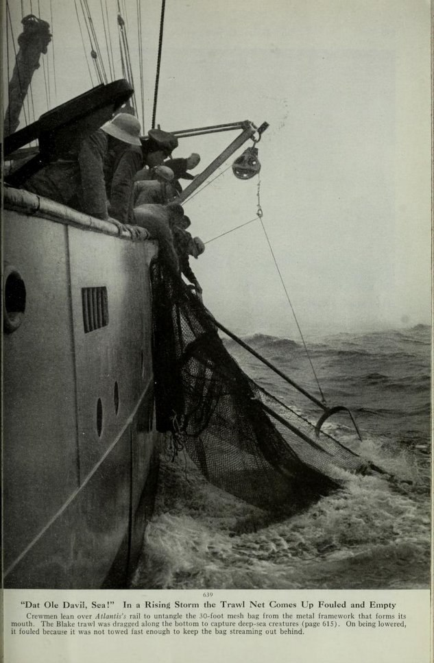

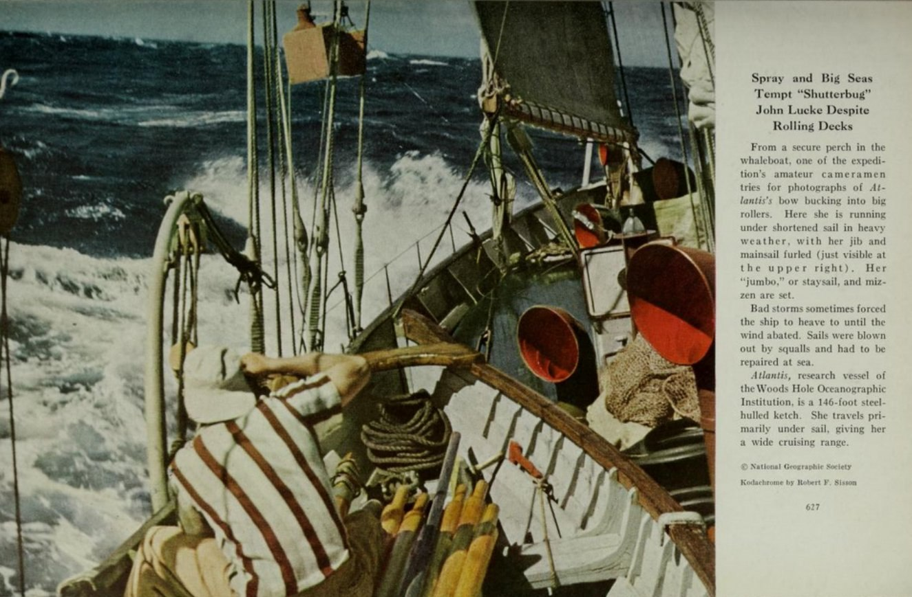

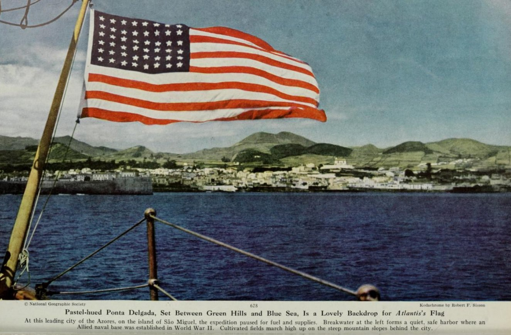

"Peaks and ranges, as rugged and precipitous as any mountain range known on land, rise about 10,000 feet above the level plains on either side. These plains average about three miles below the surface. Only a few of the Ridge's highest peaks emerge above the water surface to form the islands of the Azores, St. Paul Rocks (Rochedlos Sao Paulo), Ascension, Tristan da Cunha, Gough, Bouvet. There is no reason to believe that this mighty underwater mass of mountains is connected in any way with the legendary lost Atlantis which Plato described as having sunk beneath the waves."🤔

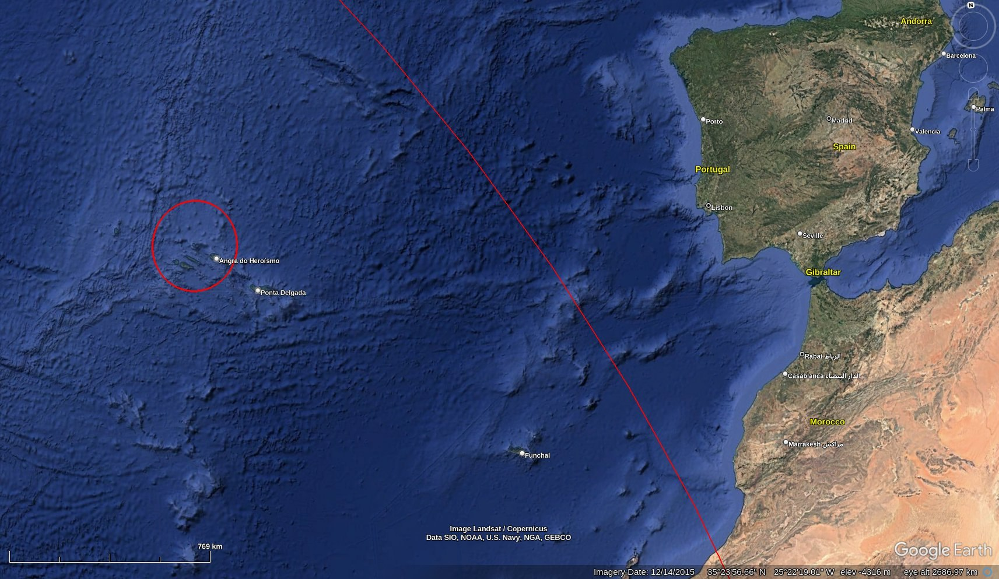

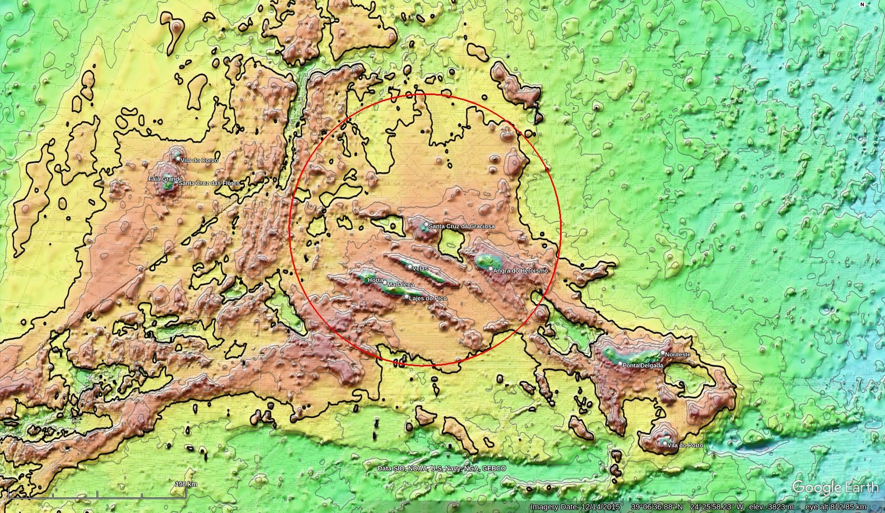

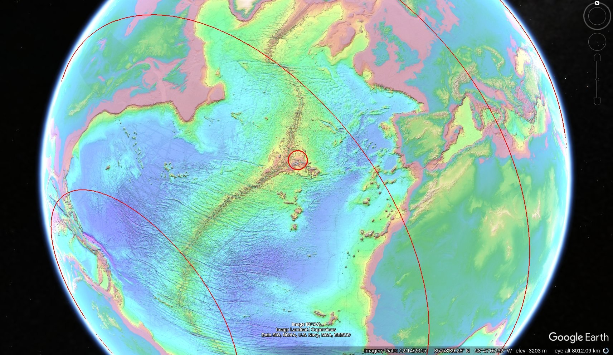

I enjoyed this paragraph in your recent addition to your website...

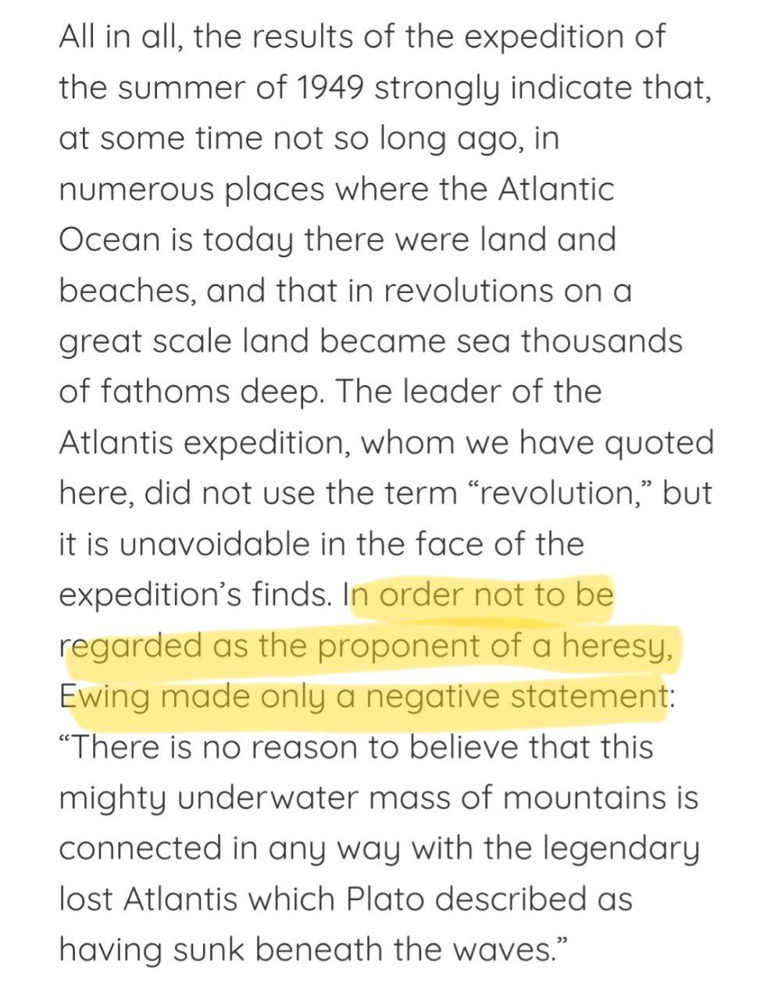

