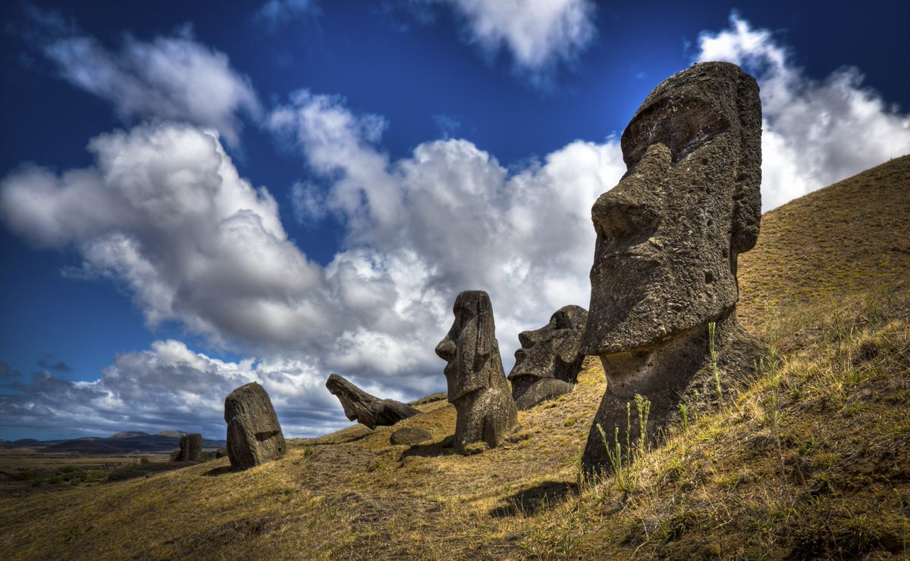

# Easter Island

## Whilst on the topic of...

Whilst on the topic of Chile, I think we can now say we have a much better idea of what buried these under meters of sediment: State 1 to State 2 and State 2 to State 1. The highest point on Easter Island is a mere 500m above sealevel. https://t.co/PuhSAUVMBY

