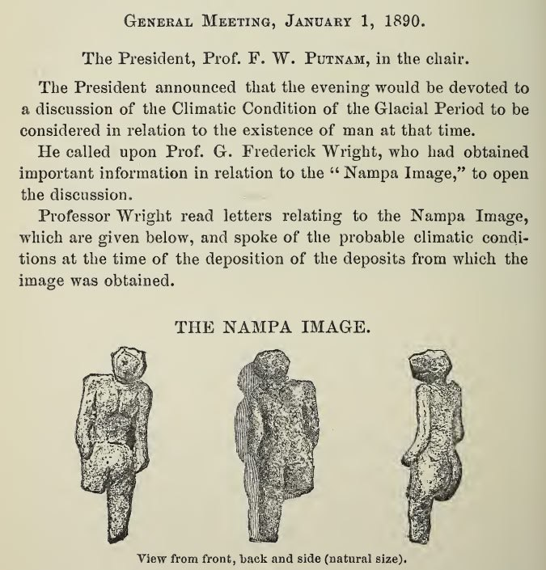
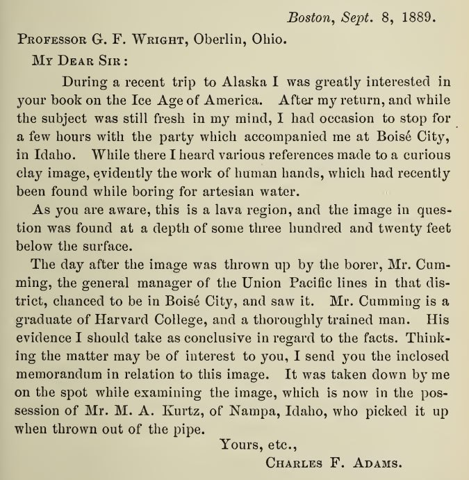

# Nampa Image

## Vid

That is neat, never heard of it before. You can still see it today: https://m.youtube.com/watch?v=xWfff8f3-AQ

We call the area the 'scab land' because its like the earth was cut and the lava just oozed up and made a massive lava basalt scab

### Nampa Image

https://m.youtube.com/watch?v=xWfff8f3-AQ