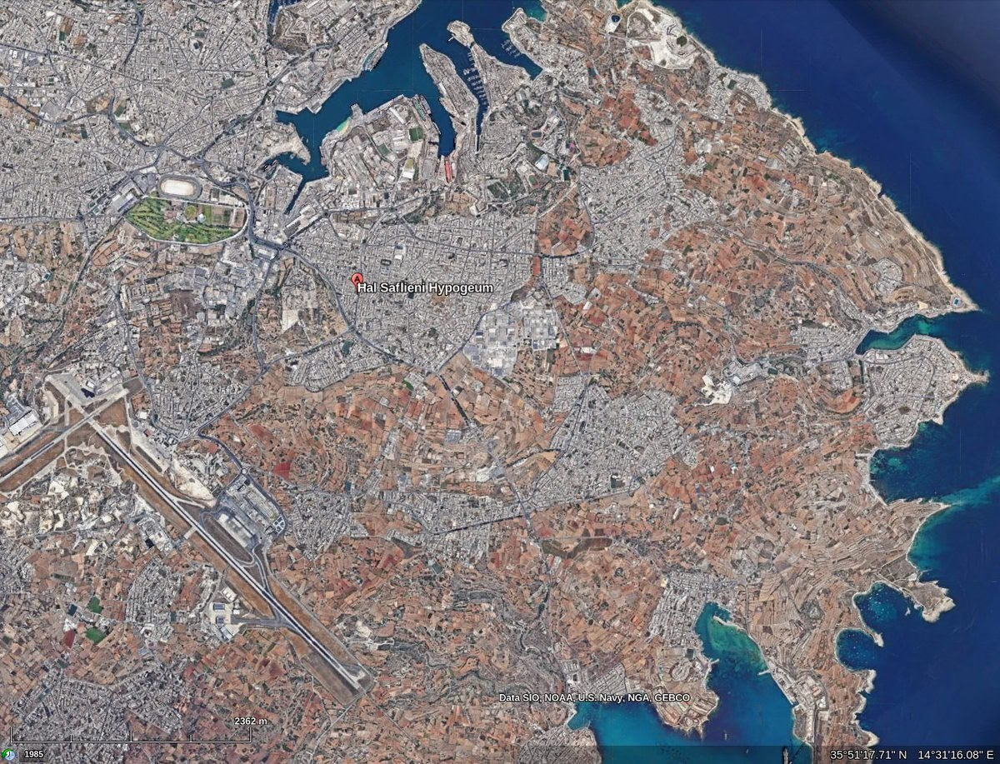

# Hal Saflieni Hypogeum

## Overview

The Ħal Saflieni Hypogeum is a Neolithic subterranean structure dating to the Saflieni phase (3300–3000 BC) in Maltese prehistory, located in Paola, Malta. It has been described as being a "refuge" which later became burial chambers... perhaps due to finding the remains of 7000 people inside. Could they have been taking refuge when they died? Thermistocles Zammit wrote an account of the discovery of this neolithic marvel in 1910, which is reproduced in the comments...
[1] https://en.wikipedia.org/wiki/%C4%A6al_Saflieni_Hypogeum

THE ĦAL SAFLIENI CAVES

On the hilltop of the new village, to the right of the road leading to Luqa, there were many caves cut into the rock around twenty years ago. Mr. Angelo Psaila, in 1902, began constructing houses between Strada Mal Saflieni and Strada Catacombe. While some wells were being dug, one of these caves—unknown to anyone—was uncovered. Since the road was higher than the foundations of the buildings, all the excess stone and debris from the builders were discarded into the cave. When the houses were finished, the government was informed of these caves, and they were purchased.

Father Manwel Magri, a Jesuit and one of the most knowledgeable about ancient works, was commissioned to clean the caves and determine their purpose and creators. However, Father Magri did not complete the task as he was sent on a mission to Tunisia, where he passed away in 1907, taking his knowledge and findings about the Ħal Saflieni caves with him. He left no writings about the caves. What a loss that Father Magri was taken so early! How much more good could he have done—such a wise, diligent, and inspired man, filled with love for his homeland and the relics left by the ancient inhabitants!

Dr. Themistocles Zammit, who oversaw the museum and the collection of antiquities, took on the task of completing the work that Father Magri had started. Within a few years, the caves were cleaned and opened to the public. And what sights they contain!

The current entrance is not the original one, as the main entrance is located beneath one of the houses on Strada Mal Saflieni. A small plot of land was purchased where a shaft and staircase were built leading downward, as the first accessible cave is about 30 spans below the street level.

These caves were carved into the rock using flint tools approximately six thousand years ago.

The entrance, located on the western side under a house on Strada Mal Saflieni, originally led through a large stone doorway. Outside, there was a building constructed with large stones, and the entrance was through a tall portal about six feet high, narrowing in the middle. Similar construction is also evident in Tarxien, Ħaġar Qim, and Mnajdra. From this entrance, the ground was excavated to create numerous caves, corridors, and chambers, all crafted with extraordinary precision and skill. Words cannot describe the craftsmanship of these caves; one must visit to truly appreciate and marvel at the ingenuity of our ancestors.

Visitors should remember that everything they see within the Hypogeum was carved using flint tools, as neither bronze nor iron had reached Malta during those times. Tools made of flint were used to dig small holes—less than an inch wide—side by side like honeycomb patterns. Once they achieved the desired depth, the stone between the holes was broken with a heavy tool. The inner sections were carefully shaped, and the walls were smoothed and polished with small stone tools. What labor-intensive work it was, and how much time it must have taken!

In some places, they painted decorations. To this day, some walls remain adorned with red ochre, with motifs resembling trees, fruits, and spirals. One ceiling even features a honeycomb pattern. Such reverence these people must have had for this sacred site they carved!

Some may ask: was it a temple? I believe it was a temple where people gathered to pay homage to the divine. Some even slept in those small niches carved in the rock, believing their god would communicate with them through dreams. Upon waking, they would recount their dreams to the priests of the temple, who would interpret them.

This practice of dream interpretation dates back to ancient times, and many cultures had places where people could sleep, dream, and consult priests for interpretation. We know that during the time of Joseph in Egypt, the Pharaoh sought Joseph's help to interpret a significant dream because he knew Joseph's previous interpretations had proven accurate.

The Hypogeum also has a chamber where one could seek advice or predictions. People have always believed in the possibility of foreseeing the future, trusting that someone with supernatural abilities could guide them. A prophet or priest would hide in a niche within the chamber, and in the silence and darkness, his voice, amplified by the acoustics, would inspire the seeker with answers to their questions.

In the Book of Kings (XXVIII:7), we read that King Saul, desperate to know the outcome of an impending battle, instructed his servants: "Find me a woman with a spirit of divination so I may consult her." His servants told him of a woman in Endor with such a spirit, and Saul sought her out. Similarly, the Ħal Saflieni caves were used for gatherings, akin to a temple, where prayers and rituals were performed to seek guidance from a higher power.

Over time, this underground temple became a sacred burial site. The remains of around seven thousand individuals were found in the Ħal Saflieni Hypogeum, along with pottery shards, beads, shell ornaments, and tools made from stone and bone.

What marvels have been uncovered at Ħal Saflieni! The craftsmanship, ingenuity, and creativity of our ancestors—dating back five to six thousand years—remain unparalleled. The people of that era surpassed others in the Mediterranean region in their ability to carve intricate caves, construct awe-inspiring buildings, craft exquisite pottery, and sculpt captivating designs in stone. 

Thus, we should honor the relics of those ancient times to show that we value our heritage and recognize its worth."

[2] https://www.um.edu.mt/library/oar/bitstream/123456789/45738/1/Il-G%C4%A7erien%20ta%27%20%C4%A6al%20Saflieni.pdf

https://tvmnews.mt/en/news/study-to-solve-mystery-of-remains-at-hal-saflieni-hypogeum/

The missing piece of the Ħal Saflieni puzzle is radiometric dating of the human remains. Over what time span did these seven thousand people perish? It seems that no such investigation has been done.

## Excerpt

"The bones were of persons of different ages, but mostly of adults. // A complete skeleton was found 51cm below the earth surface and 33cm above the rock. The skeleton is that of a male and lies on its right side in a slightly contracted position, the head resting on the right arm with the forearm bent downwards. The skeleton, which was left in situ, does not lie in a trench but is buried in the red soil among bones strewn around and upon it. No flints or vases were found near this skeleton. // No difference whatsoever between the different strata of the deposit, and the same quality of sherds were found at the surface, at the bottom and in the space between." - Zammit (1910)[1]

The red earth deposit appears to be of the same type as the topsoil found in the area surrounding Paola. This is readily seen in satellite photography. I shared Zammit's descriptions with GPT for an assessment against the refuge theory:

"The evidence from Themistocles Zammit’s report on the Ħal Saflieni Hypogeum strongly suggests that the human remains were scattered and intermingled within a sedimentary deposit layer approximately 1 meter thick. This raises the intriguing possibility that these remains could be the result of a catastrophic event, such as a sudden inundation, rather than traditional sequential burials.

1. Supporting Points for an Inundation Scenario:
1.1 Scattered and Intermingled Bones:Zammit noted that the bones were not laid in an organized manner, such as in trenches or sepulchers, but rather were found “strewn about out of their natural position.” This disorder is consistent with a sudden event like a flood, where bodies could be disarticulated and scattered.
1.2 Compact Sedimentary Deposit: The compact layer of sediment encasing the remains might indicate a rapid deposition event, such as one caused by water-borne materials settling after an inundation. This aligns with geological phenomena seen in other mass burial or catastrophic events.
1.3 No Evidence of Habitual Use: Zammit ruled out habitation or intentional burial spaces, which further suggests that the accumulation of remains might have been due to an unexpected and sudden event.
1.4 Possible Contexts of Refuge: The Hypogeum’s subterranean layout and relative isolation could have made it an ideal place for people to seek shelter in the event of a sudden natural disaster, such as a tsunami or flooding. Similar theories have been proposed for other ancient sites.

2. Alternative Explanations:
2.1 Extended Use: If radiocarbon dating were conducted and revealed a wide age range for the remains, this would support a scenario of prolonged use as a burial site, rather than a singular catastrophic event.
2.2 Cultural Practices: The scattering and mixing of remains could also result from ritualistic secondary burials, a common practice in some Neolithic societies.

3. Testing the Hypothesis:
To confirm or refute the inundation theory:
3.1 Radiocarbon Dating: Dating the remains could establish whether they all date to a specific short period, indicating a single event, or span centuries.
3.2 Sediment Analysis: Examining the sediment for signs of waterborne deposition, such as marine microfossils or stratification patterns, could confirm an inundation event.
3.3 Comparative Analysis: Comparing the site to other known inundation-related mass burial sites might provide parallels." [GPT]

[1]https://books.google.co.za/books?id=oHhXAAAAMAAJ

## Excerpts

[3] https://books.google.co.za/books?id=oHhXAAAAMAAJ

## Red soil

Red soil everywhere

