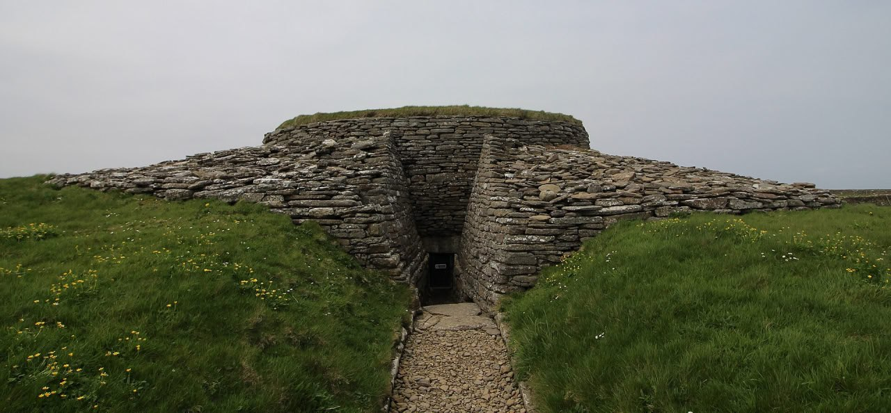
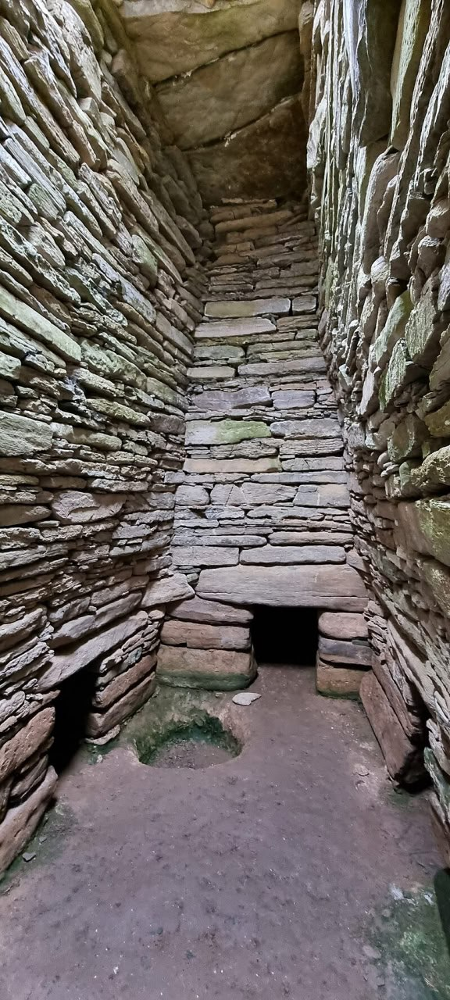
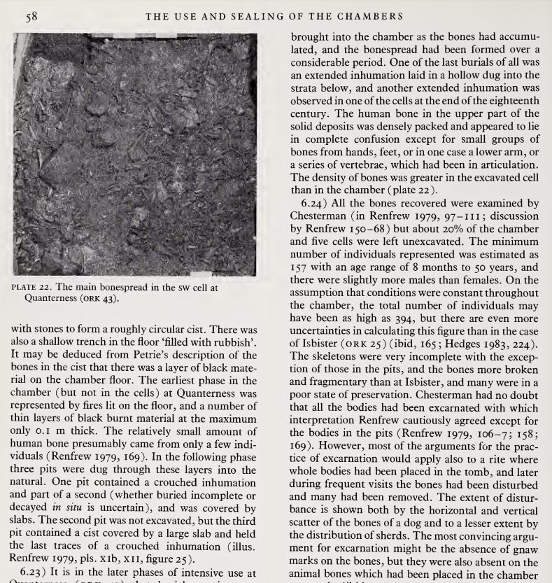

# Quoyness, Scotland

## Quoyness Chambered Cairn

Tomb or failed bunker? "Quoyness chambered cairn is a Neolithic burial monument located on the island of Sanday in Orkney, Scotland. Similar to Maeshowe in design, the tomb was probably built around 3000 BC. The cairn was excavated by James Farrer and George Petrie in 1867. The site was originally believed to be a broch, but after excavation, the antiquarians determined that the site was a chambered cairn.[4] During excavation, a stone-lined cist was found in the south corner of the primary chamber. Skeletal remains of at least ten adults and possibly four children were discovered in the cist. Several other skeletal remains were found in the side cells and in the entrance passage. Farrer left most of the human bones in the chamber. Other artefacts were also recovered, including animal bones, stone tools,[5] sherds of pottery and two spiked slate objects and a large bone pin with a knob on the shank."
[1] https://en.wikipedia.org/wiki/Quoyness_chambered_cairn

