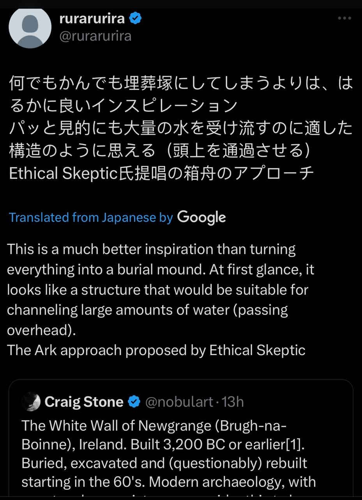
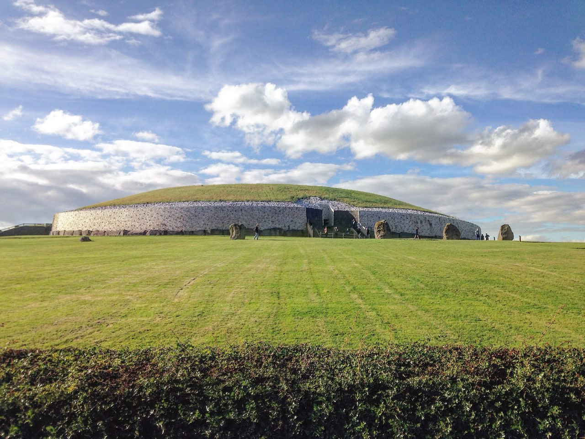

# White Wall of Newgrange (Ireland) [1]

The White Wall of Newgrange (Brugh-na-Boinne), Ireland. Built 3,200 BC or earlier[1]. Buried, excavated and (questionably) rebuilt starting in the 60's. Modern archaeology, with spectacular consistency, consider this to have been a burial place. As with most Neolithic "burial" mounds or "passage tombs", the entrance at Newgrange faces southeast [2], though not all of them are strictly aligned to the Winter Solstice sun, suggesting that the choice of orientation may have another purpose.

During an ECDO State 1 to State 2 event [3], the water would come from the NNW. The interior of the mound is elevated approximately 1.5-2.0m which, in combination with the "closing stone" now lying flat at the entrance, may have been intended to reduce flooding of the interior. I have my doubts that these would have been sufficient measures, hence the human remains found inside.

Dated cross-sections of the "slip" layers which only appear in front of the cairn on the SSE side look remarkably like waterborne deposits in their tapering teardrop forms, almost as though water traversed the structure from the NNW to the SSE depositing diluvium in the lee of the mound.[4] Could these structures have been built to shelter the living rather than the dead?

1. https://en.wikipedia.org/wiki/Newgrange
2. https://newgrange.com/newgrange-plans.htm
3. https://theethicalskeptic.com/2024/05/12/exothermic-core-mantle-decoupling-dzhanibekov-oscillation-ecdo-theory/
4. https://knowth.com/newgrange-book.htm .

With a maximum elevation of just over 1,000m and an average of approximately 118m, Enki's secret house under the sea would seem to be the most viable survival option here.

http://www.stone-circles.org.uk/stone/

## Location Analysis

"It was made without mortar, which is remarkable considering not a single dop of water has made it inside this passage tomb. We are in Ireland where it rains all the time. /// The remains of five people were found in the tomb. Three that were cremated and two who had been left alone. (???) /// Given the immense amount of time and energy to construct these tombs, archaeologists and art historians and others have wondered if maybe there were other uses for this because of that solar alignment."

https://youtu.be/YEvWbUZZEzs

## O'Kelly Book Quotes

Selected interesting notes from the first pages of O'Kelly's book, Newgrange:

"The interstices of the roof were caulked with a mixture of burnt soil and sea sand to render them waterproof and from this mixture two radiocarbon dates centering on 2500 BC were obtained for the structure of the tomb." [p22. This suggests that construction was started ±3200 BC but only completed generations later. This is one of many examples of deliberate waterproofing efforts].

"Since the floor of the passage and chamber of the tomb follows the rise of ground of the hill on which the monument is built there is a difference of almost 2m in floor level between the entrance and the interior of the chamber." [p21. A possible drainage/waterproofing measure.]

"The roof rises as it approaches the chamber and at its entrance is 3.6m high. The chamber is cruciform, containing three recesses or side-chambers. It measures 5.25m from its entrance to the back of the north or end recess and 6.55m from the back of the west recess to the back of the east recess." [p21. This seems like a cramped, but adequate space for a family to use as temporary shelter].

"Bone fragments representing a small number of people, as well as grave-goods typical of Irish passage-graves, were found when the floor of the tomb was excavated. Apart from these no further finds were made." [p23. What crazy logic spends probably generations building something to bury 5 people who couldn't have even been born at the start of construction?]

"Outside it, however, in the cairn slip and beyond, there were extensive finds associated with a later settlement of the Late Neolithic/Beaker period." [p23. The Beaker period ended in 1700 BC - this gives us a possible date upon which the cairn was overtopped.]

"We know that after the cairn had started to collapse there was a Beaker-period occu- pation of around 2000 bc outside the southern part of the mound but no trace of this was found in the tomb so the entrance must by then have been hidden. Nor was there any sign inside the tomb of the gold coins and ornaments of Romano-British type deposited around the edge of the collapsed mound and on the mound itself during the early centuries of the Christian era." [pp.24-25]

"The mouth of the passage had originally been closed by a stone which exactly fitted the aperture, but this was no longer in place in 1699." [p.25]

"The question arises as to when and by whom the closing
stone was levered back. It has been generally assumed that Newgrange was one of the tombs plundered by the Norsemen in the ninth century, but the evidence is dubious." [p.25]

"Lucas has pointed out, the raiders were probably more interested in supplies of food and these were available in the larder, that is, in the vam (the ‘cave’ or souterrain), an underground structure ideally suited for the preservation of essential commodities in normal times, and for the temporary preservation of life and limb in abnormal ones" [p.26]

"Mr Charles Campbell told me since (who was the Second man that went into the Cave upon its first Discovery) that he found the skull and bones of a man in one of those Cisterns and the bones of another humane Body Lying on the Ground in another part of the Cave somewhat remote from the Cistern." They built this structure to honor the dead by leaving their bodies lying around on the floor? [p.27]

## Investigative Process

The White Wall of Newgrange (Ireland). Built sometime before 3,200 BC. Entirely buried. Excavated and rebuilt starting in the 60's. This thing looks like a bunker.

[1] https://en.wikipedia.org/wiki/Newgrange

The mere fact that something so enormous was completely buried at some point is interesting in itself.

Looking a little more at Newgrange. The water would come from the NNW. The entrance is well oriented to reduce inundation whilst still serving as an annual time marker. The interior of the mound is elevated above ground level. Any water which gained the entrance would have to be forced uphill to flood the chamber.

1. http://www.carrowkeel.com/sites/boyne/newgrange2d.html
2. https://www.newgrange.com/newgrange-plans.htm

Crossections of the deposit layers in front of the cairn. The layer under all of it dating to ±2100 BC (4100 BP)

The stone slides look remarkably like diluvial deposits in their tapering form. People do not lay material down like this.

The cairn included a "closing stone" seen lying flat in front of the entrance.

Seems that most of these mounds were sited with southeasterly facing entrances, but they're not all strictly oriented to the sun, suggesting that this may not have been the reason for the choice of alignment.

Are those mega current ripples right across Ireland to the north and west of Newgrange? Can anyone find some decent LiDAR for these areas?

Excellent observation. When I was researching that post I had the thought that the mound reminded me of the Enki submarine. The story of Gilgamesh actually seems to describe a sealed land ark. Not a boat.

As alluded to by @rararuri [2], Newgrange is quite reminiscent of the circular Enki submarine described by @EthicalSkeptic [3]. The current (rebuilt) mound averages 270 feet in diameter, but there is much conjecture about the diameter of the original mound.

"Gilgamesh’s friend Enkidu, who shares many adventures with him, is called ‘son of the fish’ by a monster called the Huwawa. After they had founded the Sumerian civilization the fish-men, or Oannes as they were called, were said to have gone to the secret hideaway of the god Enki, who lived in a perfect cube under the sea. The patron god of the Seven Sages was Enki, who warned Ziusudra to construct an ark in which to save the seed of mankind. The ark is built as a replica of Enki’s secret house beneath the seas, so was also in the form of a perfect cube. Here are the instructions Enki gave to Ziusudra, taken from Robert Temple’s translation: Tear down your hut of reeds, build of them an ark. Abandon things, seek life, give up possessions, keep your soul alive and take into the ark the seed of all living creatures. The ark you will build will have dimensions carefully measured. Its length and its width shall be equal and roof it as I have my subterranean watery abyss." - Uriel's Machine [4]

Perhaps these were intended to ward off the water.

This design is found across the isles all the way up to Orkney and Skara Brae. Reminds of the two pivots with direction arrows.

These are from Knowth. Another pair of pivots with a six-volved spiral between them, and a possible calendar (also with two more six-volved spirals).

https://www.knowth.com/

## Citations

1. [Craig Stone](https://nobulart.com)
2. https://x.com/rurarurira/status/1834789858466054394
3. https://theethicalskeptic.com/2024/05/12/exothermic-core-mantle-decoupling-dzhanibekov-oscillation-ecdo-theory/
4 https://archive.org/details/urielsmachinepre0000knig