# Destroyed Cities

## Bab-edh-Dhra [2,3]

"Some biblical scholars argue that this was the site of "Sodom".[4] Other archaeologists disagree."

"Unlike the neighboring ruins of Numeira, Bab edh-Dhra does not appear to have been destroyed by a significant fire.[6] Numeira and Bâb edh-Dhrâʿ were destroyed at different times, about 250 years apart. While the early conclusions of Rast and Schaub, that Bâb edh-Dhrâʿ and Numeira were both destroyed at approximately the same time (i.e., 2350–2067 BC), are often reported, it is now known that their individual destruction was separated by approximately two and a half centuries (250 years), with the destruction of Bâb edh-Dhrâʿ at ca. 2350 BC[7][8][9] and Numeira at ca. 2600 BC.[10][9] Instead, archaeological evidence suggests that the site was abandoned by its inhabitants, but also "suffered exposure to fire"."

### Tombs

"The most remarkable feature of Early Bronze Bab edh-Dhra is the number of graves. While the population apparently numbered only 1,000 individuals, an estimated 20,000 tombs are located on-site. These family tombs would have held approximately half a million people and over 3 million pottery vessels. Rather than understanding them as a cemetery for semi-nomads, a better explanation is that they were a central burial ground for the country as a whole."

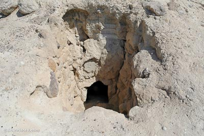

"The most common type of tomb is the “shaft grave.” A vertical shaft about 6 feet (1.8 m) deep was cut through the soft limestone. Off this shaft one to five chambers were cut, each of which could hold four to six individuals and was approximately 7 feet (2.1 m) in diameter and 3 feet (0.9 m) high. Often, many pottery pieces were around the bone pile. Shaft graves are typical to the Intermediate Bronze period, but they also date to Early Bronze I at Bab edh-Dhra."

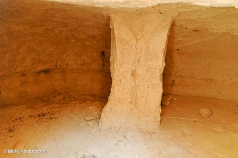

## Canaanite palace from 3700 years ago

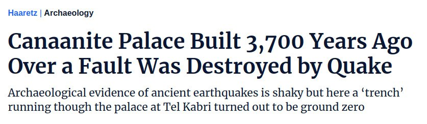

“It really looks like the earth simply opened up and everything on either side of it fell in,” Cline said. “It’s unlikely that the destruction was caused by violent human activity because there are no visible signs of fire, no weapons such as arrows that would indicate a battle, nor any unburied bodies related to combat.”

“You put everything together – no fire, quick collapse, no gradual disintegration of the roof – this is equal to a violent event that caused the collapse and that big crack cutting through the palace in the orientation of the fissure,” says Yasur-Landau. “You don’t need to be Sherlock in order to deduce that this was the result of a geological event."

https://www.haaretz.com/archaeology/2020-09-13/ty-article/.premium/canaanite-palace-built-on-a-fault-was-destroyed-by-quake-3-700-years-ago/0000017f-f0fd-df98-a5ff-f3fd07000000
- Mirror: https://archive.is/gy2xq

## Ankara, Turkey break in history 1700 BC - 1000 BC

Due to destruction by an earthquake.

## Catal Huyuk 5400 BC

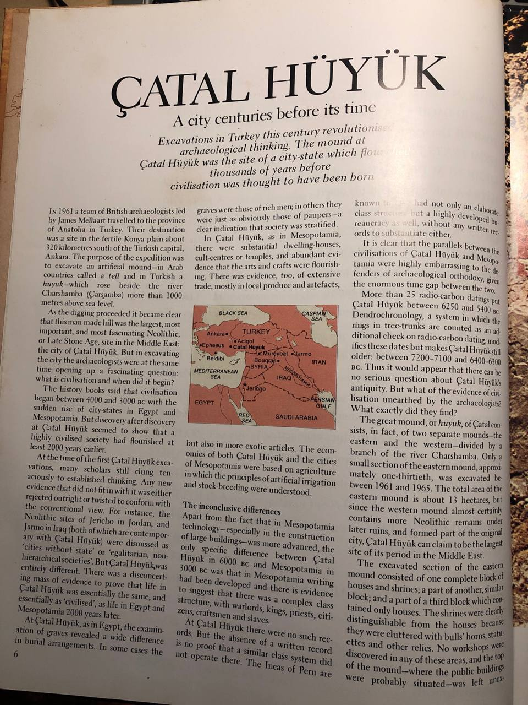
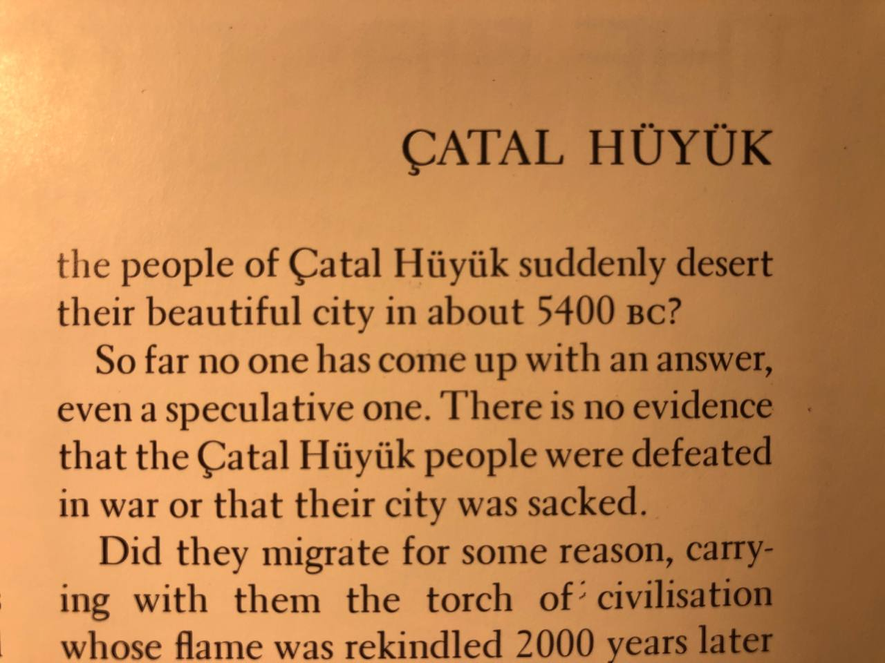

Çatal Hüyük is a tell of a very large Neolithic and Chalcolithic proto-city settlement in southern Anatolia, which existed from approximately 7500 BC to 6400 BC and flourished around 7000 BC. Excavation revealed 18 successive layers of buildings signifying various stages of the settlement and eras of history.[1] 

The mystery of this site has to do with its abandonement. Why did the people of Çatal Hüyük suddenly desert their beautiful city in about 5400 BC? So far no one has come up with an answer, even a speculative one. There is no evidence that the Çatal Hüyük were defeated in war or that their city was sacked. It is one of the great puzzles of history. The people of Çatal Hüyük vanished.[2]

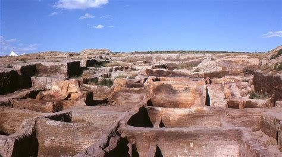
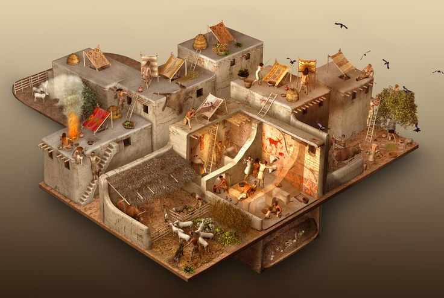
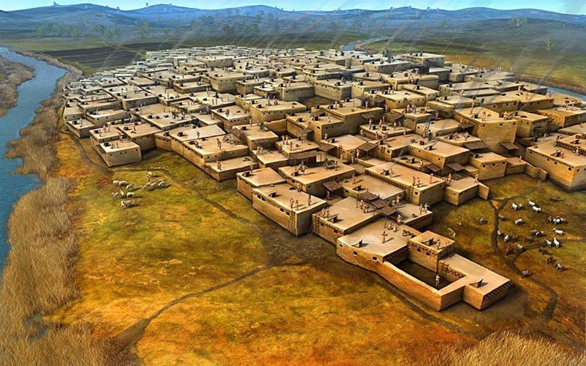

In Çatal Hüyük we find another temporal marker for a possible event 7,400 years before present (two 3,700-year (V) planetary harmonic cycles BP).

1. https://en.wikipedia.org/wiki/%C3%87atalh%C3%B6y%C3%BCk
2. https://archive.org/details/vanishedciviliza0000read

## Longxi Gansu

Mudflood Buildings, A road crew accidentally stumbled upon this while building a road thru Longxi, Gansu, China

See `img` for video.

## Chaco Canyon (Great Basin): 1130 - 1450 climate instability and abandonment [1]

"Chaco Culture National Historical Park is a United States National Historical Park in the American Southwest hosting a concentration of pueblos."

"Climate change is thought to have led to the emigration of Chacoans and the eventual abandonment of the canyon, beginning with a fifty-year drought commencing in 1130."

"The cohesive Chacoan system began unravelling around 1140, perhaps triggered by an extreme fifty-year drought that began in 1130;[28] chronic climatic instability, including a series of severe droughts, again struck the region between 1250 and 1450."

"Some scholars suggest that violence and warfare, perhaps involving cannibalism, impelled the evacuations. Hints of such include dismembered bodies—dating from Chacoan times—found at two sites within the central canyon.[34] Yet Chacoan complexes showed little evidence of being defended or defensively sited high on cliff faces or atop mesas. Only several minor sites at Chaco have evidence of the large-scale burning that would suggest enemy raids."

## The Early Initial Period Fishing Settlement of Gramalote, Moche Valley: A Preliminary Report (hard copy here)

"Pampas Gramalote was a Prehispanic fishing village near the town of Huanchaco, Peru that existed between 2000 and 1200 B.C."

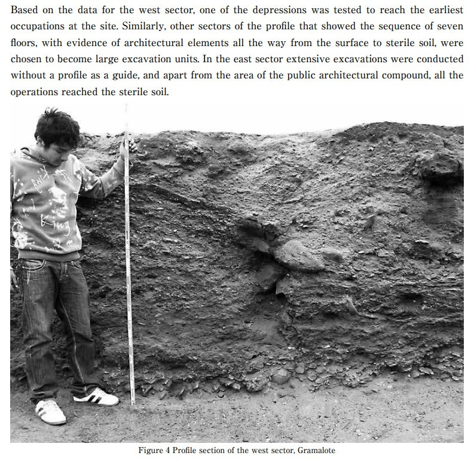

Seven sedimentary "floors". That looks a lot like alluvial deposit to me.

Ash-sand-ash-sand... more than once.

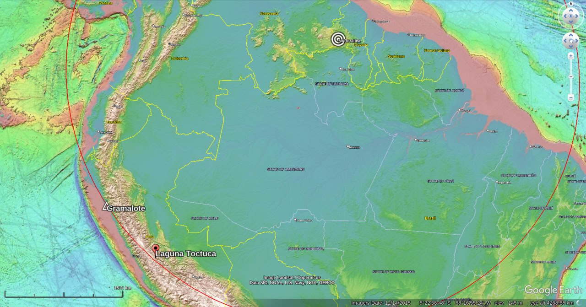

Gramalote ECDO context.

https://www.academia.edu/8157849/The_Early_Initial_Period_Fishing_Settlement_of_Gramalote_Moche_Valley_A_Preliminary_Report

### Gramalote Quotes

In general terms the site has a calibrated absolute dating that range from 1500 to 1200 B.C. which is the early part of the Initial Period in the Moche valley. Recent dates obtained from the Cortijo Phase at the Caballo Muerto Complex show a similar range, between 1600-1100 B.C. (Chauchat et al. 2006: 233-4; Nesbitt et al. 2008: 266, Tabla 2; Nesbitt 2012: 199). The similarity in the ceramic assemblages (although some diferences have been observed which will be discussed later) as well as the corresponding subsistence patterns indicate a consistent correspondence between the two sites during this early period. This new data, that comes from secure archaeological contexts help us narrow the extent of the Gramalote occupation from Billman's suggestion of 1750-1310 B.C. to 1500-1200 B.C.

Phase 1 (1500-1400 B.C.)

Preliminary results suggest that the site was inhabited by a small population, perhaps a few households who were engaged in specialized ishing and small- scale gardening. Based on current evidence it is possible that no more than 50-100 people inhabited the site during Phase 1. This calculation has been made using the surface exposed during the excavations and the loor area of the houses (Kolb 1985). In addition, ethnographic data from the surrounding area was considered in relation to number of people per household and the area of the house itself.

Phase 2 (1400-1300 B.C.)

During this phase, the population of Gramalote increased signiicantly. Indeed, I will argue that
the total extent of the site, as we know it today, was reached during this phase. As a working hypothesis I suggest that the population increased up to 200-300 inhabitants during Phase 2.

Phase 3 (1300-1200 B.C.)

This is the latest occupation at Gramalote and is a period of abandonment of the domestic
sector. In contrast, it seems to show increased ritual activity in and around the Public Architectural Compound. This conclusion is based on the fact that there is a concentration of ceramic vessels, seafood and macro-botanical remains in and around the Public Architectural Compound. But more important is the fact that only two houses were identified in the west sector, the same area where seven houses existed during Phase 2.

The most salient feature is that the two houses are smaller than in previous phases and very poorly built, re-using buried walls from abandoned structures (Figure 15). It seems that most of the architecture was made using mats and other perishable elements. Beyond that, it
is remarkable that in the outer patios of these provisional houses, up to three special storage facilities were found. Storage rooms have not been reported for previous phases in Gramalote. These are rectangular (1x1 meters) semi-subterranean storage rooms that have a small window on its western wall, probably meant for loading in the products. They were hermetically closed and roofed with shaped kisos (coral-like blocks), beach stones and mud mortar (Figure 16).

As a working hypothesis, I would like to suggest that after a period of plentiful marine resources, the food supplies available to Gramalote inhabitants started to diminish (especially sharks, sea lions and mollusks). Then, possibly, a number of rules had to be set in order to preserve these resources, which subsequently produced social tension over who had the right to exploit certain products. Social tension might also have arisen as the result of certain families specializing in the exploitation of speciic products and then ighting for their control. Apparently, during Phase 3 the exploitation and consumption of marine products were controlled by the Public Architectural Compound, and possibly decided to whom and when they gave the right to exploit the resources mentioned. Alternatively, the Public Architectural Compound also started to control the exchange of the marine products with other communities, creating disagreement within the community of Gramalote. There is also very strong evidence that by the end of the occupation, people started to get more resources from rocky beaches, which still today are found in Huanchaco bay. Interestingly enough, later settlements of the Salinar, Gallinazo, Moche, Chimu, Chimu-Inca, Colonial, Republican and even modern eras favored Huanchaco bay as a more suitable spot to live. The abandonment of Gramalote and the location of modern Huanchaco are key to understanding the adaptation of this ishing community through time and choice to relocate their settlement. Many more ideas can be put on the table but all of them are, at this point of this research, speculative. More investigations in the area are needed to understand this complex process of adaptation that helps a maritime community survive until today. It is clear though, that multiple factors may have caused the abandonment of Gramalote.

## Noah's Flood Reconsidered: Kish flood deposits: Sumer flood 3500 - 2600 BC (hard copy here)

"In a recent issue of this journal Prof. Mallowan reviewed the historical evidence for the flood described in the biblical story of Noah. In the table that he prepared three floods are noted at Kish. Two of them occurred in c. 2900 B.C. and rely for their identification on evidence of water-deposited material in the streets and damage to mud-brick walls: the third, the latest and most violent, dated to c. 2600 B.C. was again identified by evidence from the streets and deposited an average of 40 cm. of water-borne material—that is about sixteen inches. The same table read in conjunction with the text (p. 80), indicated for Shurrupak (Fara) a deposit of clay and sand of about 60 cm. thickness over an “ordinary patch of charcoal and ashes” above the Jamdat Nasr level and below the Early Dynastic: it is dated to c. 2850 B.C. AS these levels are dated c. 3000 B.C. and c. 2850 respectively, I suppose that the flood deposit could have occurred at any intervening date, but that specific evidence suggests 2850 B.C.

For Ur the table records flood deposits from 3·72 to 0·72 metres thick in c. 3500 B.C. at the end of the ‘Ubaid period (the text records greater depths) and deposits of unknown depth dated to c. 2700 B.C."

- Kish, Iraq, two 2900 BC floods, one 2600 BC flood
- Shurrupak (Fara), 3000 BC charcoal and ashes, 2850 BC flood deposit
- Ur: 3500 BC and 2700 BC deposits

https://www.cambridge.org/core/journals/iraq/article/abs/physical-evidence-for-noahs-flood/226A2701813C09C5CD25BCA17C8E5074

## NOAH'S FLOOD RECONSIDERED (hard copy here)

"History has indeed preserved abundantevidence of former Mesopotamian floods, ever since the third millennium B.C. We have a reference in the prayer of Gudea of Lagash(zznd centuryB.C.) which runs: " Roaring like the waters pouring out (through a breach in the dyke) Destroying cities like the flood wave ".12 A year date of Ibbi-Sin,who ruled over Ur in about o00oB.C., was namedaftera deluge " which obliteratedthe bounds of heaven and earth", but Ur survived and no tracesof this particularflood were found, presumably becausethe inevitablemud and sand had been clearedaway afterwards. About two centurieslater (i 8th centuryB.C.) there is a date formulaof Hammurabiof Babylon naming a year in which a great flood had destroyed the city of Eshnunna;'3 then, after a lapse of about eight centuries (ioth century B.C.) there comes a referencein the reign of Nabu-mukin-apalto a severe flood, this time in Babylon itself, which preventedthe chariotof Mardukfrom leaving the temple, and it is easy to imagine the streetsof the city awash with the waters of the Euphratesduring the spring festival"

"It thus seems not unreasonableto assumethat the Flood happenedsome time before the reign of Gilgamesh,let us say before z650 B.C. How much before? That question we cannot yet answer becausewe have no means of discovering when Utnapishtimlived as a mortal man: we are only told that when he met Gilgamesh he had alreadybecome a god, but we do not know for how many years he had then been a god; for guidance we can only turn to the Sumerian King Lists which name more than a score of rulers of Kish between the Flood and En-me-barages"

"In a schematicsection publishedby Watelin46four flood levels arenoted above the watertable, althoughin all other accountsthe records do not mention more than three, and these are as follows: the highest of them lay at I-75 m. below plain-level and had an average thickness of 0 40 cm.;47 the two lower ones were of lesser dimensions and appearto have occurredat the beginning of the Early Dynastic period for they were associatedwith the "first city building level ".48 These flood deposits were most clearlystratified in a street, and it appears that they had been violent enough to necessitate repairs in the walls which flanked it. The street walls had however been sufficientlystrong to protect the houses, wherein tracesof flood debriswere on that account less obtrusive, and moreover in several places the debris was presumedto have been clearedaway by the occupants. Traces of the floods could be discernedboth by beds of potsherdswhich had sunk to the bottom of standingwater and by beds of mud and sand. Watelin suggested that deposits of grey clay might be attributedto flowing water shedding itself of organic matter,and that yellow clay remainedin places where there had been standing water.49 A more detailedanalysiswould be needed to confirmthese observa- tions. However that may be, the topmost, or latest was the most violent of the floods observed at Kish and at first Watelin was inclined to associate it with " Noah's "."

"So much for Kish. Is there any other evidence which can be used for identificationof the historicalFlood? The answeris yes, and for that we must consider the site of Fara, the ancient Shuruppakwhere tracesof the Noachian Flood might confidentlybe expectedsince, as we have alreadyseen, Utnapishtim reigned in that city at the time of the disaster, and there, according to the legend he received warning of it."

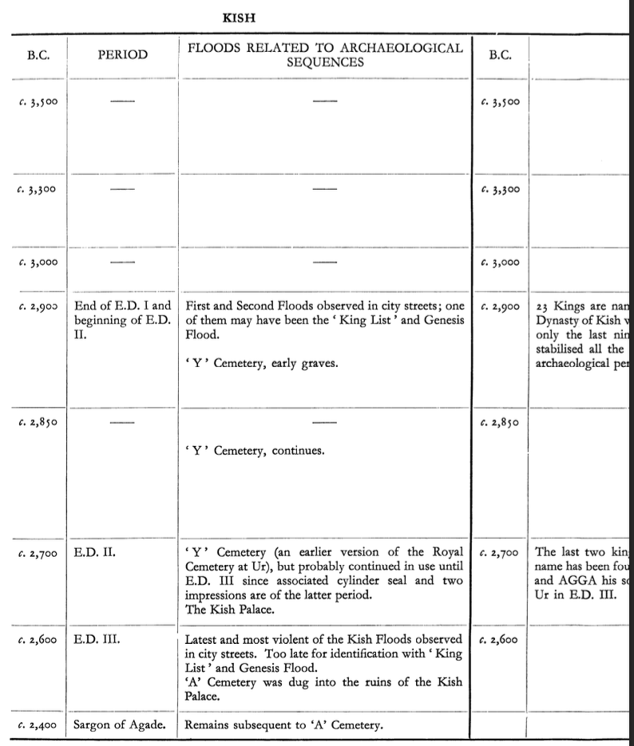
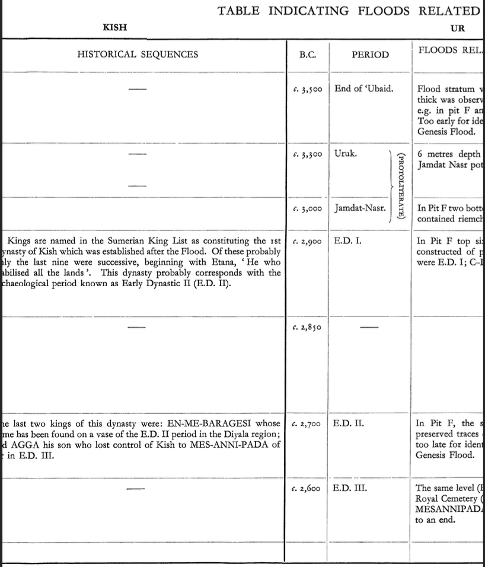
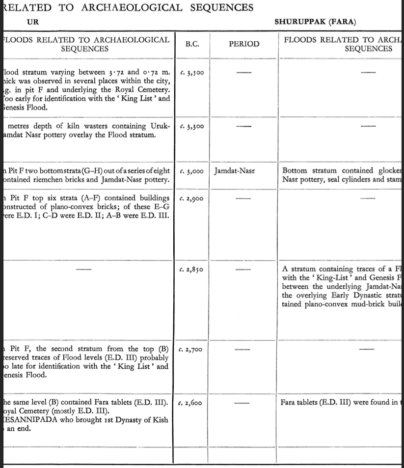
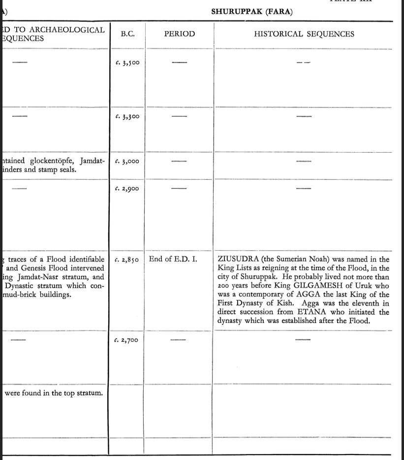

## Vitrified forts in Scotland

Dates to around 150 AD.

1. https://www.sciencedirect.com/science/article/abs/pii/S2352409X19304080
2. https://en.wikipedia.org/wiki/Vitrified_fort

## Ugarit (Apparently Destroyed 1200 BC) [4]

"The polity was at its height from c. 1450 BC until its destruction in c. 1185 BC;[5] this destruction was possibly caused by the purported Sea Peoples, or an internal struggle."

## Harappa [5]

"The earliest recognisably Harappan sites date to 3500 BC. This early phase lasts till around 2600 BC. The civilization's mature phase lasted from 2600 BC to 2000 BC. This is when the great cities were at their height. Then, from around 2000 BC, there was a steady disintegration that lasted till 1400 BC – what is usually called Late Harappan.[12] There is no sign that the Harappan cities were laid waste by invaders. The evidence strongly points to natural causes.s"

## Bubastis, Egypt 2890-2686 BC chasm

"In a later account by the Greek historian Manetho, it's stated that a "chasm opened near Bubastis and many perished" during the reign of Hotepsekhemwy in the Second Dynasty." [6]

https://en.wikipedia.org/wiki/Bubastis

"The Second Dynasty of ancient Egypt (or Dynasty II, c. 2890 – c. 2686 BC[1]) is the latter of the two dynasties of the Egyptian Archaic Period, when the seat of government was centred at Thinis."

## Massif Rouge (hard copy here)

"The full results of the excavation are not presented here. Our main conclusions were the following. As stated, Parrot had recognized two phases. The study of the monuments established that there existed at least five phases, three assigned to ville II (2500–2300 BCE) and two to the ville III of Mari (2250–1759 BCE)."

"During the excavations of the Great Trench, Parrot discovered a founda- tion deposit typical of the early second city and this first stage of the massif is dated to the beginning of the ville II, that is around 2500 BCE (Butterlin/Gallet 2016)."

"This monument was enlarged twice during the history of the ville II as it was established in a trench in the northern part of the Massif itself. The last enlarge- ment probably occurred after major destruction, and the Massif was enlarged towards the north and the east, acquiring its typical trapezoidal shape at this time."

"The massive gypsum blocks of masonry were erected at this time and it appears after our excavations that this operation did not just create a protecting wall but in fact involved the building of a massive terrace of gypsum stones, up to 2 m long and 4 m high (Figure 4). This huge construction was not visible: at the southwest- ern corner where Parrot had not excavated, we found that the stone walling was covered by a heavy red wash of earth, 10 cm deep. It covered the upper part of the masonry, while the lower part was in foundations, under the level of the so-called voie sacrée which runs along the eastern façade of the building. At this stage, the Massif occupied a surface of more than 1200 m². This monument, like the rest of the city, suffered major damage at the fall of the ville II and was exposed for a long time to erosion which cut especially deeply into the eastern part of the monument, damaging even the structure of the first stage of the monument which therefore cannot be safely reconstructed in its entirety.

"After the sack of the city, the monument remained abandoned until the reign of Apil Kin, ca. 2100 BCE. "

## Citations

1. https://en.wikipedia.org/wiki/Chaco_Culture_National_Historical_Park
2. https://en.wikipedia.org/wiki/Bab_edh-Dhra
3. https://www.bibleplaces.com/babedhdhra/
4. https://en.wikipedia.org/wiki/Ugarit
5. https://en.wikipedia.org/wiki/Harappa
6. https://en.wikipedia.org/wiki/Bubastis

# TODO

Cities to investigate:
- Nimrud
- Susa
- Tell Abu Hureyra