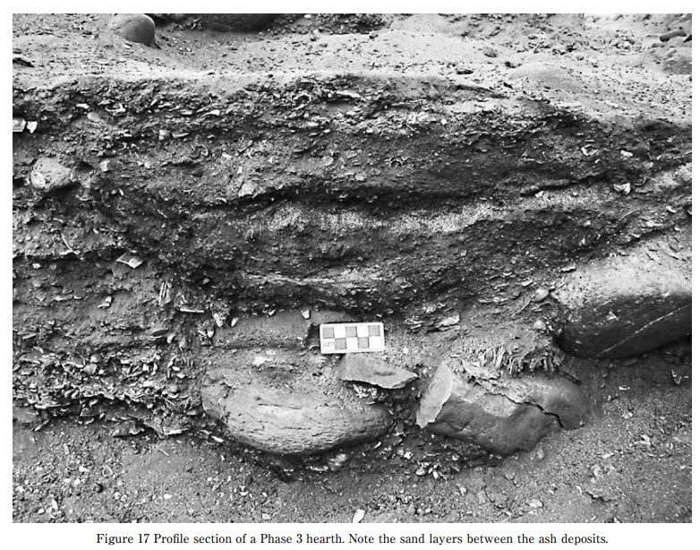

# Destroyed Cities

## Canaanite palace from 3700 years ago

“It really looks like the earth simply opened up and everything on either side of it fell in,” Cline said. “It’s unlikely that the destruction was caused by violent human activity because there are no visible signs of fire, no weapons such as arrows that would indicate a battle, nor any unburied bodies related to combat.”

“You put everything together – no fire, quick collapse, no gradual disintegration of the roof – this is equal to a violent event that caused the collapse and that big crack cutting through the palace in the orientation of the fissure,” says Yasur-Landau. “You don’t need to be Sherlock in order to deduce that this was the result of a geological event."

https://www.haaretz.com/archaeology/2020-09-13/ty-article/.premium/canaanite-palace-built-on-a-fault-was-destroyed-by-quake-3-700-years-ago/0000017f-f0fd-df98-a5ff-f3fd07000000
- Mirror: https://archive.is/gy2xq

## Ebla

"Starting as a small settlement in the Early Bronze Age (c. 3500 BC), Ebla developed into a trading empire and later into an expansionist power that imposed its hegemony over much of northern and eastern Syria.[2] Ebla was destroyed during the 23rd century BC. It was then rebuilt and was mentioned in the records of the Third Dynasty of Ur. The second Ebla was a continuation of the first, ruled by a new royal dynasty. It was destroyed at the end of the 3rd millennium BC, which paved the way for the Amorite tribes to settle in the city, forming the third Ebla. The third kingdom also flourished as a trade center; it became a subject and an ally of Yamhad (modern-day Aleppo) until its final destruction by the Hittite king Mursili I in c. 1600 BC."

Ebla. Estimated destruction and final abandonment c.~1600BC. This date could well be erroneous, as it was arrived at by attributing the destruction to the Hittite conquests at that time, with no solid evidence linking the two. Pure speculation. This could easily have fallen around 1700BC.
- [https://books.google.co.za/books?id=E1aF0hq1GR8C&lpg=PA211&pg=PA211#v=onepage&q&f=false
- https://en.wikipedia.org/wiki/Ebla

## Ankara, Turkey break in history 1700 BC - 1000 BC

Due to destruction by an earthquake.

## Catal Huyuk 5400 BC

Çatal Hüyük is a tell of a very large Neolithic and Chalcolithic proto-city settlement in southern Anatolia, which existed from approximately 7500 BC to 6400 BC and flourished around 7000 BC. Excavation revealed 18 successive layers of buildings signifying various stages of the settlement and eras of history.[1] 

The mystery of this site has to do with its abandonement. Why did the people of Çatal Hüyük suddenly desert their beautiful city in about 5400 BC? So far no one has come up with an answer, even a speculative one. There is no evidence that the Çatal Hüyük were defeated in war or that their city was sacked. It is one of the great puzzles of history. The people of Çatal Hüyük vanished.[2]

In Çatal Hüyük we find another temporal marker for a possible event 7,400 years before present (two 3,700-year (V) planetary harmonic cycles BP).

1. https://en.wikipedia.org/wiki/%C3%87atalh%C3%B6y%C3%BCk
2. https://archive.org/details/vanishedciviliza0000read

## Longxi Gansu

Mudflood Buildings, A road crew accidentally stumbled upon this while building a road thru Longxi, Gansu, China

See `img` for video.

## Chaco Canyon (Great Basin): 1130 - 1450 climate instability and abandonment [1]

"Chaco Culture National Historical Park is a United States National Historical Park in the American Southwest hosting a concentration of pueblos."

"Climate change is thought to have led to the emigration of Chacoans and the eventual abandonment of the canyon, beginning with a fifty-year drought commencing in 1130."

"The cohesive Chacoan system began unravelling around 1140, perhaps triggered by an extreme fifty-year drought that began in 1130;[28] chronic climatic instability, including a series of severe droughts, again struck the region between 1250 and 1450."

"Some scholars suggest that violence and warfare, perhaps involving cannibalism, impelled the evacuations. Hints of such include dismembered bodies—dating from Chacoan times—found at two sites within the central canyon.[34] Yet Chacoan complexes showed little evidence of being defended or defensively sited high on cliff faces or atop mesas. Only several minor sites at Chaco have evidence of the large-scale burning that would suggest enemy raids."

## The Early Initial Period Fishing Settlement of Gramalote, Moche Valley: A Preliminary Report (hard copy here)

Seven sedimentary "floors". That looks a lot like alluvial deposit to me.

Ash-sand-ash-sand... more than once.

Gramalote ECDO context.

### Quotes

In general terms the site has a calibrated absolute dating that range from 1500 to 1200 B.C. which is the early part of the Initial Period in the Moche valley. Recent dates obtained from the Cortijo Phase at the Caballo Muerto Complex show a similar range, between 1600-1100 B.C. (Chauchat et al. 2006: 233-4; Nesbitt et al. 2008: 266, Tabla 2; Nesbitt 2012: 199). The similarity in the ceramic assemblages (although some diferences have been observed which will be discussed later) as well as the corresponding subsistence patterns indicate a consistent correspondence between the two sites during this early period. This new data, that comes from secure archaeological contexts help us narrow the extent of the Gramalote occupation from Billman's suggestion of 1750-1310 B.C. to 1500-1200 B.C.

Phase 1 (1500-1400 B.C.)

Preliminary results suggest that the site was inhabited by a small population, perhaps a few households who were engaged in specialized ishing and small- scale gardening. Based on current evidence it is possible that no more than 50-100 people inhabited the site during Phase 1. This calculation has been made using the surface exposed during the excavations and the loor area of the houses (Kolb 1985). In addition, ethnographic data from the surrounding area was considered in relation to number of people per household and the area of the house itself.

Phase 2 (1400-1300 B.C.)

During this phase, the population of Gramalote increased signiicantly. Indeed, I will argue that
the total extent of the site, as we know it today, was reached during this phase. As a working hypothesis I suggest that the population increased up to 200-300 inhabitants during Phase 2.

Phase 3 (1300-1200 B.C.)

This is the latest occupation at Gramalote and is a period of abandonment of the domestic
sector. In contrast, it seems to show increased ritual activity in and around the Public Architectural Compound. This conclusion is based on the fact that there is a concentration of ceramic vessels, seafood and macro-botanical remains in and around the Public Architectural Compound. But more important is the fact that only two houses were identified in the west sector, the same area where seven houses existed during Phase 2.

The most salient feature is that the two houses are smaller than in previous phases and very poorly built, re-using buried walls from abandoned structures (Figure 15). It seems that most of the architecture was made using mats and other perishable elements. Beyond that, it
is remarkable that in the outer patios of these provisional houses, up to three special storage facilities were found. Storage rooms have not been reported for previous phases in Gramalote. These are rectangular (1x1 meters) semi-subterranean storage rooms that have a small window on its western wall, probably meant for loading in the products. They were hermetically closed and roofed with shaped kisos (coral-like blocks), beach stones and mud mortar (Figure 16).

As a working hypothesis, I would like to suggest that after a period of plentiful marine resources, the food supplies available to Gramalote inhabitants started to diminish (especially sharks, sea lions and mollusks). Then, possibly, a number of rules had to be set in order to preserve these resources, which subsequently produced social tension over who had the right to exploit certain products. Social tension might also have arisen as the result of certain families specializing in the exploitation of speciic products and then ighting for their control. Apparently, during Phase 3 the exploitation and consumption of marine products were controlled by the Public Architectural Compound, and possibly decided to whom and when they gave the right to exploit the resources mentioned. Alternatively, the Public Architectural Compound also started to control the exchange of the marine products with other communities, creating disagreement within the community of Gramalote. There is also very strong evidence that by the end of the occupation, people started to get more resources from rocky beaches, which still today are found in Huanchaco bay. Interestingly enough, later settlements of the Salinar, Gallinazo, Moche, Chimu, Chimu-Inca, Colonial, Republican and even modern eras favored Huanchaco bay as a more suitable spot to live. The abandonment of Gramalote and the location of modern Huanchaco are key to understanding the adaptation of this ishing community through time and choice to relocate their settlement. Many more ideas can be put on the table but all of them are, at this point of this research, speculative. More investigations in the area are needed to understand this complex process of adaptation that helps a maritime community survive until today. It is clear though, that multiple factors may have caused the abandonment of Gramalote.

## Kish flood deposits: Sumer flood 3500 - 2600 BC

https://www.cambridge.org/core/journals/iraq/article/abs/physical-evidence-for-noahs-flood/226A2701813C09C5CD25BCA17C8E5074

## Citations

1. https://en.wikipedia.org/wiki/Chaco_Culture_National_Historical_Park
2. https://en.wikipedia.org/wiki/Ebla
