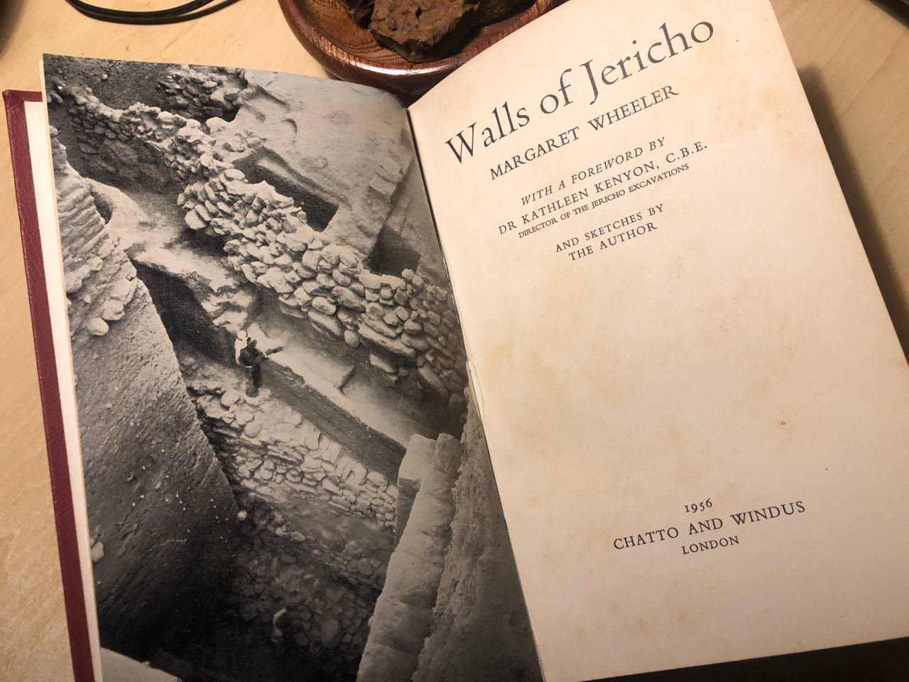
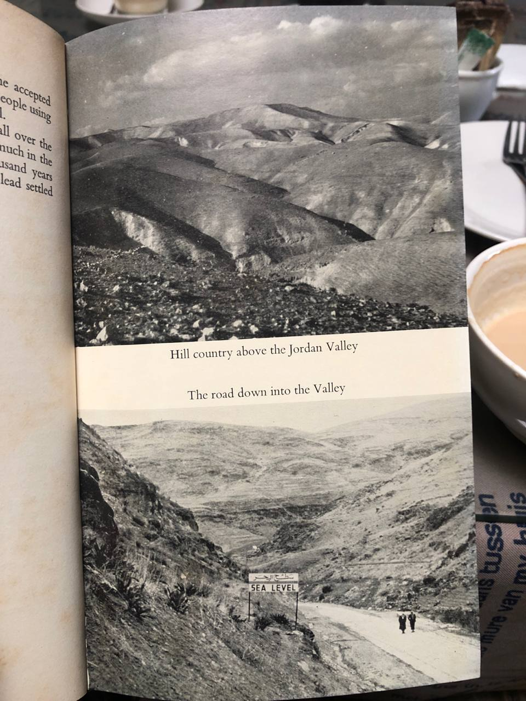
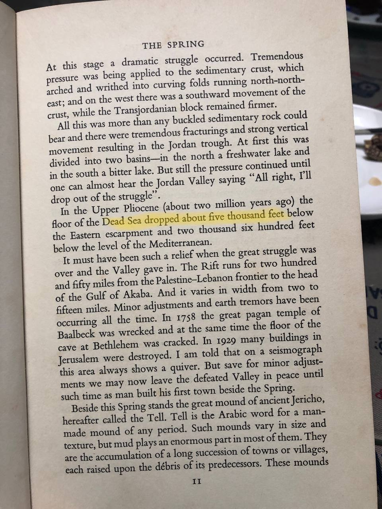
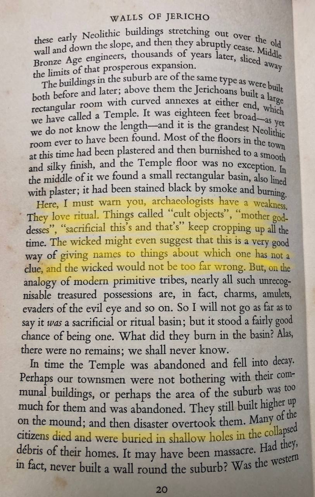
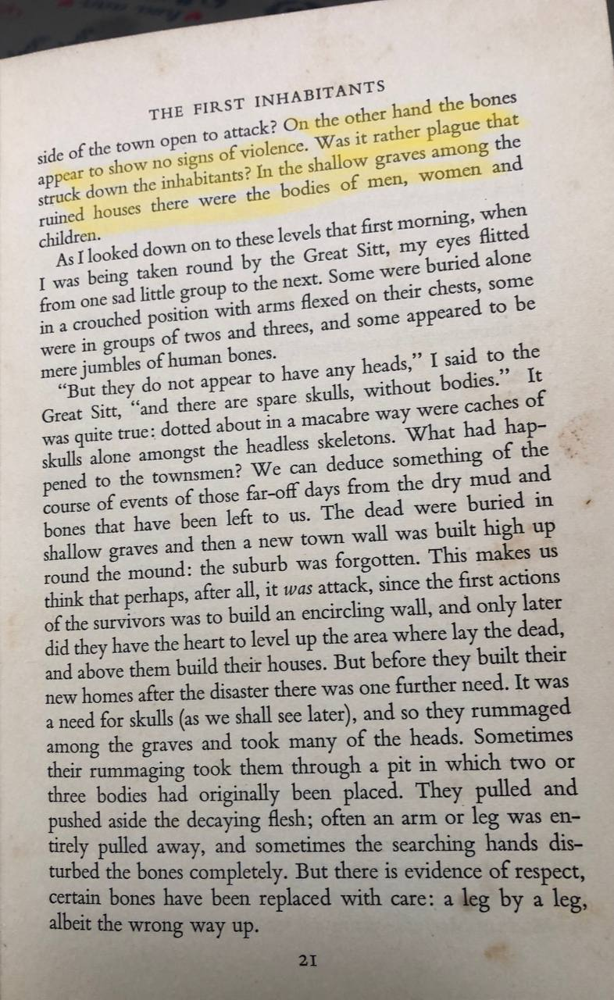

# Jericho

Excellent excerpt about it here: https://nobulart.com/the-problem-of-jericho/

## Jericho [1]

This is a city with a very long history. Supposedly this city was destroyed by Joshua, placing (one of) its destructions near Exodus. Hard copy about the chronology of this site in this folder.

Apparently this site also has a destruction layer between 6000 - 4500 BC. Which would indicate it has two destruction layers.

"The first permanent settlement on the site of Jericho developed near the Ein es-Sultan spring between 9,500 and 9000 BCE."

"The Pre-Pottery Neolithic B (PPNB) was a period of about 1.4 millennia, from 7220 to 5850 BCE[clarification needed] (though carbon-14-dates are few and early). After a few centuries, the first settlement was abandoned. After the PPNA settlement phase, there was a settlement hiatus of several centuries, then the PPNB settlement was founded on the eroded surface of the tell. This second settlement, established in 6800 BCE, perhaps represents the work of an invading people who absorbed the original inhabitants into their dominant culture."

"The dead were buried under the floors or in the rubble fill of abandoned buildings. There are several collective burials. Not all the skeletons are completely articulated, which may point to a time of exposure before burial."

"Bronze Age Jericho fell in the 16th century at the end of the Middle Bronze Age, the calibrated carbon remains from its City-IV destruction layer dating to 1617–1530 BCE. Carbon dating c. 1573 BCE confirmed the accuracy of the stratigraphical dating c. 1550."

### The story of Jericho (hard copy here)

"About 2000 BC, or rather later, a major catas- trophe overwhelmed the aged city … . An entirely new culture, that of the middle Bronze Age [MB], replaced the old.

The main defences of Jericho in the Late Bronze Age [LB] followed the upper brink of the city mound, and comprised two parallel walls, the outer six feet and the inner twelve feet thick. In- vestigations along the west side show continuous signs of destruction and conflagration. The outer wall suffered most, its remains falling down the slope. The inner wall is preserved only where it abuts the citadel, or tower, to a height of eighteen feet; elsewhere it is found largely to have fallen, together with the remains of buildings upon it, into the space between the walls which was filled with ruins and debris. Traces of intense fire are plain to see, including reddened masses of brick, cracked stones, charred timber and ashes. Houses alongside the wall were found burnt to the ground, their roofs fallen upon the domestic pottery within.

One gets used to burnt layers in excavations of this kind, for it was the usual fate of houses and cities to perish by fire; but this was no ordinary burning. The layer of ashes was so thick and the signs of intense heat so vivid, that it gave the im- pression of having been contrived, that fuel had been added to the fire.

The wall was violently destroyed by fire. The layers of ash, in beautiful pastel shades of blues, greys and pinks, suggesting brushwood or thatch as did the other fire, come right down against the stones of the foundations, showing that they were exposed when the fire took place. The brickwork, normally mud-coloured, is burnt bright red through- out, clear evidence of the strength of the conflagra-tion ... The disaster was indeed complete, for this was the end of Early Bronze Age Jericho.

As our detailed knowledge of Palestinian archaeology has gradually increased over the past thirty years or so, it has become apparent that there was a very sharp break between the Early Bronze Age of the third millenium and the Middle Bronze Age of the first half of the second.

Jericho was again destroyed at the end of the Middle Bronze Age. The ash of the burnt city ‘is about a metre thick, and consists of streaks of black, brown, white and pinkish ash’,"

### Walls of Jericho, Margaret Wheeler

## Citations

1. https://en.wikipedia.org/wiki/Jericho