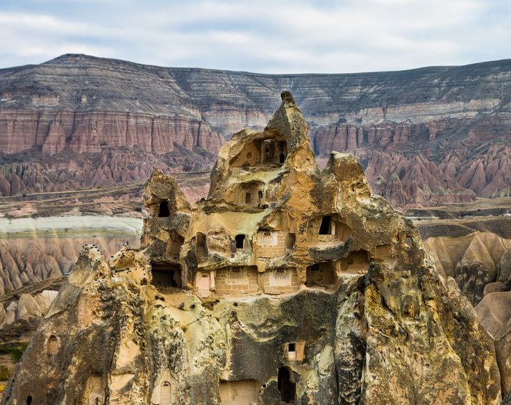
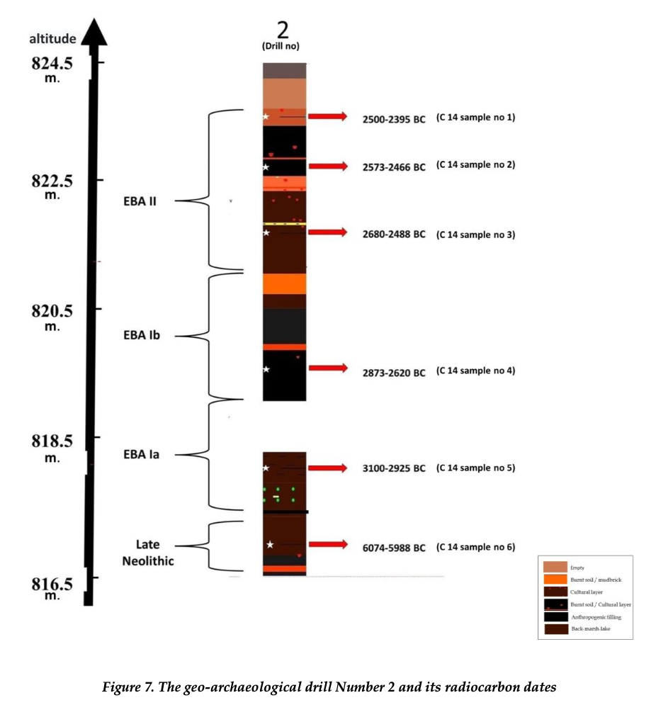
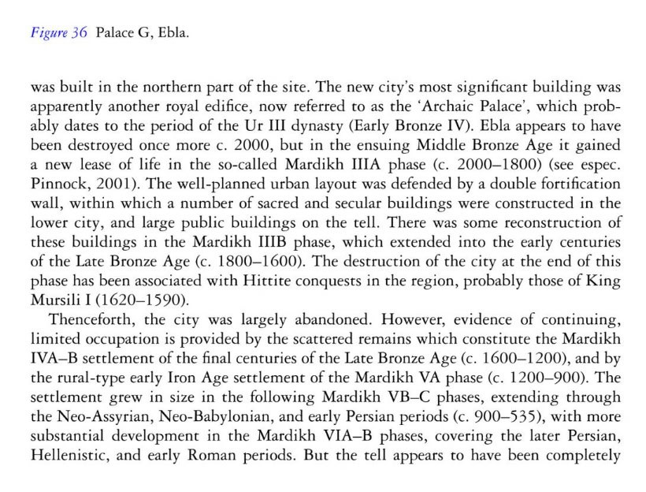

# Burned Cities

There are a number of remains of ancient cities specifically in the Middle East that seem to have been burned right around the 1900 BC event period.

- 1300, 1200 BC: Troy
- 1750 BC Kultepe/Khanesh
- 1700 BC: Tall el-Hammam
- 1700 BC: Hattusa
- 1700 BC: Tavslani Mound
- 2300, 2000 BC: Ebla
- Sodom, Gomorrah

## Numeira [4]

"Calibrated radiocarbon dates place the settlement in the EB III. Habitation spanning approximately 250 years or 10-12 generations. Numeira was violently destroyed at the end of the EB III, (2300 BC.) never to be re-occupied.[8][9] This is 200 years earlier than the current assumed date for the destruction of Sodom."

### Geologic Reconstruction of Numeira (hard copy here) [5]

## Cappadocia Melted?

https://rumble.com/v2867gx-melted-cappadocia-meltology-shorts.html

## Kultepe/Khanesh (Turkey), 1750 BC

It seems the Hittites were the people who lived in Turkey from the early 2nd millenium BC, reaching their peak during the mid-14th century BC. Looking at what happened during 1700 BC: *"sometime in 1710–1705 BC, Kanesh was destroyed".*

https://en.wikipedia.org/wiki/Hittites

*"...was burned to the ground. evel Ib, 1798–1740 BC. After an abandoned period, the city was rebuilt over the ruins of the old and again became a prosperous trade center. The trade was under the control of Ishme-Dagan I, who was put in control of Assur when his father, Shamshi-Adad I, conquered Ekallatum and Assur. However, the colony was again destroyed by fire."*

https://en.wikipedia.org/wiki/K%C3%BCltepe

## Tall el-Hammam city melted ~3700 years ago

Evidence that a "cosmic impact" destroyed ancient city in the Jordan Valley:

*"But there is a 1.5-meter interval in the Middle Bronze Age II stratum that caught the interest of some researchers for its "highly unusual" materials. In addition to the debris one would expect from destruction via warfare and earthquakes, they found pottery shards with outer surfaces melted into glass, "bubbled" mudbrick and partially melted building material, all indications of an anomalously high-temperature event, much hotter than anything the technology of the time could produce."*"

*"We saw evidence for temperatures greater than 2,000 degrees Celsius," said Kennett, whose research group at the time happened to have been building the case for an older cosmic airburst about 12,800 years ago that triggered major widespread burning, climatic changes and animal extinctions. The charred and melted materials at Tall el-Hammam looked familiar, and a group of researchers including impact scientist Allen West and Kennett joined Trinity Southwest University biblical scholar Philip J. Silvia's research effort to determine what happened at this city 3,650 years ago."*

- https://phys.org/news/2021-09-evidence-cosmic-impact-ancient-city.html
- https://en.wikipedia.org/wiki/Tell_el-Hammam#Air_burst_claim

## Hattusa (Hittite Empire capital, Turkey), 1700 BC

*"A carbonized layer apparent in excavations attests to the burning and ruin of the city of Hattusa around 1700 BC."*

https://en.wikipedia.org/wiki/Hattusa

## Troy (1300 BC, 1200 BC)

*"Troy VI (1700 BC - 1300 BC) and Troy VIIa (1300 BC - 1180 BC) represent the peak phase of the prosperity of the city in the late Bronze Age... Both layers - VI and VIIa - were rapidly destroyed, for unknown reasons. This is evidenced by the fallen stone blocks and the traces of fire. The hypothesis put forward by Blegen says that these are the traces of an earthquake, but not all researchers agree with this theory."*

http://turkisharchaeonews.net/site/troy

*"Troy VI was destroyed around 1300 BC, corresponding with the sublayer known as Troy VIh. Damage in the Troy VIh layer includes extensive collapsed masonry and subsidence in the southeast of the citadel, indicative of an earthquake. Alternative hypotheses include an internal uprising as well as a foreign attack, though the city was not burned and no victims were found in the debris."*

*"The city was destroyed around 1180 BC, roughly contemporary with the Late Bronze Age collapse but subsequent to the destruction of the Mycenaean palaces. The destruction layer shows evidence of enemy attack, including scorch marks."*

https://en.wikipedia.org/wiki/Troy

*"After the city of Troy VI was destroyed by an earthquake around 1300 BC, a much different settlement developed at the site. Although Troy VII seems to have been rebuilt by the survivors of Troy VI, the new city lost much of its monumental character. A large portion of the population appears to have moved within the walls of the citadel creating a somewhat cramped environment."*

*"The large freestanding structures of the previous period are re-used, but now they are partitioned and subdivided into much smaller spaces. This was likely necessary to accomodate the increased population within Troy's walls. Large storage jars called pithoi were installed in many of the new houses. This indicates that the occupants of Troy VII were perhaps stockpiling supplies and may have been worried about their food supply. The fortification walls were quickly rebuilt and strengthened. Some of the gates that were open in Troy VI were sealed, while other gates were enhanced. This suggests that Troy's inhabitants were consciously restricting access to [the] city and were clearly concerned for their safety."*

https://www.archaeology.org/travel/interactivemap-troy/troy-7.html

## Tavsanli Mound: Turkey settlement burned to ground 3700 years ago [1]

"A team of archaeologists has discovered the well-preserved brain and skin remnants of people who lived around 3,700 years ago in Turkey. The remains belong to two Bronze Age individuals who were found at the Tavşanlı Mound (or Tavşanlı Höyük) in Turkey's Kütahya province—located in the west of the Anatolian peninsula. The remnants belong to a young man aged 15-18 at the time of death, and another middle-aged man who was 40-45 years old when he died, the Anadolu Agency (AA) reported. Researchers believe these individuals died when their homes were set on fire and they were unable to flee during an attack around 3,700 years ago. Evidence suggests there was a large-scale attack on the city around 1700 B.C. that resulted in the entire settlement being burned to the ground."

https://www.newsweek.com/archaeologists-discover-brain-remnants-people-lived-3700-years-ago-1825076

### GEO-ARCHAEOLOGICAL AND GEOPHYSICAL INVESTIGATION ON THE EARLY BRONZE AGE LAYERS OF TAVŞANLI HÖYÜK (INLAND WESTERN ANATOLIA) [2] (hard copy here)

"Studies carried out on an area of 100 x 55 meters have shown that the site featured a settlement pattern of houses surrounded by streets and alleys during the Early Bronze Age II (2700-2400 BC) and revealed a strong evidence that, at least for the area studied, it was not settled in again following a great fire outbreak during the Early Bronze Age III period."

## Ebla [3]

"Starting as a small settlement in the Early Bronze Age (c. 3500 BC), Ebla developed into a trading empire and later into an expansionist power that imposed its hegemony over much of northern and eastern Syria.[2] Ebla was destroyed during the 23rd century BC. It was then rebuilt and was mentioned in the records of the Third Dynasty of Ur. The second Ebla was a continuation of the first, ruled by a new royal dynasty. It was destroyed at the end of the 3rd millennium BC, which paved the way for the Amorite tribes to settle in the city, forming the third Ebla. The third kingdom also flourished as a trade center; it became a subject and an ally of Yamhad (modern-day Aleppo) until its final destruction by the Hittite king Mursili I in c. 1600 BC."

"The first destruction occurred c. 2300 BC; palace "G" was burned, baking the clay tablets of the royal archives and preserving them.[55] Many theories about the cause and the perpetrator have been posited.."

"The second kingdom's period is designated "Mardikh IIB2", and spans the period between 2300 and 2000 BC.[22] The second kingdom lasted until Ebla's second destruction, which occurred anytime between 2050 and 1950 BC, with the 2000 BC dating being a mere formal date."

"The second kingdom disintegrated toward the end of the 21st century BC,[36] and ended with the destruction of the city by fire, although evidence for the event has only been found outside of the so-called "Temple of the Rock", and in the area around palace "E" on the acropolis."

"The third kingdom is designated "Mardikh III"; it is divided into periods "A" (c. 2000–1800 BC) and "B" (c. 1800–1600 BC).[22] In period "A", Ebla was quickly rebuilt as a planned city.[97] The foundations covered the remains of Mardikh II; new palaces and temples were built, and new fortifications were built in two circles – one for the low city and one for the acropolis... Ebla was destroyed by the Hittite King Mursili I in about 1600 BC."

Ebla. Estimated destruction and final abandonment c.~1600BC. This date could well be erroneous, as it was arrived at by attributing the destruction to the Hittite conquests at that time, with no solid evidence linking the two. Pure speculation. This could easily have fallen around 1700BC.
- [https://books.google.co.za/books?id=E1aF0hq1GR8C&lpg=PA211&pg=PA211#v=onepage&q&f=false

## Middle Eastern cities destroyed by fire circa 1700 BC, Late Bronze Age collapse (1200 BC)

ChatGPT list (need to investigate):
- Ugarit (Syria),  1200 BC
- Mycenaean Cities (Greece) 1200 BC
- Kadesh (Syria), 1300 BC
- Mari (Syria), 1800 BC
- Ebla (Syria), 1600 BC
- Canaanite Cities (Israel/Palestine), 1800 - 1700 BC
- Gordion (Turkey)
- Harappa (Pakistan) 1700 BC
- Mohenjo Daro (Pakistan) 1700 BC
- Dholavira (India)
- Chanhudaro (Pakistan) 1700 BC

ChatGPT list of extreme high temperature burning:
- Bab edh-Dhra, Jordan
- Nimrud/Kalhu, Iraq
- Troy
- Hattusa
- Ugarit
- Jericho, Palestine
- Thebes, Egypt
- Susa, Iran
- Bubastis, Egypt
- Tell Abu Hureya, Syria
- Canaanite cities

What's interesting is that (at least according to ChatGPT) these weren't wooden cities. The cities of this time in this area were built used baked brick and mudbrick construction. How can entire cities built from such material burn?

There is also a discrepancy between 1700 BC and the 1200 BC Late Bronze Age collapse. Assuming the dates are not intentionally fudged, these may have been separate events, although likely not unrelated.

## Citations

1. https://en.wikipedia.org/wiki/Tav%C5%9Fanl%C4%B1
2. https://zenodo.org/records/5057560
3. https://en.wikipedia.org/wiki/Ebla
4. https://en.wikipedia.org/wiki/Numeira
5. https://annas-archive.org/slow_download/3121fd9a13589493a61bb442b975cf5e/0/2