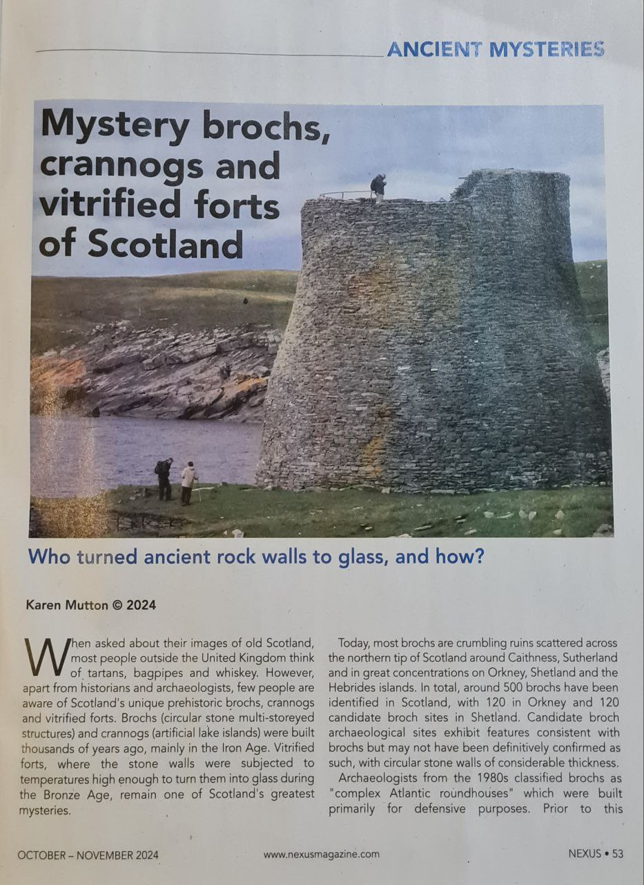
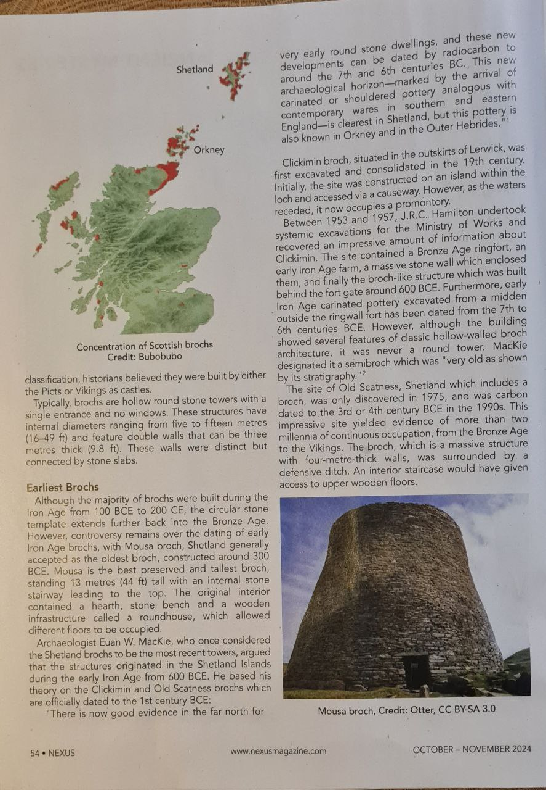
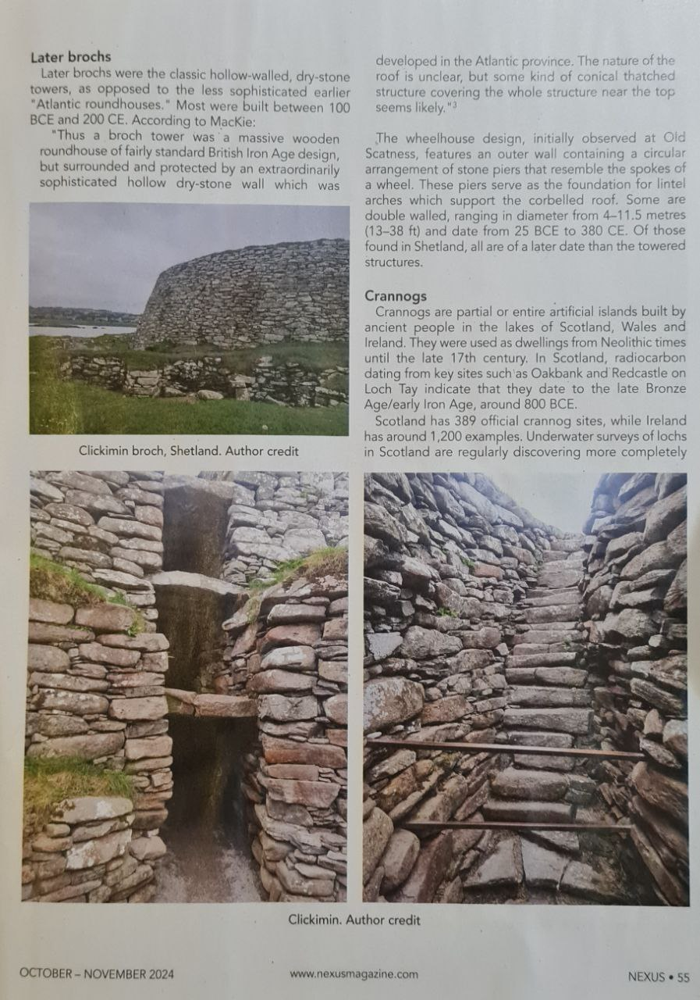
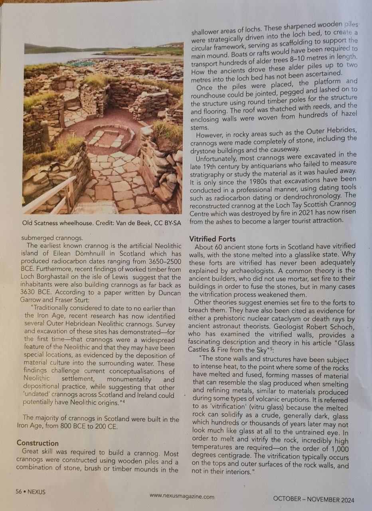
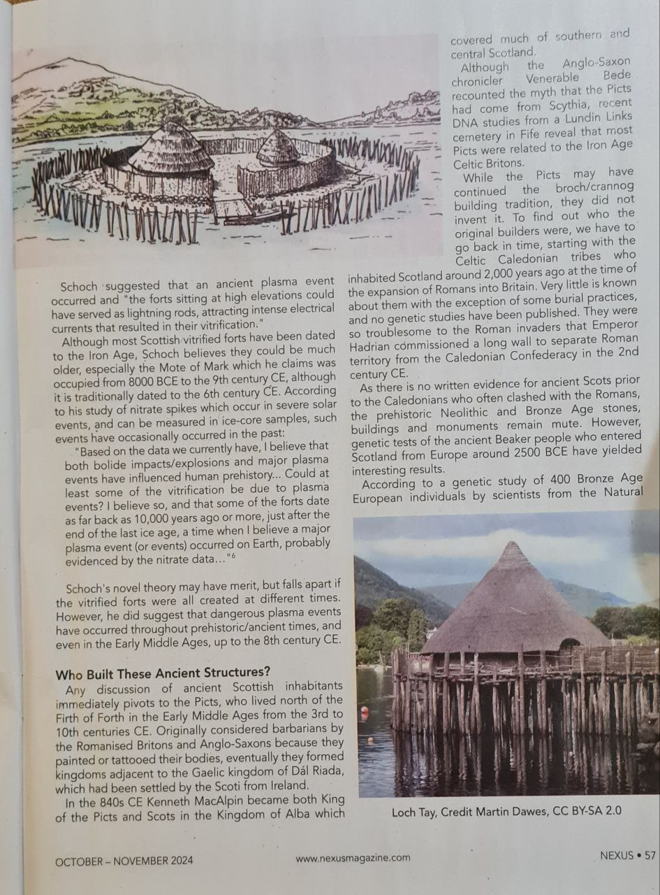
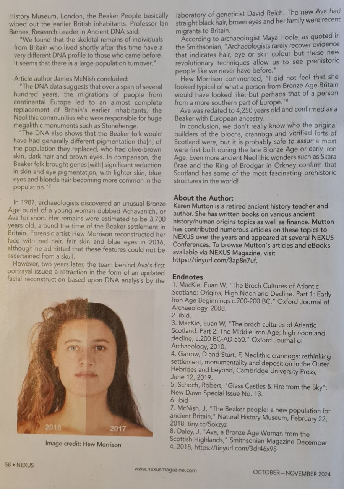
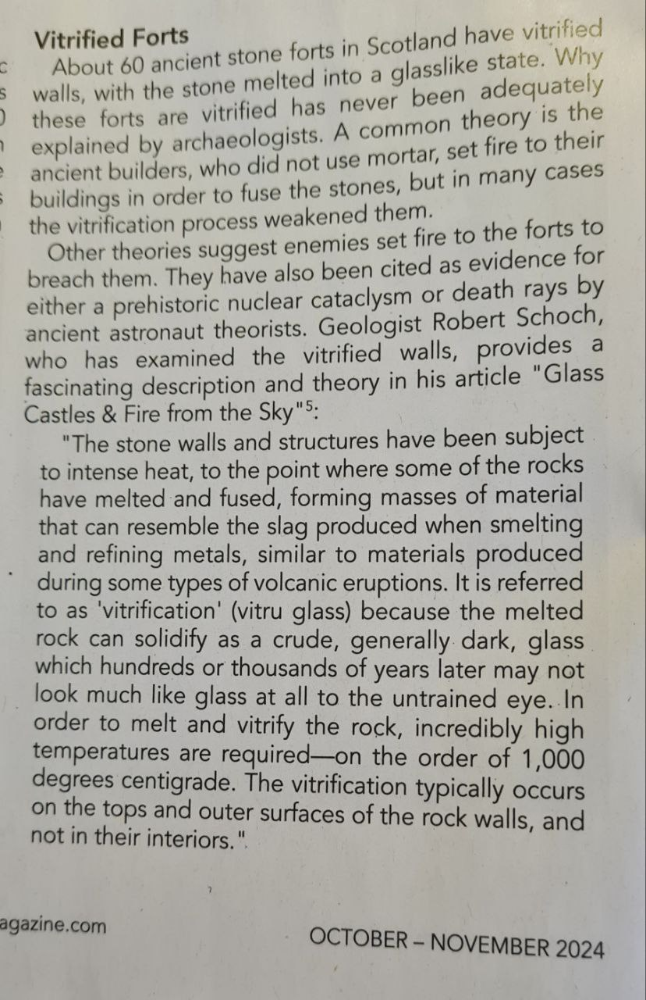
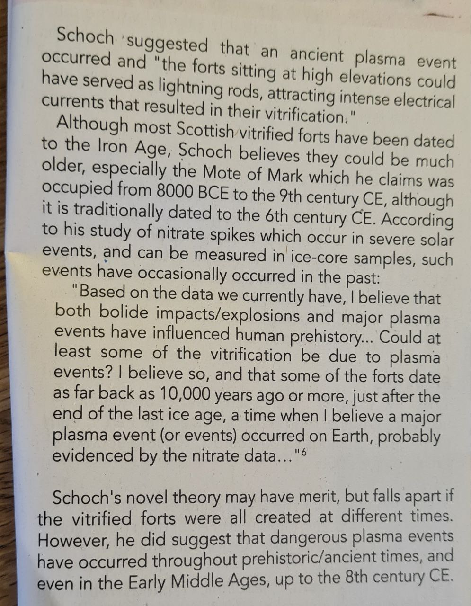

# Vitrified Forts

## Scottish Structures

Lots of good info in this article on Scottish structures.

Some brochs had double walls 4 metres wide. Why so thick and dry hollow walled?

## Vitrified forts in Scotland

Dates to around 150 AD.

1. https://www.sciencedirect.com/science/article/abs/pii/S2352409X19304080
2. https://en.wikipedia.org/wiki/Vitrified_fort

This Geologist Robert Scoch talks our language!

https://studylib.net/doc/8356181/glass-castles-and-fire-from-the-sky (hard copy here)

Robert Scoch's website is worth a look although he doesn't appear to be an "Earth Flipper" https://www.robertschoch.com/

https://www.robertschoch.com/misc_news.html#bu_master_class

## Nobulart Theory

I consider vitrification to be a product of ground to ionosphere discharge aka plasma, which is a product of geomagnetic excursions, which are a product of the same cycle that causes heating and decoupling of the core.  All one. All connected in time.

## GPT Summary of the paper in here

The document provides an in-depth discussion on ancient vitrified forts, particularly focusing on those in the United Kingdom, with examples mainly from Scotland. Here’s a summary of the key points:

### Overview of Vitrified Forts
- **Vitrified forts** are ancient structures where the stone walls appear to have been exposed to intense heat, causing them to melt and fuse. The process is called **vitrification**, akin to the formation of glass, due to the extreme temperatures required (around 1,000°C).
- These forts are primarily found in Scotland but also appear in England, Ireland, Wales, and parts of mainland Europe, including France and Germany.
- The forts often appear as rubble walls without true masonry and are situated on hilltops, offering a strategic advantage.

### Historical Context
- The origin of vitrified forts dates back to at least the **Iron Age** (circa 800 BCE to early centuries CE). Some may have been reused in the early Dark Ages, around the time of legendary figures like King Arthur (5th-6th centuries CE).
- Artifacts found in excavations, like at the Mote of Mark, suggest usage spanning several millennia, possibly originating from as far back as the **Mesolithic period** (8000 BCE - 4000 BCE).

### Theories Behind Vitrification
Several hypotheses have been proposed to explain how and why these forts were vitrified:

1. **Deliberate Construction Technique**: Builders may have intentionally set large fires against the walls to fuse the stones together for structural reasons, though this theory is contested as vitrified walls tend to be weaker.
   
2. **Attacks by Enemies**: Some suggest that enemy forces could have set fire to the wooden parts of the forts, causing vitrification. However, it is unclear if the fires could have reached the required temperature.

3. **Ceremonial Purposes**: Another theory posits that vitrification might have been part of religious rituals or used to dedicate the forts, although this does not explain why weakening the walls would be desirable.

4. **Natural Events**: It has been suggested that phenomena like major lightning strikes or plasma discharges could have caused the vitrification, especially since many forts are on high elevations, potentially acting as lightning rods.

5. **Meteor Impacts or Ancient Weaponry**: More speculative theories include meteor or comet airbursts causing the extreme heat or the use of an advanced fire-based weapon unknown to us today.

### Geological and Plasma Hypothesis
- Dr. Robert Schoch, a geologist, proposes that intense plasma events from the sun or other cosmic phenomena could be responsible. He cites historical events like the **Tunguska explosion** (1908) as examples of how a mid-air cosmic blast could generate sufficient heat without leaving a crater.
- The idea includes possible **solar outbursts** or coronal mass ejections that might have impacted Earth in ancient times, causing surface vitrification.

### Cultural Impact and Legacy
- These forts may have inspired legends of "glass castles" in Celtic traditions, suggesting a connection to the mythical "world of the gods."
- The presence of vitrified structures may reflect ancient knowledge or response to catastrophic events, possibly explaining the construction of other megalithic sites and rock-cut dwellings around the world.

In conclusion, vitrified forts remain an archaeological mystery, with various explanations ranging from human ingenuity to cosmic catastrophes, yet no single theory has been universally accepted.
