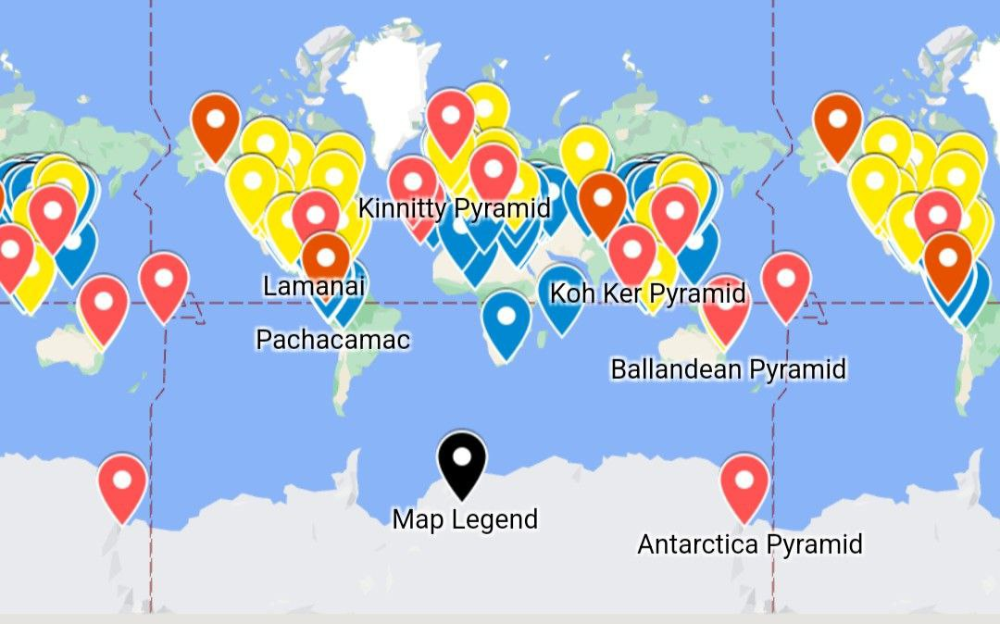
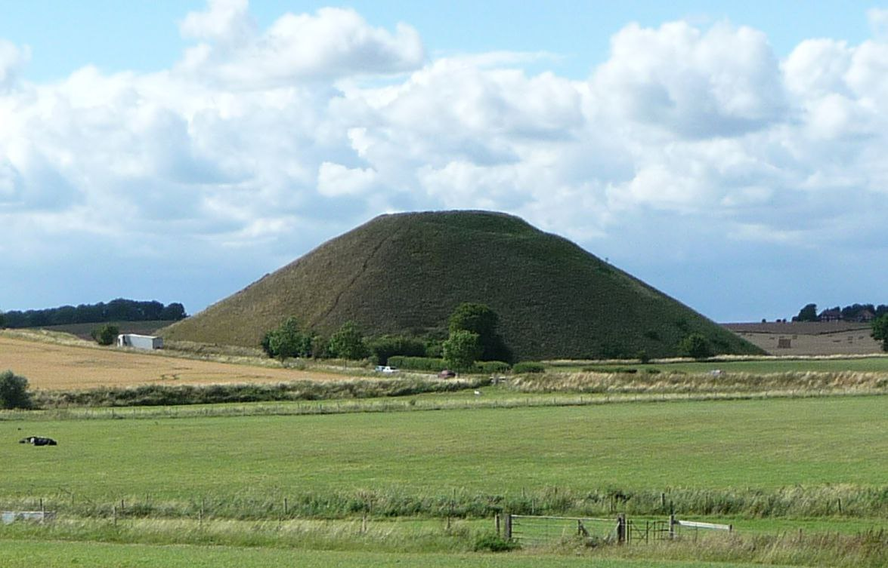

# Human Built ECDO-related Structures

This folder is for important structures humans have built that are potentially related to ECDO events.

Khafre/Khufu Pyramids, structures that are central to the ECDO thesis, are in `khafre-khufu`.

## Ancient Megaliths

Ancient megaliths defy modern logic. Even our advanced machinery struggles with 20-40 ton stones. Imagine so-called primitive societies tackling such feats.

Join us now
∙ Channel
∙ Chat

See /img for video_471@02-11-2024_07-15-16.mp4.

## All the pyramids in the world

Map of all the pyramids in the world: https://www.google.com/maps/d/viewer?mid=1a7ESLhx-k-r0zTW22XiENshhHwf-QXM

## Babylon

*"The walls of the mighty Babylon and the eight-volved Tower of Babel or cloud-encompassed Bel were never constructed to resist any mortal foe. NO. Those city walls, which were 60 miles in circumference, 200 feet high, 578 feet thick, were not made to defy the strength of armies, but to resist the fearful forces of Nature, the floods that swept the plains of Shinar, from the mountains of Armenia, every spring during this Age of Horror. The tremendous embankments and river walls constructed by the Ancients are monuments of human skill and enterprise belonging to an epoch that antedates by thousands of years the Age of their supposed builders."* - Thomas H. Burgoyne, The Light of Egypt - Vol. I (1889)

*"This accounts for and fully explains the existence of fossil remains of the seal, walrus and polar bear in the burning plains of Africa and Hindustan, and of the tropical remains now being discovered in the Arctic regions."*

This would very likely have been expunged from recent records. His source would predate 1889.

https://nobulart.com/the-hermetic-key/

## 3 Oldest Castle Fortifications

Aleppo, Masada, Arwad.

### Citadel of Aleppo

3,000 YBP. 400m asl. 40m [typo corrected] elevation above the surrounding ground.

https://en.wikipedia.org/wiki/Citadel_of_Aleppo

### Masada, Israel

Masada. Israel. 1st cenutry BCE. Its boaty.

https://en.wikipedia.org/wiki/Masada

## Great Circle Artifacts

Angkor Wat and Nazca lie on the great circle centred at Stonehenge (red trace). Another great circle connects Easter Island, Machu Picchu, Giza and Mohenjo-daro (blue trace). Intersections at Peru and Cambodia may account for the high density of megaliths, geoglyphs and curious artefacts found there. The planes defined by these great circles intersect along an axis approximately connecting Angkor Wat to Nazca/Paracas, inclined to one another at sin −1 (0.9) the gradian/degree ratio being 9/10.

https://www.youtube.com/watch?v=PiQL5yVpWig

## Khara Hora Underground Cave

https://m.youtube.com/watch?v=akmKO2pgdTY&t=2s

https://youtu.be/J1QDP-Oqcr0?si=3q92eVg2x0-Fq-Xz

## Pyramid - Eight Parts

https://x.com/dgr8awakening/status/1834394949179097510?s=46

## Bosnian Pyramids Vedic Cycles

See PDF `Evidence of Vedic Cosmology...` in this folder.

## Men an Tol in Cornwall

## "9000-year-old ‘Stonehenge-like’ structure discovered at the bottom of Lake Michigan"

https://www.thebrighterside.news/post/9000-year-old-stonehenge-like-structure-discovered-at-the-bottom-of-lake-michigan/

## Japanese underwater pyramid

Has anyone dug into this? It would be interesting to map some of the underwater megaliths to see if there may be a correlation to old maps and possible water flows during S1/S2

## Amazon "Stonehenges" ancient foundation terraces/mounds

https://www.express.co.uk/news/world/1961703/archaeology-breakthrough-brazil-stonehenge-amazon

Paywall bypass link https://archive.is/Ko7eP

## Baalbek Ancient Stone Engineering

Terrible. I was in Baalbek in 2007 just after a war ended with Israel and they had started rebuilding Beirut. The Lebanese are lovely people. What I found amazing about the structures in Baalbek is the  small gap between the large cut stones. To create the gap you would need a laser to cut it so precisely. So I don’t believe these structures were constructed by the Romans. It needed some culture with greater technology to do it.

## Men-an-Tol, Cornwall UK

Men-an-Tol is a mysterious monument located in Cornwall, United Kingdom. It is one of Cornwall's most enigmatic and iconic ancient structures. Also known as the "Crick Stone", it is estimated to date back to the Neolithic or early Bronze Age. It undoubtedly served some sort of ceremonial or astronomical purposes and may be the remains of an ancient stone circle. There are many legends associated with it. It is said to represent a portal to the realm of the fey folk. Other legends tell us that it has miraculous healing powers. It is also said that a woman can achieve pregnancy with ease if she crawls through the holed stone seven times backwards on a full moon night.

@europeanvolk

## Ur, Iraq

Ur, Iraq. 1926.

I didn't realize how high the mound/pyramid/ziggurat in the middle is.

https://smarthistory.org/ziggurat-of-ur/

## Silbury Hill

## Meteora Monasteries

Apparently these were more common previously: there were over 20 of them, of which 6 remain.

Meteora Monasteries aren't just the only wonder "suspended in the air."

Centuries ago, clifftop architecture was very popular.

Greece even has more monasteries on Mount Athos, arguably more impressive than those at Meteora.

COMMENT: We might've thought they were related to preparation for deluvial events ? Maybe it was just protection from invaders. 

https://x.com/WorldScholar_/status/1857522428353651015?s=35

# TODO Potential Leads

List of religious sites: https://x.com/JeremyTate41/status/1846619542958604547

- Goseck circle in Germany
- Mnajdra Malta megalith temple complex

Curious on the difference between 1700 BC and 1300-1200 BC dating for some of these events.

- Temple at Dendera
	- https://x.com/DGr8Awakening/status/1824267280303194435

"Ancient Superhighways: 12,000-Year-Old Massive Underground Tunnels Stretch From Scotland To Turkey": https://ancient-archaeology.com/2024/05/ancient-superhighways-12000-year-old-massive-underground-tunnels-stretch-from-scotland-to-turkey/

Search for (ancient) underground cities

Vrtra Underground Pyramid, Alaska http://www.human-resonance.org/Vrtra_Underground_Pyramid.pdf

Bosnian Pyramids

chinese pyramids https://thebrainchamber.com/chinese-pyramids/

David Dubyne:
- African Megaliths part 1 of 2
- https://youtu.be/ao4HX8RGQ2o?si=87vQGm8LrHGCu1fc
- African Megaliths part 2 of 2
- https://youtu.be/V0J5opObsK8

## djedefre

Unfinished Djedefre pyramid: https://m.youtube.com/watch?v=JEzZoNuRVJ0
- severe karst erosion (shown below):

