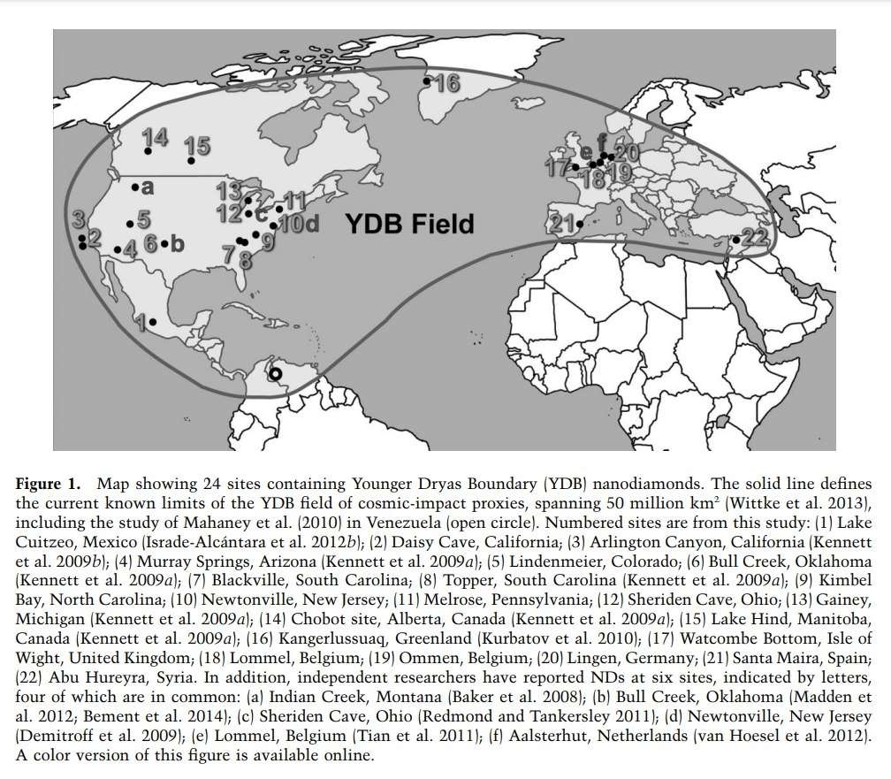
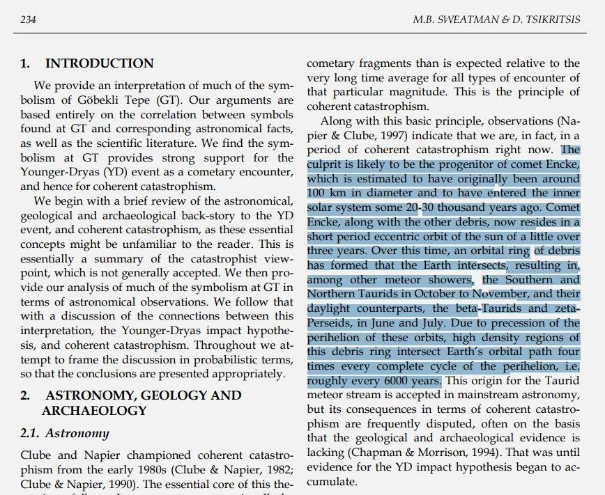

# Gobekli Tepe

Sweatman seems to be the leading expert on this.

## GT buried by debris? [1]

[It] was probably built to keep an eye on Encke's progenitor (which I like to think of as Enlil, the destoyer).

Ironically, the GT site may have been buried in debris from an impact from the very thing it was built to observe. Number 22 on the map.

I’ve seen a cross section of the layered deposits at GT. They aren’t all level. Some are thicker against the walls on one side than the other, suggesting that it was possibly buried by natural process. GT lies less than 100km from YDIH impact site 22. I suspect it may have been buried by impact ejecta.

## Gobekli Tepe [1]

Confirming TES' speculated built date in the period after the YDB. I'm thinking Gobleke Tepe was built during the previous stable period. So there was an event that triggered the constuction of GT as an observatory, which is starting to make it look as though the 'YDB Event' might more properly be called the BAI Event.

My thinking is that it was built to watch for whatever we encountered around 12,800 BC that upset the apple cart. It's possible that the focus on interpreting GT should be expanded to include consideration of the stars at that earlier time. It would have possibly been more likely to have been built during the warmer insterstadia than the cooler YD.

## Gobekli Tepe's relation to comets

An interesting paper, with a convincing argument that GT was astronomically linked to observing (predicting?) the progenitor of Encke and the taurids in much the same way as the pyramids were constructed to monitor the aftermath of the YDB event.

- https://web.archive.org/web/20230605190759/http://www.maajournal.com/Issues/2017/Vol17-1/Sweatman%20and%20Tsikritsis%2017(1).pdf
- https://www.tandfonline.com/doi/full/10.1080/1751696X.2024.2373876

## The ground was heavily disturbed...

The ground was heavily disturbed by human agricultural activity up until its "discovery" in 1963. For how long had those farmers been harvesting the naturally occurring timber? Replanting what was endemic to the area for most of its history seems rational. https://t.co/KOl3R5iWUZ https://t.co/FK77TxCzPa

## Also from the Göreme Valley...

Also from the Göreme Valley region in Türkiye. Could we be looking at something similar here https://t.co/7EG0tdXpO9

## Göbleki Tepe. Comets and the...

Göbleki Tepe. Comets and the Taurids are mentioned, but interestingly nothing is said of 2P/Encke (which is widely considered to be of the same origin as the meteors). https://t.co/NHfm8pz75o https://t.co/0rivckHSox

## YDB impact site No. 22...

YDB impact site No. 22 is less than 150 km south of Göbleki Tepe https://t.co/At4KuQR9c8

## Revised and updated with additional...

Revised and updated with additional research considering Göbleki Tepe as an observatory for 2P/Encke and the taurids meteor complex. https://t.co/3Bsb94YZxj

## 2006 : Trees are already...

2006 : Trees are already in the ground. 2018 : First appearance of Gobleki Tepe on the UNESCO projects site. I'm no UN fan, but I am I missing something here? What does UNESCO have to do with these trees? https://t.co/HRgOkCBeg8

## Pillar 43

https://x.com/OMApproach/status/1855225136841957744?s=35

## Citations

1. [Craig Stone](https://nobulart.com)

# TODO

https://x.com/OMApproach/status/1834179336477262224?s=35