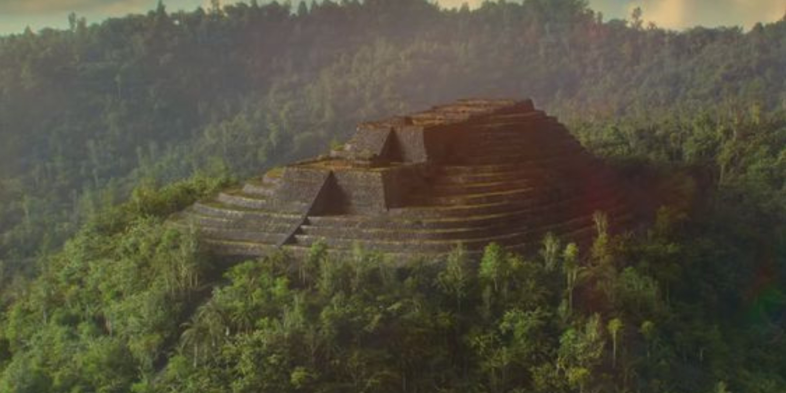

# Gunung Padang

Shows in Graham Hancock's new show.

## Dating

"Danny Hilman Natawidjaja, an Indonesian geologist, has claimed that the site had been built as a giant pyramid 9,000 to 20,000 years ago, implying the existence of an otherwise unknown advanced ancient civilization."

## Citations

1. https://en.wikipedia.org/wiki/Gunung_Padang