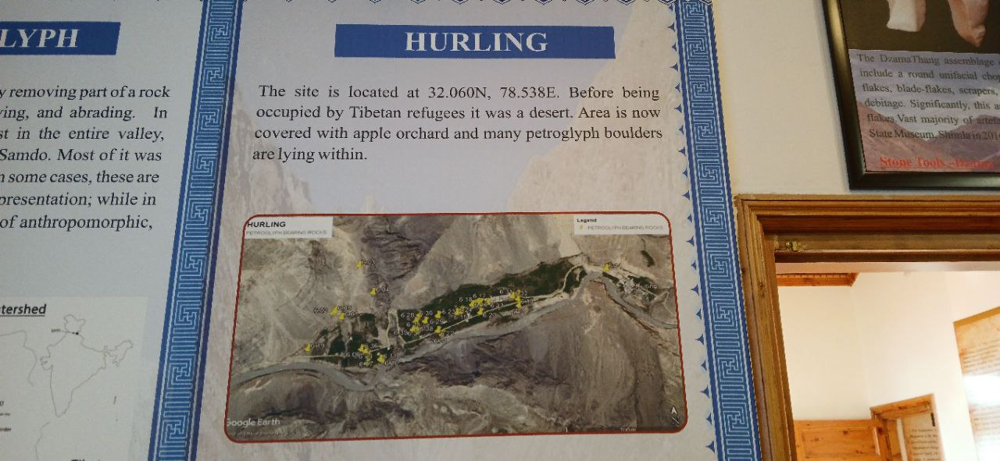
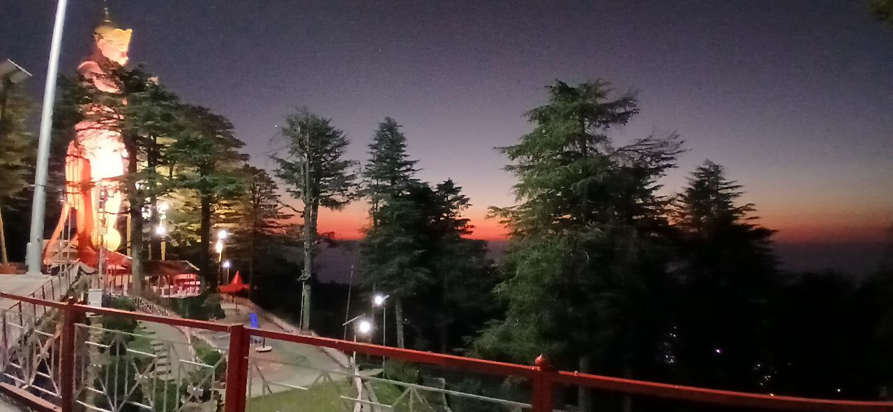

# India

## Shimla Cave

Found this in shimla museum.
Many Ancient rock carvings at this location maybe survivor hideout.
Not sure about elevation.

https://maps.app.goo.gl/hxQ9Qz7tn2oeuias8

## Jhaku Temple in Shimla India. 

2455m in elevation, called to be oldest temple in the city.

https://amp.theguardian.com/world/2015/feb/28/shimla-indian-summers-raj-colonial-legacy-lives-on