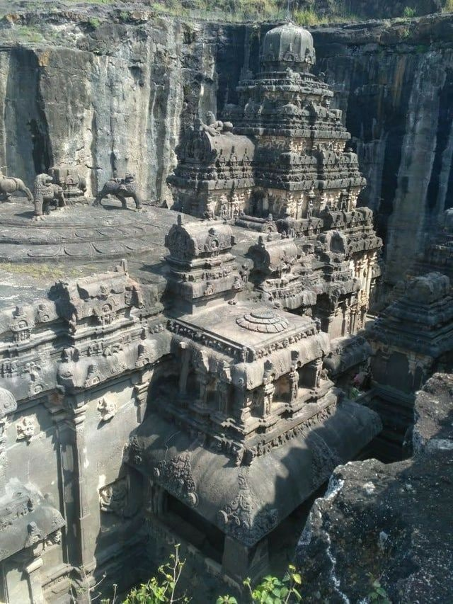
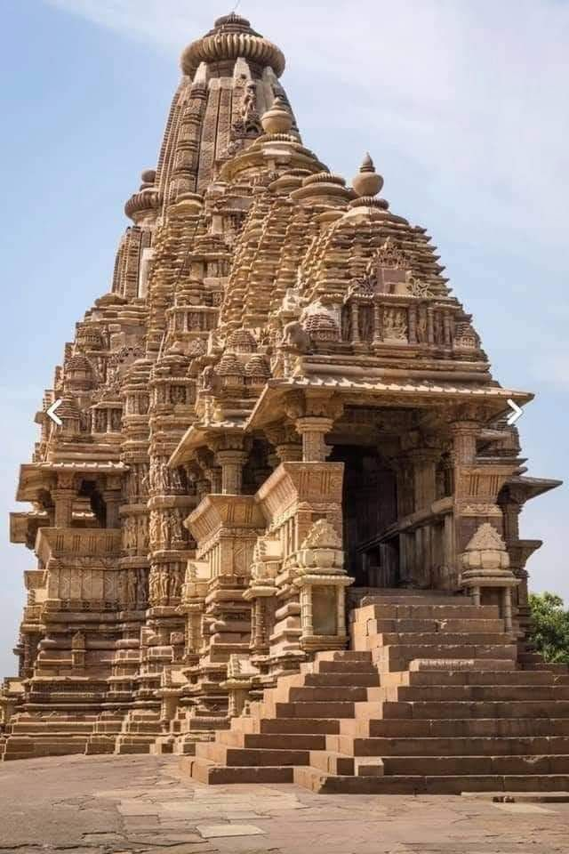
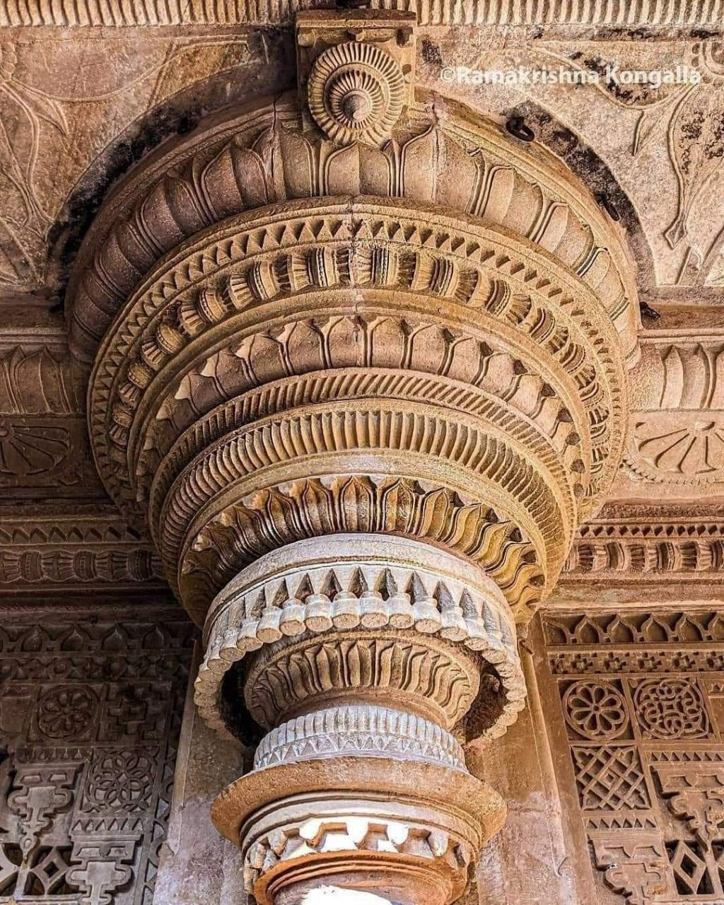
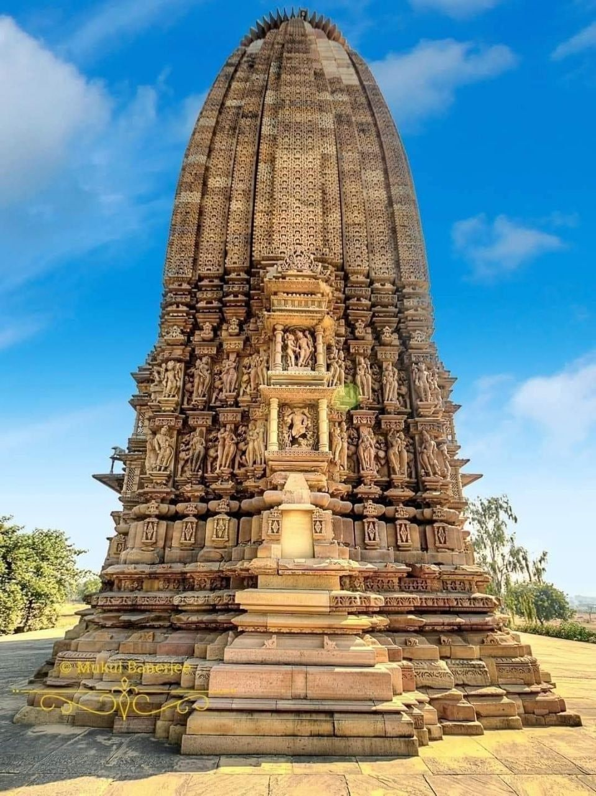
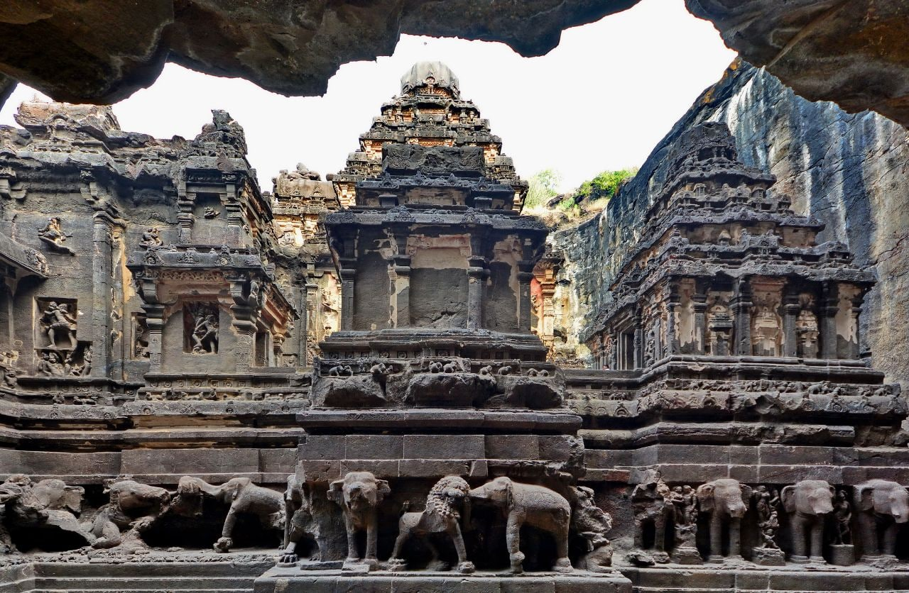
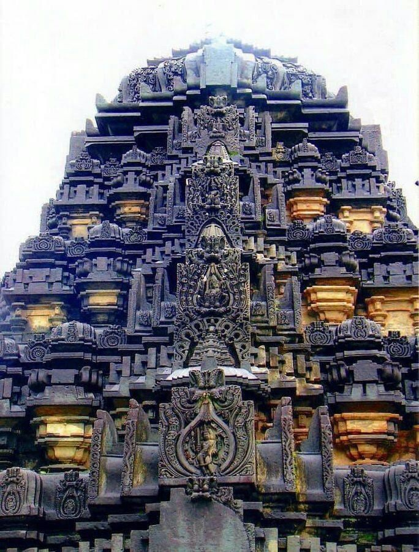

# Indian Temples

Nobulart: "Always worth checking sources. "The Lost Past" is just fishing for clicks by putting out anything that sounds interesting. They're mostly built from soft carved sandstone blocks, which were lifted and fitted without mortar. They're not neolithic. The neolithic age ended 3000 years before these were built."

## Indian Temples

