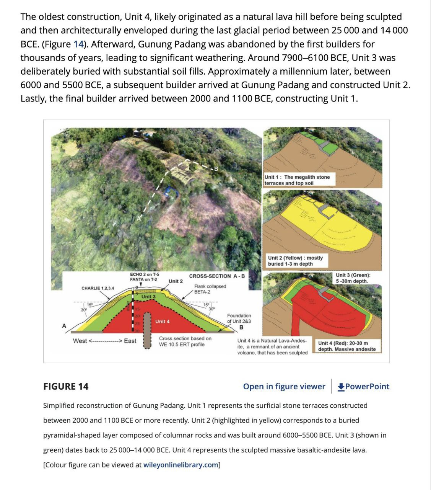

# Indonesia

## West Java Stone Structures

Archeologists just found ancient highly advanced stone structures in West Java radiocarbon dated to be between 27,000 - 16,000 years old, drastically upending our theories of human civilization.

Along with Gobli Tepeke it seems like our entire conception of history is flawed

