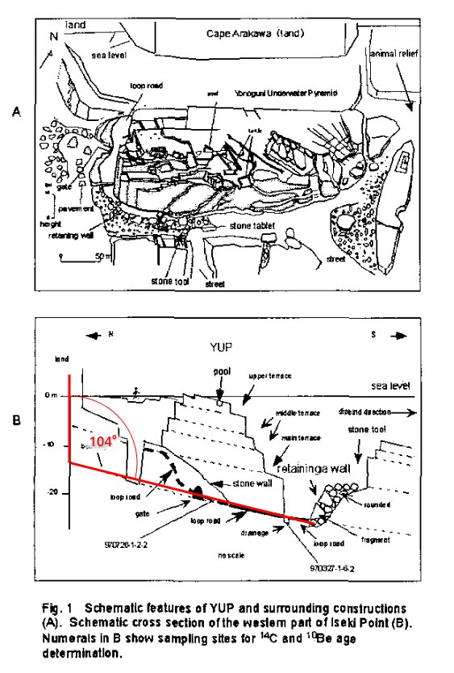

# Japan Structures

## Japanese megaliths video

this whole doc is interesting, but check out the 9 minute mark:

https://m.youtube.com/watch?v=LJb58oTNly0

A researcher found a Japanese artifact he thinks is aligned with North Pole and pointing to other megalithic sites across the globe

There’s also a tortoise stone in Japan that apparently when it faces west the legend says that Japan will be flooded by the ocean

## Yonagumi

Has anyone dug into this? It would be interesting to map some of the underwater megaliths to see if there may be a correlation to old maps and possible water flows during S1/S2

A very likely common civilization spanning the pacific from Mexico and Guatemala till the shores of Japan.

## Nobulart [1]

I suspect that most such sites now lie buried in sediment on the continental shelves. Difficult to locate. Yonaguni has more of the appearance of a volved elongated tower than that of a pyramid. Note that the slope of the terraces lies parallel to that of the seabed, which happen to form an angle of close to 104 degrees with the vertical walls. It also lies very close to the eastern Euler meridian - a mere 2 degrees east of it at 123°E

[1] https://sci-hub.ru/10.1109/oceans.2004.1405617

## Citations

1. Craig Stone