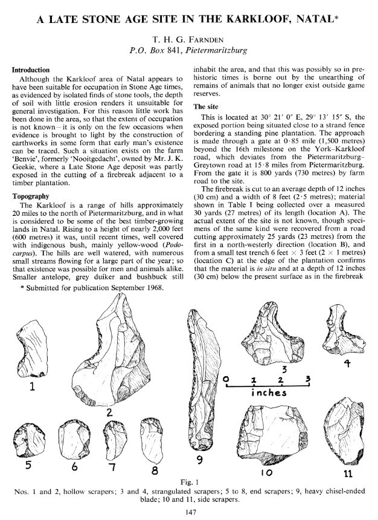
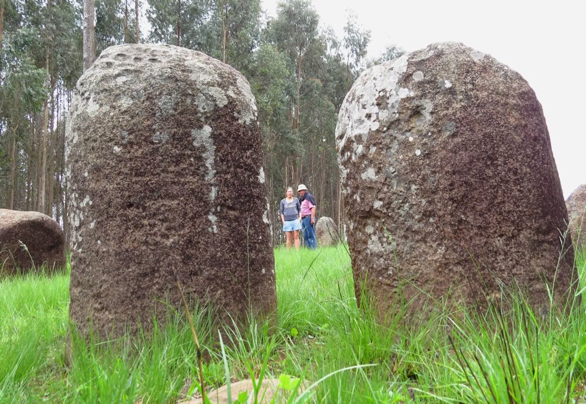
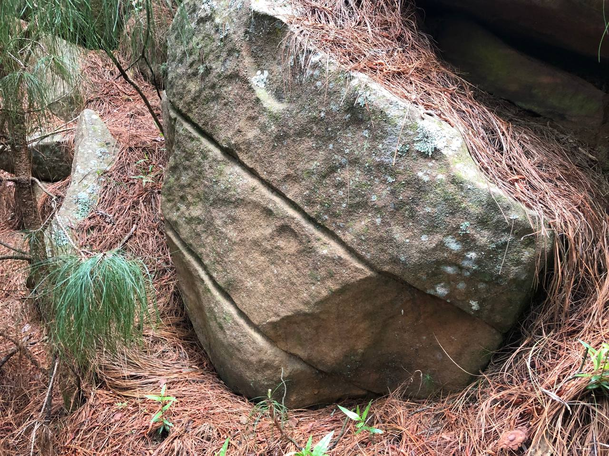
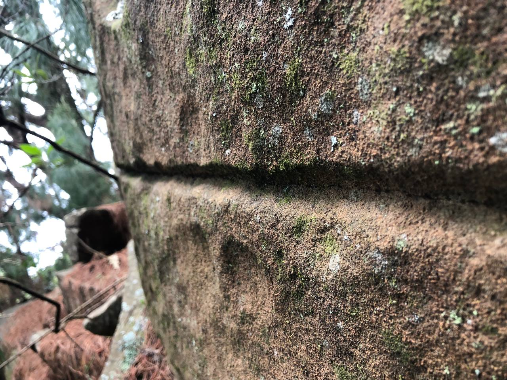
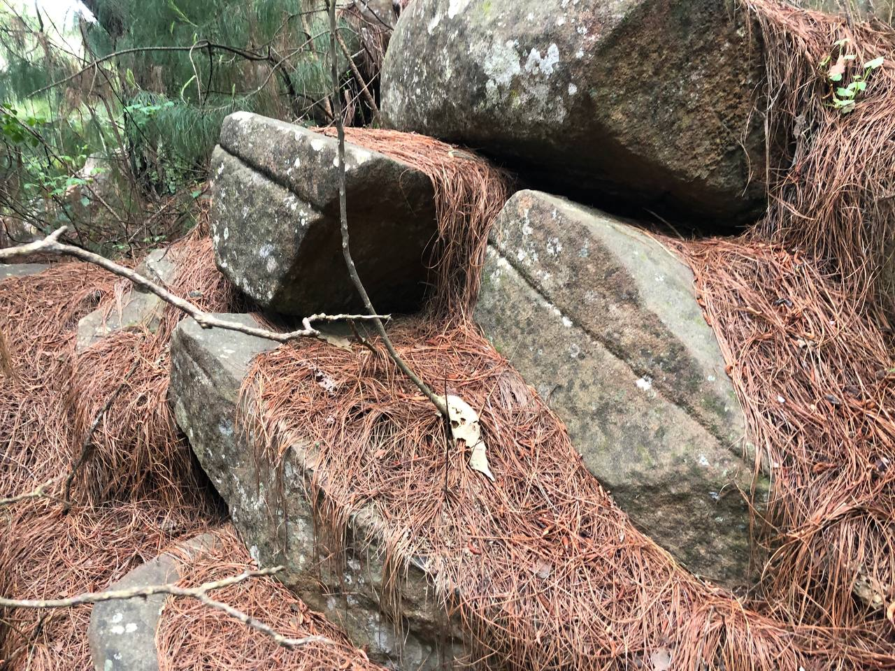
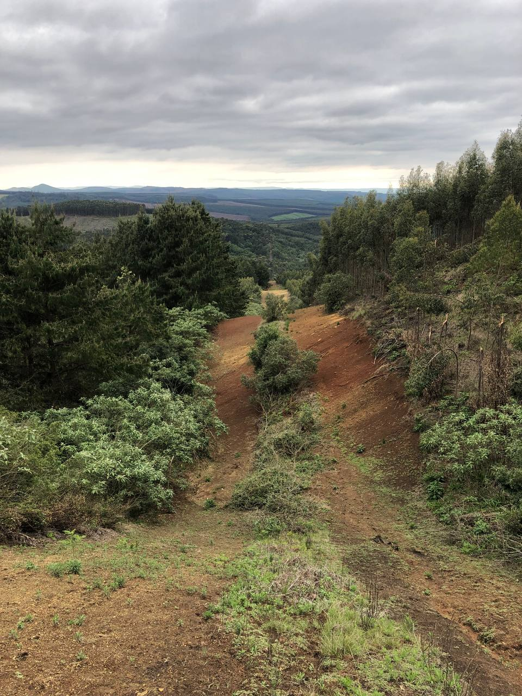
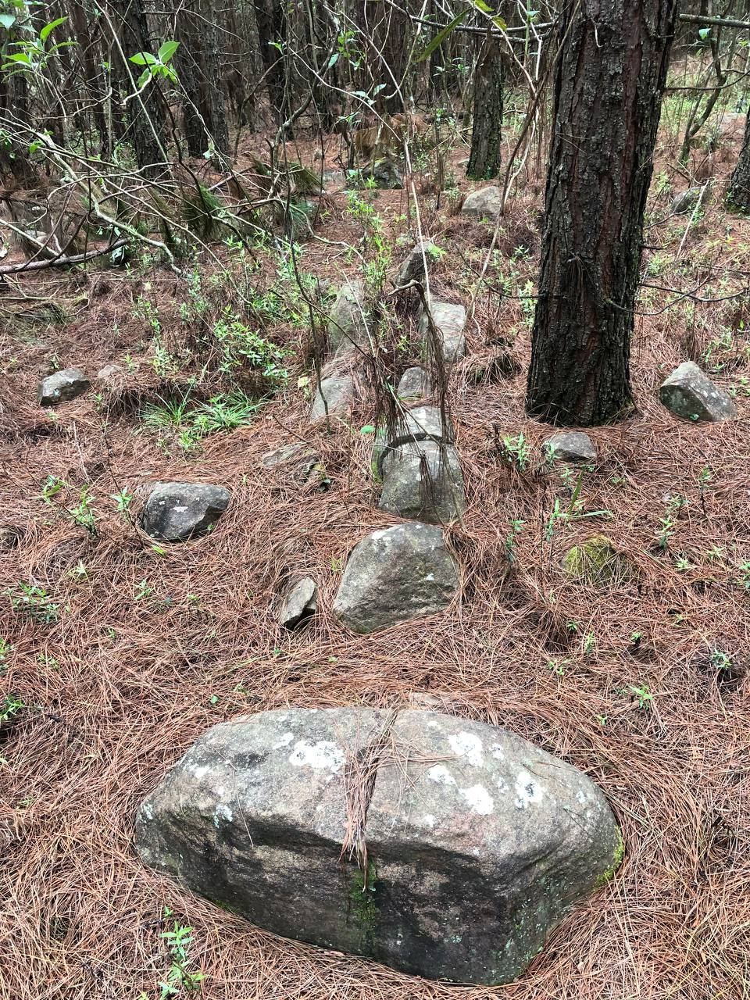
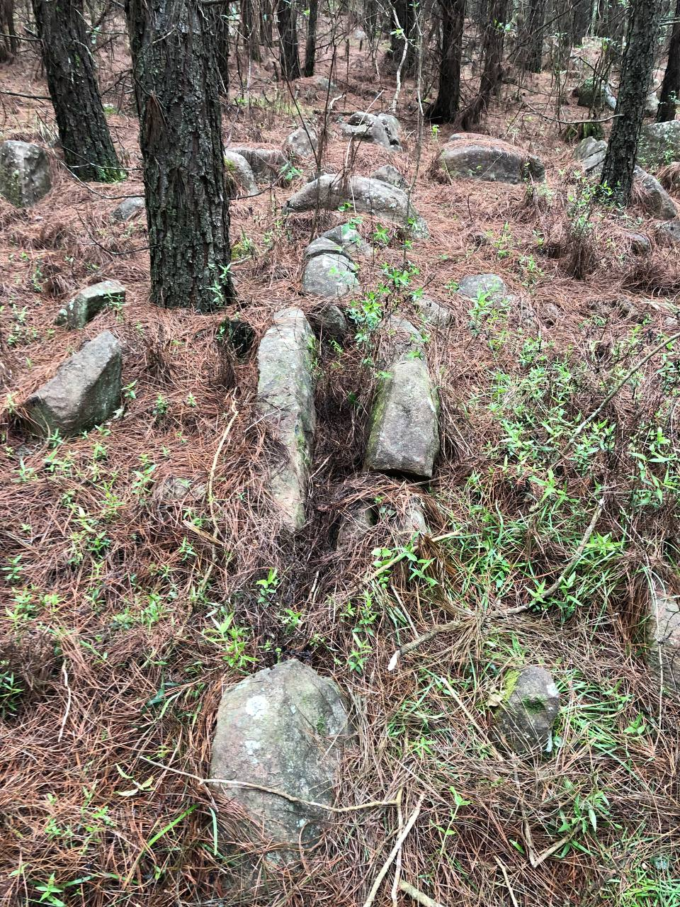

# Karkloof Standing Stones

## Standing Stones of Karkloof

"Someone else notices that the northern sides are pockmarked while the southern sides are smooth."

Would be good to know which side of the mountain these are on, to know which direction would be shielded somewhat from the wind.

## Karkloof Stones

Planning is underway for a documented visit to two sites of interest in the Karkloof area (both near 31°E). The stones exhibit significant weathering on the northern sides, suggesting that they have not been moved for a very long time.
[1] https://sci-hub.ru/10.2307/3887638
[2] https://midlandsconservanciesforum.wordpress.com/2014/11/04/standing-stones-of-karkloof/

## Karkloof Pictures

Some interesting features in dolorite stone during our first Karkloof field trip today. The stones in pics 5 and 6 were a few of several lines aligned to geographic E-W. These areas have been heavily disturbed by decades of commercial forestry, but we chose this site for our first exploration based on the 1960’s paper linked above.

https://t.me/nobulartchat/26499

