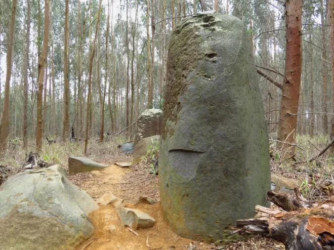
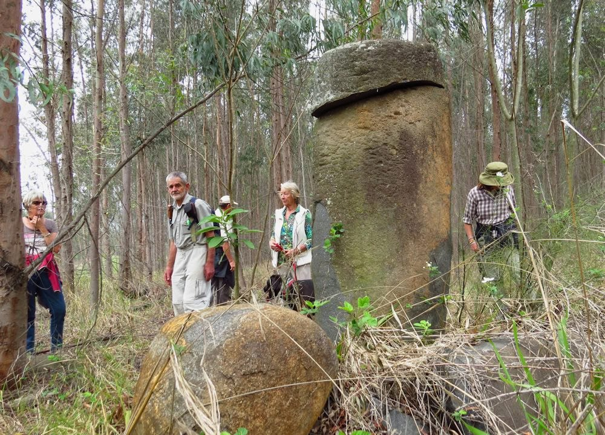

# Karkloof Standing Stones

## Standing Stones of Karkloof

"Someone else notices that the northern sides are pockmarked while the southern sides are smooth."

Would be good to know which side of the mountain these are on, to know which direction would be shielded somewhat from the wind.

## Karkloof Stones

Planning is underway for a documented visit to two sites of interest in the Karkloof area (both near 31°E). The stones exhibit significant weathering on the northern sides, suggesting that they have not been moved for a very long time.
[1] https://sci-hub.ru/10.2307/3887638
[2] https://midlandsconservanciesforum.wordpress.com/2014/11/04/standing-stones-of-karkloof/

