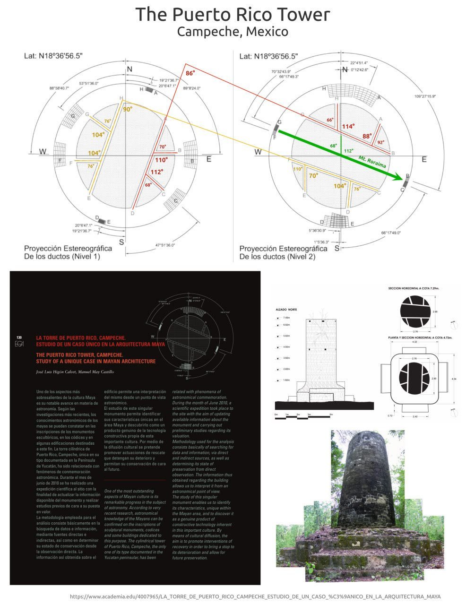

# Puerto Rico Tower

Hard copy here.

## Nobulart Analysis

The Puerto Rico Tower (Mayan: 600-900 AD) is located in the municipality of Xpujil (Campeche, Mexico) N18º36.941´ W89º22.599´at 272m. 12 horizontal ducts penetrate the solid stone construction on two levels. Precisely built. Purpose unknown.
[1] https://academia.edu/4007965/LA_TORRE_DE_PUERTO_RICO_CAMPECHE_ESTUDIO_DE_UN_CASO_%C3%9ANICO_EN_LA_ARQUITECTURA_MAYA

