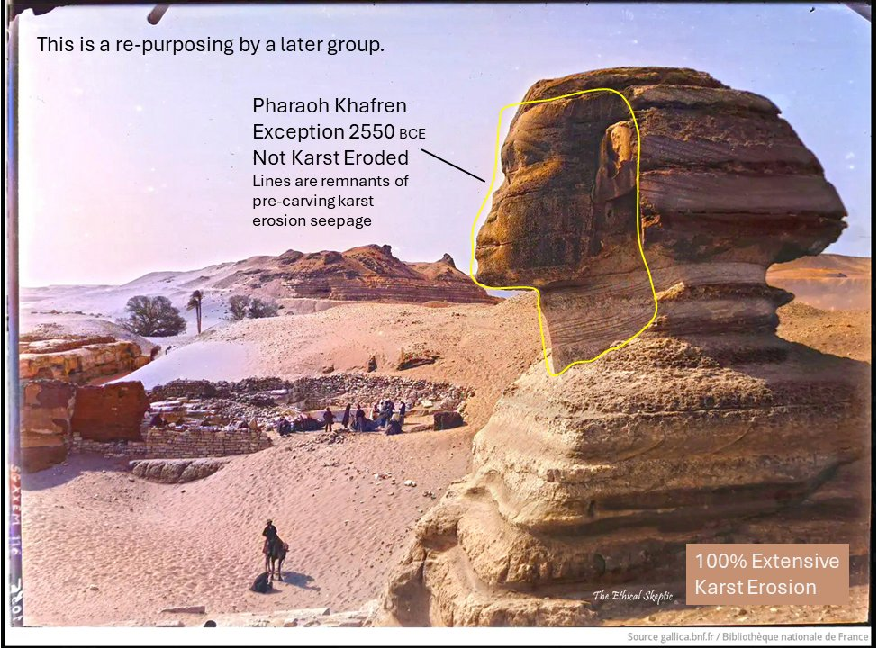

# Sphinx

## Sphinx Erosion

A focused investigation into the deep erosion on and around the sphinx. Presented by Charlton Heston. 1993
https://odysee.com/@TheAgeofAquariusPI4PSI2:1/The-Mystery-of-the-Sphinx-1993:a

Excerpt from Mystery of the Sphinx (1993) (in the folder)

[1] https://odysee.com/@TheAgeofAquariusPI4PSI2:1/The-Mystery-of-the-Sphinx-1993:a

## RT Lying is their most...

RT Lying is their most consistent prior art. History is not what you have been taught. https://t.co/QVN5zB2yjC

