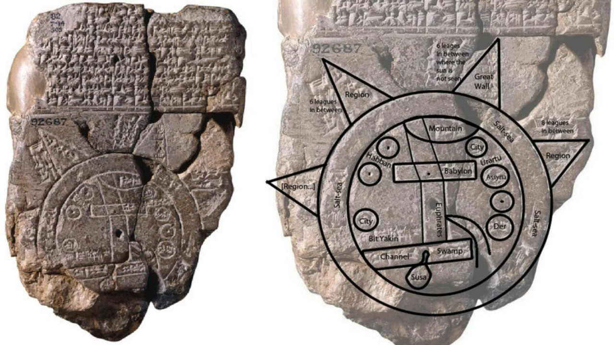
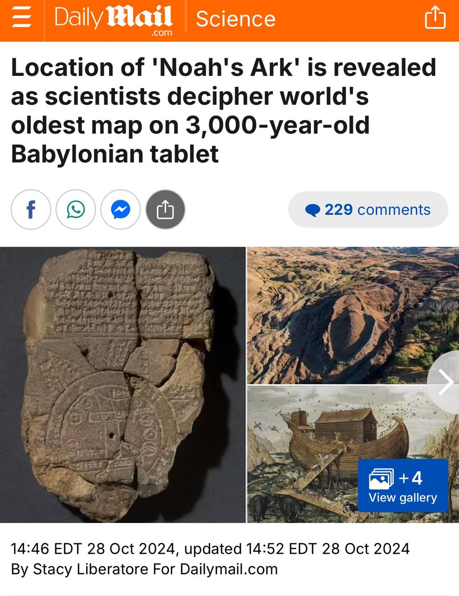

# Imago Mundi

A 2,700-year-old tablet is the oldest map of the world. 

[Comment: I question that. Unless it's just "Maps Of The Known World". Then maybe that statement is correct. ]

The "Imago Mundi" is the oldest map of the world — as it was known to the Babylonians around 700 BC.

It's carved into a small piece of clay, with annotations explaining it, and the creation myth of the world.

It reveals just how differently the ancients understood the world — but one detail is particularly strange.

It sheds light on a VERY ancient story… [Flood & Ark etc]

https://x.com/Culture_Crit/status/1850600512481325493?s=19

## Imago Mundi

https://ubique.americangeo.org/map-of-the-week/map-of-the-week-the-imago-mundi/#:~:text=A%20circular%20%E2%80%9Cbitter%20river%E2%80%9D%20or,that%20extend%20beyond%20the%20sea.

## Noah's Ark Location

Location of 'Noah's Ark' is revealed as scientists decipher world's oldest map on 3,000-year-old Babylonian tablet
😳😳😳

Read: https://www.dailymail.co.uk/sciencetech/article-14011293/Noahs-Ark-revealed-worlds-oldest-map-Babylonian-tablet.html?ns_mchannel=rss&ns_campaign=1490&ito=1490

https://t.me/LauraAbolichannel

