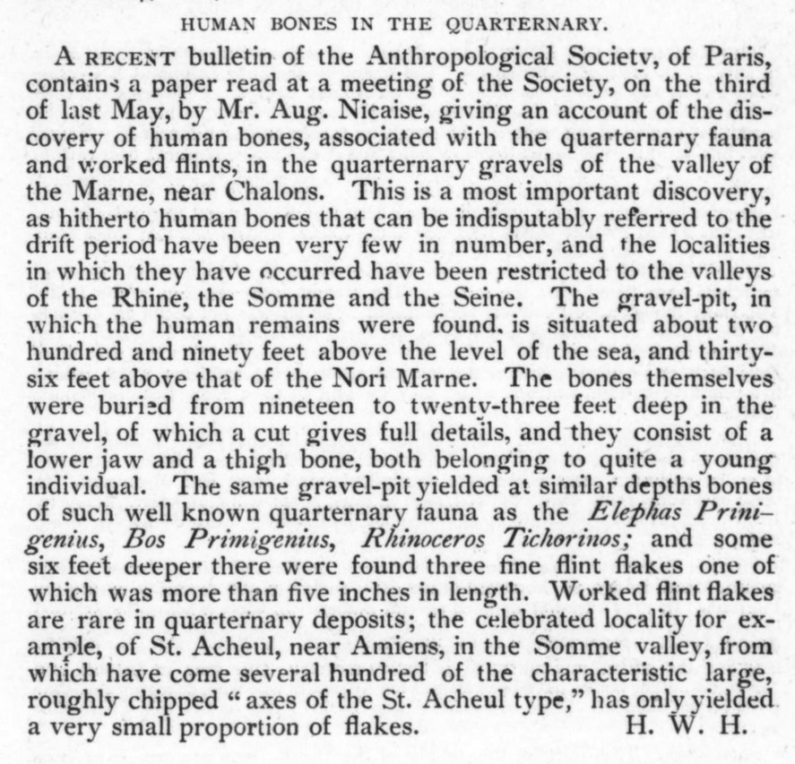
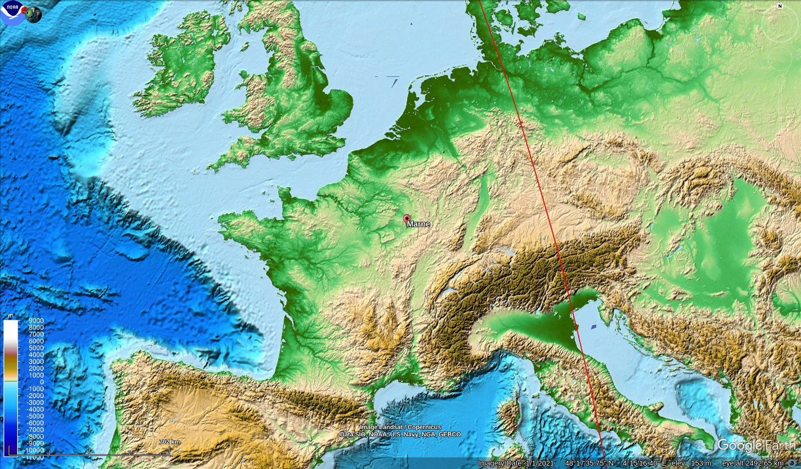
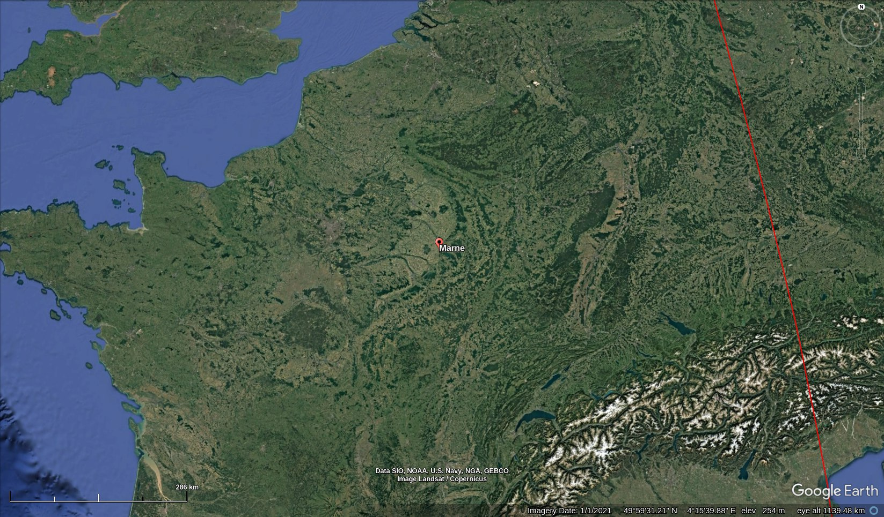
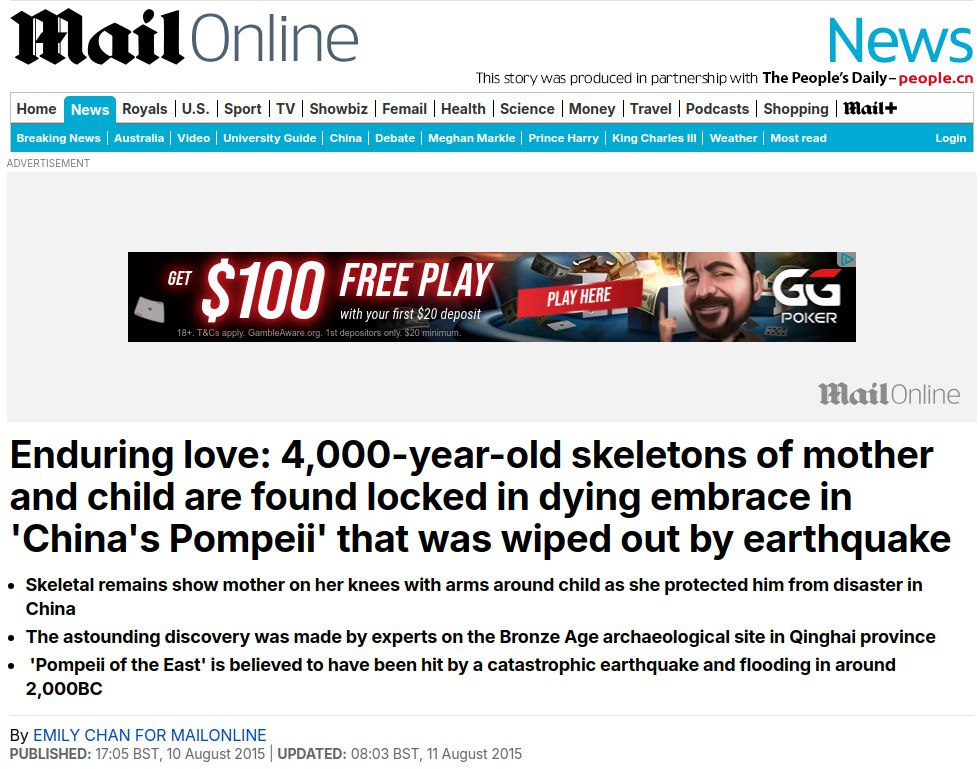
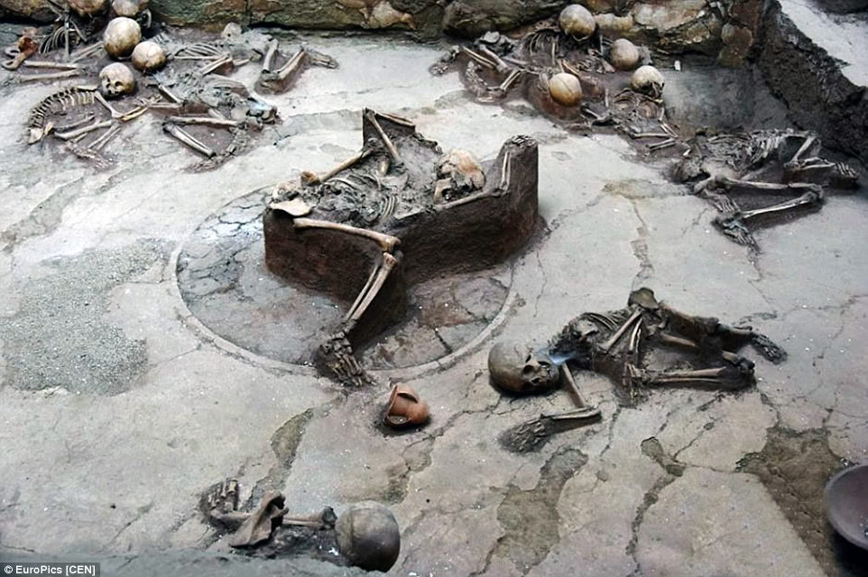
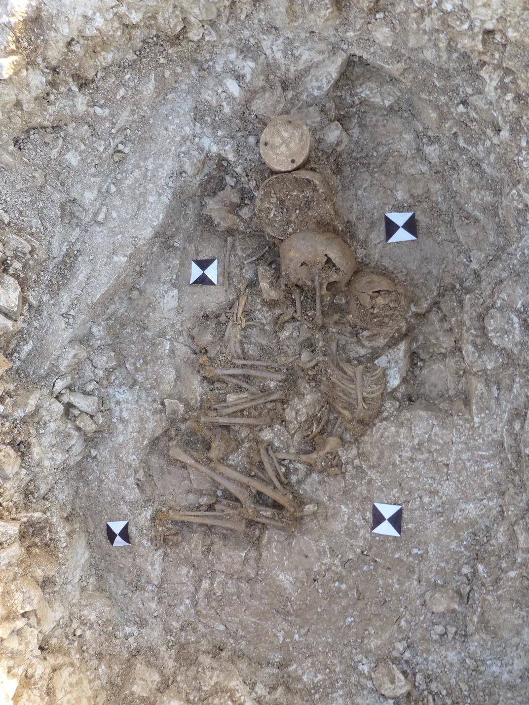

# Human Remains

## France Gravel Pit Remains with Animals

France. "The gravel-pit, in which the human remains were found. is situated about two hundred and ninety feet above the level of the sea, and thirty-six feet above that of the Nori Marne. The bones themselves were buried from nineteen to twenty-three feet deep in the gravel, of which a cut gives full details, and they consist of a lower jaw and a thigh bone, both belonging to quite a young individual. The same gravel-pit yielded at similar depths bones of such well known quarternary fauna as the Ziephas Prinigenius, Bos Primigenius, Rhinoceros Tichorinos; and some six feet deeper there were found three fine flint flakes one of which was more than five inches in length." - The American Antiquarian Vol 6:1 (1884)
[1] https://archive.org/details/sim_american-antiquarian-and-oriental-journal_1884-01_6_1/page/60/mode/2up

## Archaeologists Uncover Remains of Two Children and an Adult Believed to be 3,800 Years Old, Linked to Ancient 'Water Cult'

https://www.msn.com/en-gb/news/world/archaeologists-uncover-remains-of-two-children-and-an-adult-believed-to-be-3-800-years-old-linked-to-ancient-water-cult/ar-AA1pgMk4?ocid=winp2fptaskbarhoverent&cvid=fc15d0494a344b7487d8b92d0ab9bd22&ei=14

“A paper on this area states that “local shells, sea lion and shark bones, were found [in graves with the human (https://knewz.com/tag/human-history/) remains] along with domestic structures.”

## Asian bodies in the Mediterranean?

"Ancient Plaque Reveals Exotic Diets 3,700 Years Ago 

A study of ancient proteins in human plaque has revealed that oriental elements and cooking oils were a part of diets in the Mediterranean around 3,700 years ago, indicating the existence of long-distance trade involving exotic foods such as turmeric or bananas.

“Today’s Mediterranean cooking, including Valencian cooking, is characterized by having been created from cultural exchanges, and we now know it was also this way during the Bronze Age, after this study reveals that globalization affected Mediterranean cooking millennia ago,” said biomolecular archaeologist Domingo C. Salazar Garcia of the University of Valencia.

The study aimed to clarify whether the early globalization of commercial networks during the Bronze Era also affected eating habits. The researchers examined food remains in dental plaque and found evidence that the inhabitants of the Eastern Mediterranean coast already ate turmeric, bananas, and even soy during the Bronze Age and Iron Age."

https://www.dentistrytoday.com/ancient-plaque-reveals-exotic-diets-3-700-years-ago/

## Dublin Incinerated Remains

Round barrow excavation in Kilmahuddrick, Dublin. Human remains incinerated in place in their hidey hole. Dated to 3790±40 BP (in 2016) or roughly 1800 BC. Human remains are dated to much more recent dates though.

"A patch of oxidised clay and charcoal was present on its flat upper surface and there was a patch of oxidised or ?re-reddened clay on the natural clay of the adjacent inner edge of F3, indicating in situ burning. Immedi ately south of Fl 5 was a spread of charcoal and oxidised clay, F30, which overlay the basal silt Fl7 and measured 0.3m north/south by 0.24m east/west by 0.03-0.04m deep. Charcoal within F30 was identified as Fraxinus and returned a radiocarbon date of 3790140 BP (GrA 17925,2398-2047 cal.BC at 2 sigma)"
 
https://sci-hub.ru/10.2307/20650841

## China 4000 year old

https://www.dailymail.co.uk/news/peoplesdaily/article-3192196/Enduring-love-4-000-year-old-skeletons-mother-child-locked-dying-embrace-Pompeii-East.html

## Otzi [1]

"Ötzi, also called The Iceman, is the natural mummy of a man who lived between 3350 and 3105 BC. Ötzi's remains were discovered on 19 September 1991, in the Ötztal Alps (hence the nickname "Ötzi", German: [œtsi]) at the Austria–Italy border. He is Europe's oldest known natural human mummy, offering an unprecedented view of Chalcolithic (Copper Age) Europeans."

"Ötzi was found on 19 September 1991 by two German tourists, at an elevation of 3,210 m (10,530 ft) on the east ridge of the Fineilspitze in the Ötztal Alps on the Austrian–Italian border, near Similaun mountain and the Tisenjoch pass."

"The next day, a mountain gendarme and the keeper of the nearby Similaunhütte first attempted to remove the body, which was frozen in ice below the torso, using a pneumatic drill and ice axes, but bad weather forced them to give up."

"Analysis of the contents revealed the partly digested remains of ibex meat, confirmed by DNA analysis, suggesting he had had a meal less than two hours before his death. Wheat grains were also found.[16] It is believed that Ötzi most likely had a few slices of a dried, fatty meat, which came from a wild goat in South Tyrol, Italy.[17] Analysis of Ötzi's intestinal contents showed two meals (the last one consumed about eight hours before his death), one of chamois meat, the other of red deer and herb bread; both were eaten with roots and fruits."

"Ötzi's lungs were examined endoscopically and were found to be blackened by soot, probably due to his frequent proximity to open fires for warmth and cooking."

"In May 2012, scientists announced the discovery that Ötzi still had intact blood cells. These are the oldest complete human blood cells ever identified. In most bodies this old, the blood cells are either shrunken or mere remnants, but Ötzi's have the same dimensions as living red blood cells and resemble a modern-day sample."

"Ötzi's stomach was completely full and its contents were mostly undigested."

## Burton Agnes Barrow Remains/Drums

"“It was found … in the center of what we call a round barrow. And in that center was a square pit, in which we found three skeletons of quite young children. The eldest was about 12 and was holding on to the two smaller children, [aged] about 3 and 5.”"

But carbon dating of bones found in the Burton Agnes grave indicates that the style of sculpture is even older, dating to between 3005 and 2890 B.C.E., during the first phase of Stonehenge’s construction.

https://www.smithsonianmag.com/smart-news/an-ornate-5000-year-old-stone-drum-is-the-uks-most-significant-prehistoric-art-find-in-a-century-180979604/

## Caves and Bunkers

Caves=nature's bunker

## Citations

1. https://en.m.wikipedia.org/wiki/%C3%96tzi