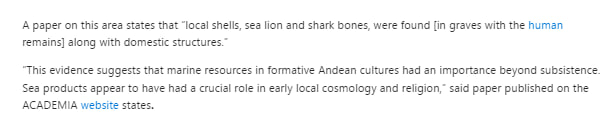
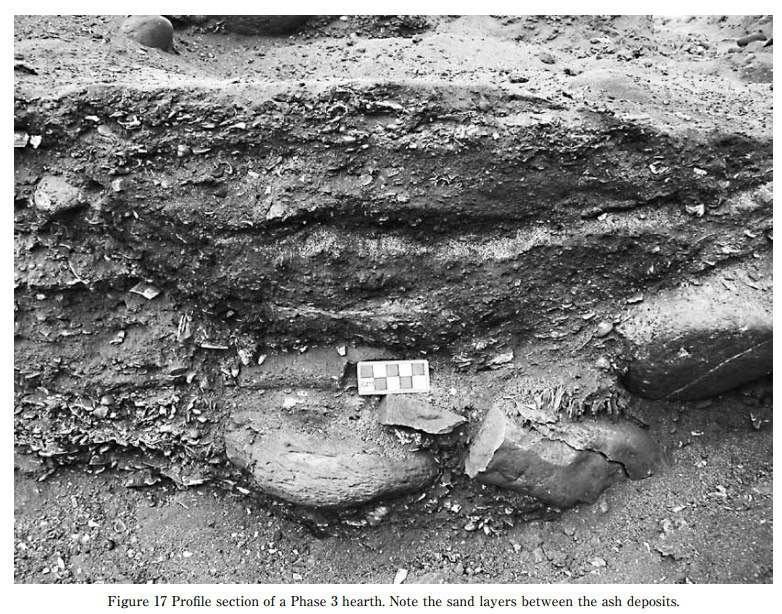
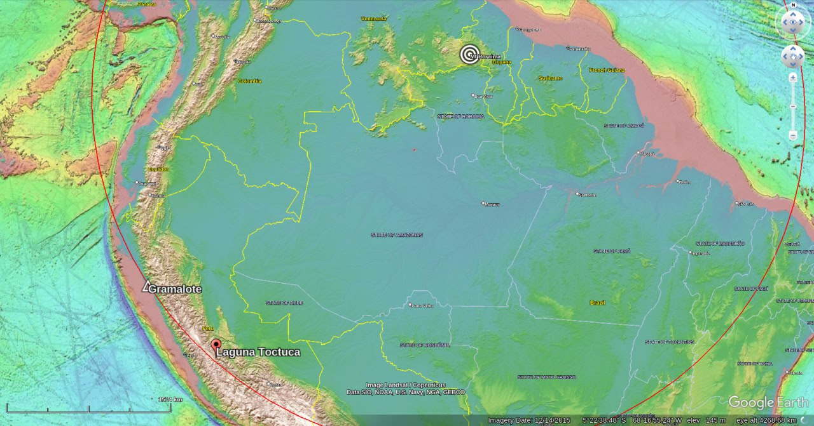

# Human Remains

## Peru

Archaeologists Uncover Remains of Two Children and an Adult Believed to be 3,800 Years Old, Linked to Ancient 'Water Cult'

https://www.msn.com/en-gb/news/world/archaeologists-uncover-remains-of-two-children-and-an-adult-believed-to-be-3-800-years-old-linked-to-ancient-water-cult/ar-AA1pgMk4?ocid=winp2fptaskbarhoverent&cvid=fc15d0494a344b7487d8b92d0ab9bd22&ei=14

“A paper on this area states that “local shells, sea lion and shark bones, were found [in graves with the human (https://knewz.com/tag/human-history/) remains] along with domestic structures.”
- Hard copy of paper in `research-papers/`

Seven sedimentary "floors". That looks a lot like alluvial deposit to me.

Ash-sand-ash-sand... more than once.

Gramalote ECDO context.

## Asian bodies in the Mediterranean?

"Ancient Plaque Reveals Exotic Diets 3,700 Years Ago 

A study of ancient proteins in human plaque has revealed that oriental elements and cooking oils were a part of diets in the Mediterranean around 3,700 years ago, indicating the existence of long-distance trade involving exotic foods such as turmeric or bananas.

“Today’s Mediterranean cooking, including Valencian cooking, is characterized by having been created from cultural exchanges, and we now know it was also this way during the Bronze Age, after this study reveals that globalization affected Mediterranean cooking millennia ago,” said biomolecular archaeologist Domingo C. Salazar Garcia of the University of Valencia.

The study aimed to clarify whether the early globalization of commercial networks during the Bronze Era also affected eating habits. The researchers examined food remains in dental plaque and found evidence that the inhabitants of the Eastern Mediterranean coast already ate turmeric, bananas, and even soy during the Bronze Age and Iron Age."

https://www.dentistrytoday.com/ancient-plaque-reveals-exotic-diets-3-700-years-ago/

## Dublin Incinerated Remains

Round barrow excavation in Kilmahuddrick, Dublin. Human remains incinerated in place in their hidey hole. Dated to 3790±40 BP (in 2016) or roughly 1750 BC. Human remains are dated to much more recent dates though.

"A patch of oxidised clay and charcoal was present on its flat upper surface and there was a patch of oxidised or ?re-reddened clay on the natural clay of the adjacent inner edge of F3, indicating in situ burning. Immedi ately south of Fl 5 was a spread of charcoal and oxidised clay, F30, which overlay the basal silt Fl7 and measured 0.3m north/south by 0.24m east/west by 0.03-0.04m deep. Charcoal within F30 was identified as Fraxinus and returned a radiocarbon date of 3790140 BP (GrA 17925,2398-2047 cal.BC at 2 sigma)"
 
https://sci-hub.ru/10.2307/20650841

## Citations

1. https://www.smithsonianmag.com/smart-news/an-ornate-5000-year-old-stone-drum-is-the-uks-most-significant-prehistoric-art-find-in-a-century-180979604/
2. [Craig Stone](https://nobulart.com)