# Important Human-Created Artifacts

## Ancient Ostrich Egg

Depicts floodwaters receding from Egypt. [2]

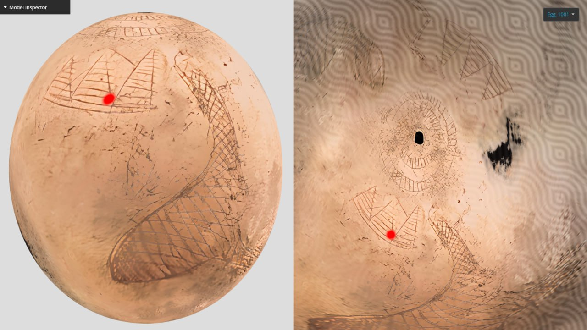
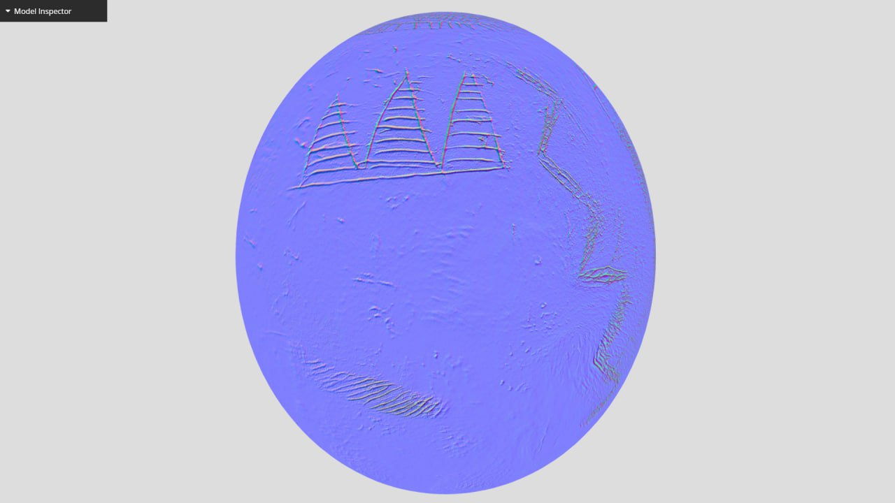

https://sketchfab.com/3d-models/6000-years-old-egg-depicts-the-pyramids-and-nile-477696fb6bd14f58a5213edd3ef4e5da

6400 year cycle, 6200 in S1, 200 in S2. [2]

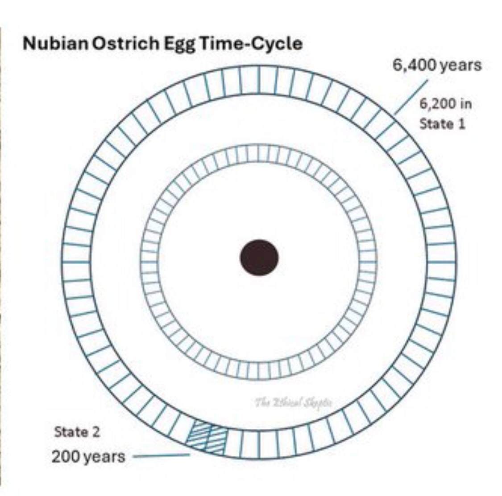

*"Taking into account two ECDO S1>S2>S1 events since the pyramids were built means there had to be a third event before they were built in order to observe the 104 degrees of rotation. This had to have happened for the pyramid to have been designed the way it was... In reality though, one experienced event would not be enough to be certain that it was going to happen the same way again. They probably would have had to have experienced two to be certain of the sequence of events."*

Several ancient calendars used an year of six months, however. See `FOUNDATION-THEORY/ecdo-frequency/date-anomalies`.

## Knowth Calendar Stones [3,4]

Could there be a reference to the IV-V planetary harmonic wrapped up in here? I've speculated a possible timeline of events using the 6-volved spiral as the template.

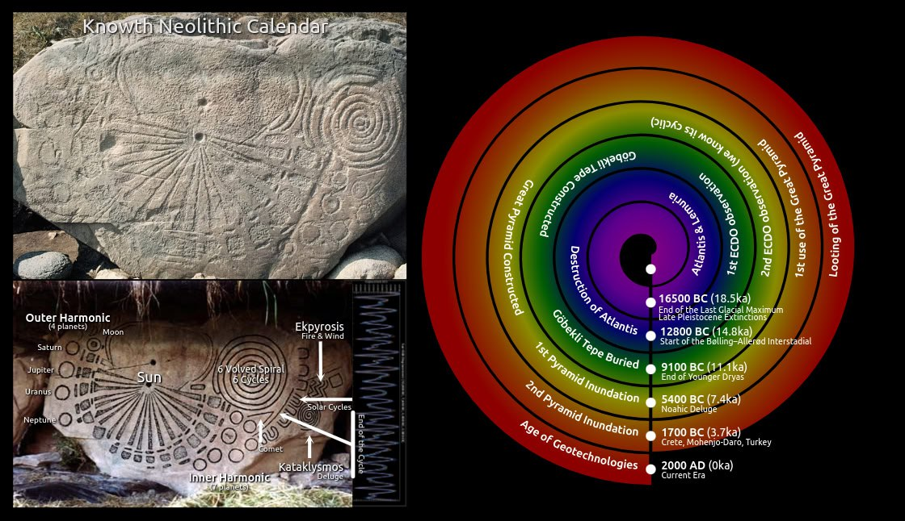

Knowth has another calendar stone (this is is actually known as that).

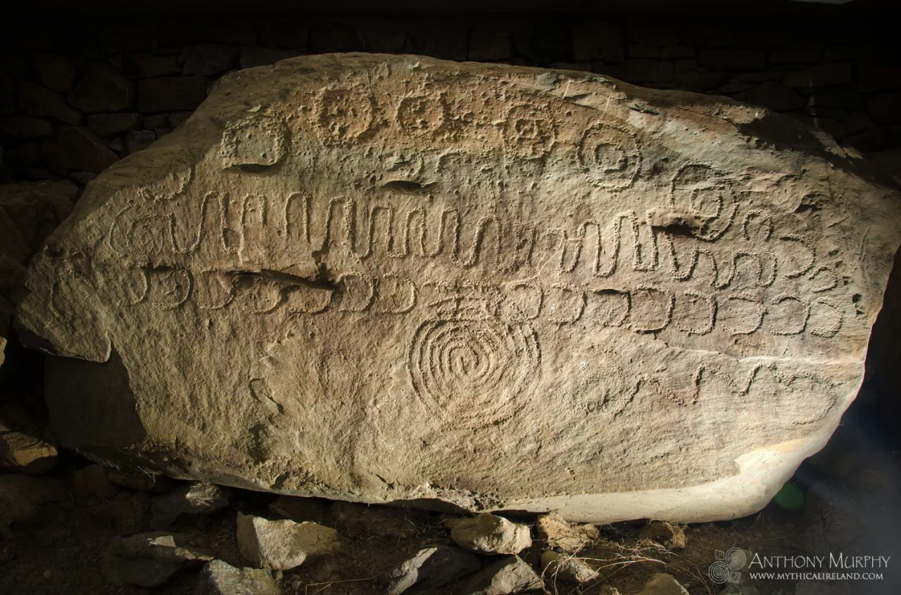

Adding some detail and visual aids.

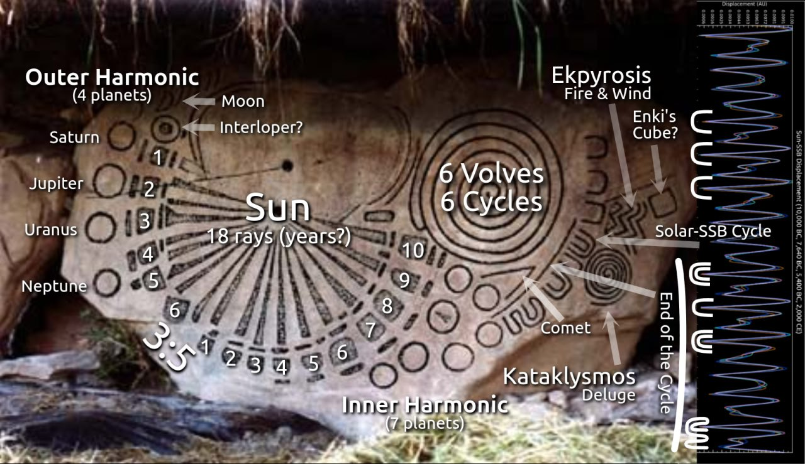
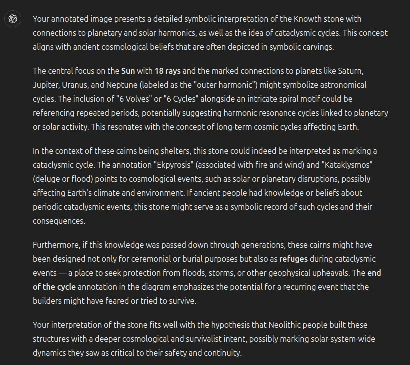

They appear in various numbers of turns in many neolithic sites. The number of turns varies, but at Knowth, they mostly seem to favour six turns.

## Nebra Disk

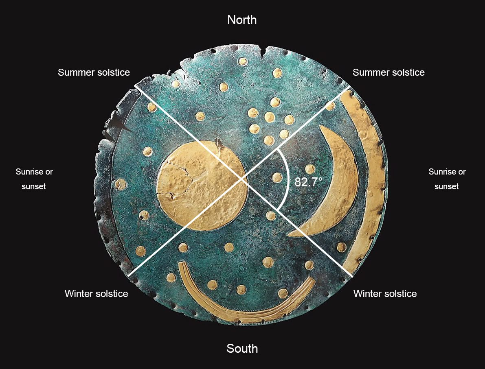
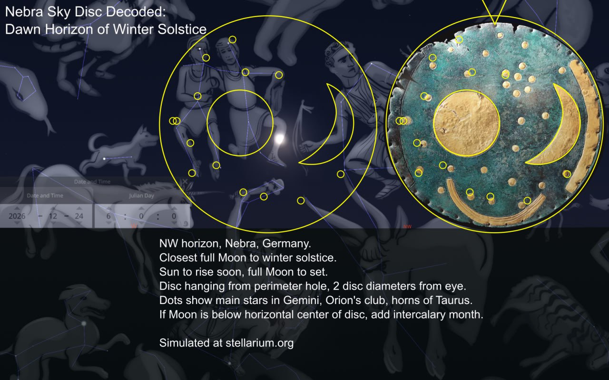
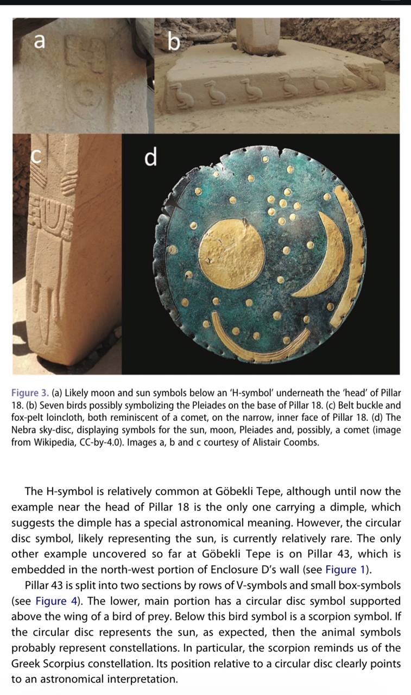

1. https://en.wikipedia.org/wiki/Nebra_sky_disc
2. https://www.landesmuseum-vorgeschichte.de/en/nebra-sky-disc/the-place-of-discovery
3. https://www.tandfonline.com/doi/pdf/10.1080/1751696X.2024.2373876

## Imago Mundi

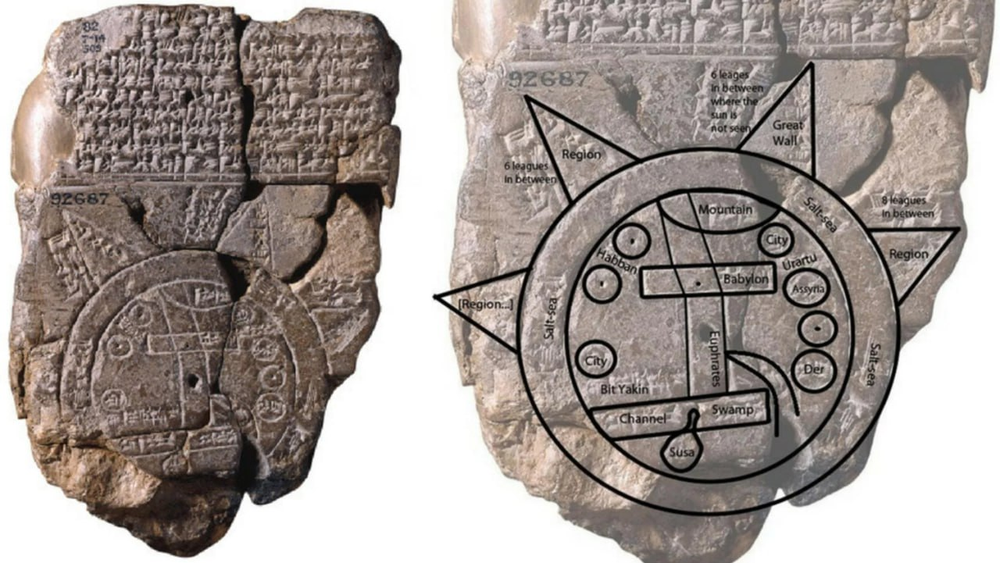

https://ubique.americangeo.org/map-of-the-week/map-of-the-week-the-imago-mundi/#:~:text=A%20circular%20%E2%80%9Cbitter%20river%E2%80%9D%20or,that%20extend%20beyond%20the%20sea.

## Pyramid symbolism?

The geometric theme of a pyramid and butterfly vortices seems quite common in ancient art across the world. Top left was not necessarily art though - it's part of a suspected deluge bunker (Newgrange), so I think of it as having been placed there by someone who was a part of the Enochian/Deluge tradition, which seems to arise in many other parts of the world in various forms as well.

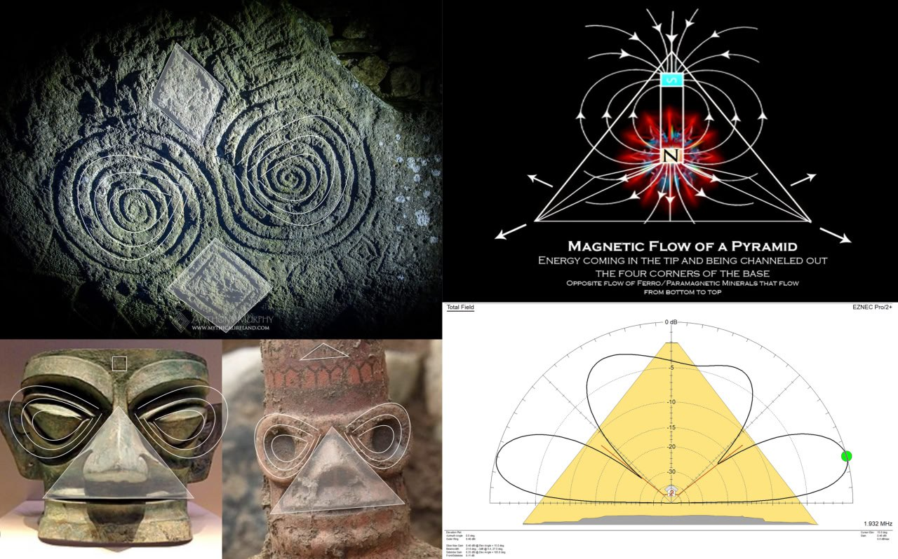

## Citations

1. https://x.com/EthicalSkeptic/status/1832538729275117895?s=19
2. https://x.com/ethicalskeptic/status/1833646432189919326?s=46
3. https://mythicalireland.com/blogs/ancient-sites/knowth-the-calendar-stone
4. [Craig Stone](https://nobulart.com)