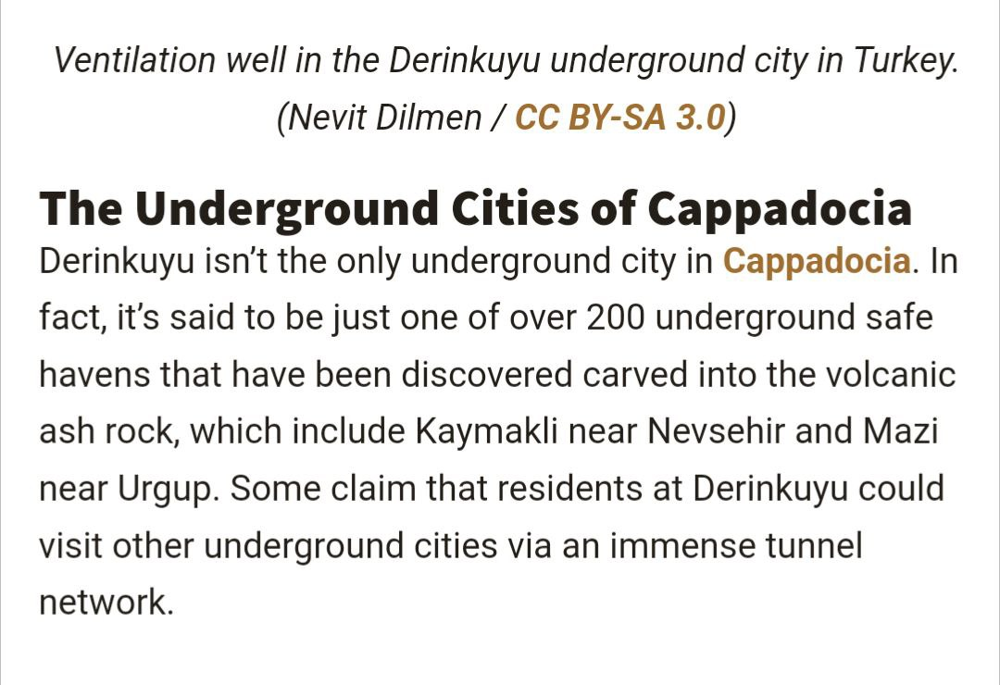
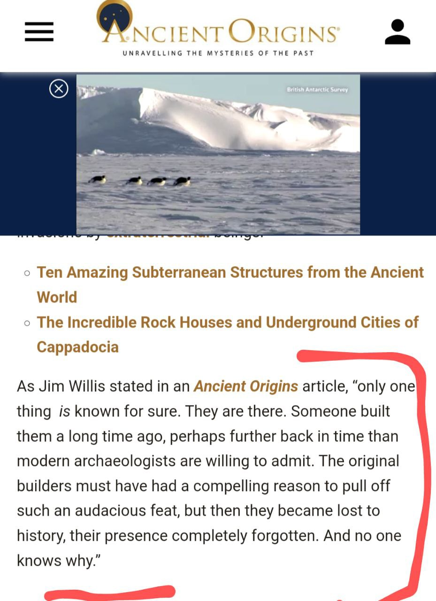

# Human Built ECDO-related Structures

This folder is for important structures humans have built that are potentially related to ECDO events.

Khafre/Khufu Pyramids, structures that are central to the ECDO thesis, are in `khafre-khufu`.

## All the pyramids in the world

Map of all the pyramids in the world: https://www.google.com/maps/d/viewer?mid=1a7ESLhx-k-r0zTW22XiENshhHwf-QXM

## Derinkuyu underground city

https://www.ancient-origins.net/ancient-places-asia/derinkuyu-0073

## Underground cities: Kaymakli, Ozkonak

https://cappadociatravelpass.com/a-cappadocian-mystery-kaymakli-underground-city

## Babylon

*"The walls of the mighty Babylon and the eight-volved Tower of Babel or cloud-encompassed Bel were never constructed to resist any mortal foe. NO. Those city walls, which were 60 miles in circumference, 200 feet high, 578 feet thick, were not made to defy the strength of armies, but to resist the fearful forces of Nature, the floods that swept the plains of Shinar, from the mountains of Armenia, every spring during this Age of Horror. The tremendous embankments and river walls constructed by the Ancients are monuments of human skill and enterprise belonging to an epoch that antedates by thousands of years the Age of their supposed builders."* - Thomas H. Burgoyne, The Light of Egypt - Vol. I (1889)

*"This accounts for and fully explains the existence of fossil remains of the seal, walrus and polar bear in the burning plains of Africa and Hindustan, and of the tropical remains now being discovered in the Arctic regions."*

This would very likely have been expunged from recent records. His source would predate 1889.

https://nobulart.com/the-hermetic-key/

## Arwad

Arwad, an island off the coast of Syria, has been continuously inhabited for about 5,000 years. "Along the entire eastern coast of the Mediterranean, there is only one inhabited island: Arwad. Not much more than a dot of rock off the coast of Tartus, Syria, it once dominated a goodly stretch of that coast, ruling the mainland like an offshore castle. War galleys of Arwad fought on the side of the Egyptians, the Assyrians and even the Persians when the tide turned for Greece in the early fifth century bce. More than a millennium and a half later, the island became the last bastion in the entire Levant for the crusading Knights Templar before their final, dramatic expulsion. Though Arwad today is a quieter place, the remains of its massive stone fortifications have many a tale to tell.

Near the center of the island protrudes the Citadel of Arwad, a rectangular fortress raised sometime in the 13th century but now largely Ottoman, though it retains Mamluk and Crusader features. Two thousand years before its first stones were laid, on this site stood the palace of the Phoenician kings.

The island was once insulated also by a massive outer city wall made of gargantuan stone blocks. As historian Lawrence Conrad describes it, in Byzantine times “the great walls surrounding the island on all but the harbor side were at least 10 meters high in places and were built of tremendous blocks up to six meters long and two meters high.” The walls, according to Conrad, dated at least to the Seleucid era that followed Alexander the Great, and probably even to the Phoenician era before.

Much of this protective structure was razed after the Arab takeover in 650 ce; other parts of the walls were brought down after the Mamluk expulsion of the crusading Knights Templar in the autumn of 1302. Only a few segments of the great wall survive, and they tower dramatically near the water’s edge, relics of a seemingly impossible feat of engineering."

[1] https://aramcoworld.com/Articles/January-2016/Arwad-Fortress-at-Sea

## 3 Oldest Castle Fortifications

### Citadel of Aleppo

3,000 YBP. 400m asl. 40m [typo corrected] elevation above the surrounding ground.

https://en.wikipedia.org/wiki/Citadel_of_Aleppo

### Masada, Israel

Masada. Israel. 1st cenutry BCE. Its boaty.

https://en.wikipedia.org/wiki/Masada

### Citadel of Arwad, Syria

Citadel of Arwad, Syria. 3rd millennium BC. An historic Templar stronghold.

https://en.wikipedia.org/wiki/Arwad

## Island of Arwad Megawall

They built a 10m high wall around the entire island. I’m guessing it wasn’t to keep the crabs off the beaches. 

https://x.com/andtartary2/status/1834082117552406642?s=46

## Great Circle Artifacts

Angkor Wat and Nazca lie on the great circle centred at Stonehenge (red trace). Another great circle connects Easter Island, Machu Picchu, Giza and Mohenjo-daro (blue trace). Intersections at Peru and Cambodia may account for the high density of megaliths, geoglyphs and curious artefacts found there. The planes defined by these great circles intersect along an axis approximately connecting Angkor Wat to Nazca/Paracas, inclined to one another at sin −1 (0.9) the gradian/degree ratio being 9/10.

https://www.youtube.com/watch?v=PiQL5yVpWig

## Khara Hora Underground Cave

https://m.youtube.com/watch?v=akmKO2pgdTY&t=2s

## Pyramid - Eight Parts

https://x.com/dgr8awakening/status/1834394949179097510?s=46

## Bosnian Pyramids Vedic Cycles

See PDF `Evidence of Vedic Cosmology...` in this folder.

## Dolmen of Menga, Spain

"Like many of its peers, the Dolmen of Menga is built into a hill. This burial site’s forecourt, which is equipped with a metal gate today, provides access to an ancient stone passageway that opens on an ovular burial chamber. Stone pillars punctuate the space, and supporting its stone ceiling. In full, the Dolmen of Menga measures 90 feet long, 20 feet wide, and 11 feet tall. It’s built from 32 massive rocks, weighing 441,000 pounds altogether."

"The Dolmen of Menga dates to 3,800–3,600 B.C.E., during the Copper Age. Little is known of its prehistoric builders today, except that they were adept engineers"

"Archaeologists studied the Dolmen of Menga for the first time in the 19th century. Upon cracking its chamber open, they found hundreds of skeletons."

"Last December, José Antonio Lozano Rodriguez, who spearheaded the 2013 study, published another report with an even larger group of Spanish academics. Together, they examined the Dolmen of Menga and found that it was built from sedimentary rocks quarried from an outcropping about half a mile away. Transporting such fragile materials so far would have taken serious know-how. What’s more, they also realized the dolmen’s outer stones are arranged in an interlocking fashion to channel water away, and prevent erosion."

More than one bunker on the site. Entrances are not consistent, other than being facing in S-E quadrant, as would be appropriate for inundation from the northwest. I'm looking for a description of how the "hundreds of skeletons" were found.

https://sci-hub.ru/10.1016/j.jas.2013.10.010

These markings are on the door at the Dolmen of Menga. One on the left reminds me of Knowth "magnets". A five pointed star is often symbolic of Venus.

https://www.nuevaacropolismalaga.org/archives/malaga/dolmenes_de_antequera.php

We've also seen these [Skara Brae] markings before. These are from the Spain.

The entrance to Mayes Howe is approximately 225° to the SW. Not ideal, but possibly a compromise to serve for both directions.

[1] https://sci-hub.ru/10.1017/s0003581500046837

This paper also contains a look as similar sites in Spain.

The Cuerva de Menga in Spain has its entrace pointing NE. Appropriate for water coming from the south. De Viera just to the south opens to the East.

El Romerol nearby opens to the south. As far as these in Spain go, I see no astronomical purpose nor pattern to them whatsoever.

## Men an Tol in Cornwall

# TODO Potential Leads

- Goseck circle in Germany
- Mnajdra Malta megalith temple complex

Curious on the difference between 1700 BC and 1300-1200 BC dating for some of these events.

- Temple at Dendera
	- https://x.com/DGr8Awakening/status/1824267280303194435

"Ancient Superhighways: 12,000-Year-Old Massive Underground Tunnels Stretch From Scotland To Turkey": https://ancient-archaeology.com/2024/05/ancient-superhighways-12000-year-old-massive-underground-tunnels-stretch-from-scotland-to-turkey/

Search for (ancient) underground cities

Vrtra Underground Pyramid, Alaska http://www.human-resonance.org/Vrtra_Underground_Pyramid.pdf

Bosnian Pyramids

chinese pyramids https://thebrainchamber.com/chinese-pyramids/

## djedefre

Unfinished Djedefre pyramid: https://m.youtube.com/watch?v=JEzZoNuRVJ0
- severe karst erosion (shown below):

