# Dolmen of Menga, Spain

"Like many of its peers, the Dolmen of Menga is built into a hill. This burial site’s forecourt, which is equipped with a metal gate today, provides access to an ancient stone passageway that opens on an ovular burial chamber. Stone pillars punctuate the space, and supporting its stone ceiling. In full, the Dolmen of Menga measures 90 feet long, 20 feet wide, and 11 feet tall. It’s built from 32 massive rocks, weighing 441,000 pounds altogether."

"The Dolmen of Menga dates to 3,800–3,600 B.C.E., during the Copper Age. Little is known of its prehistoric builders today, except that they were adept engineers"

"Archaeologists studied the Dolmen of Menga for the first time in the 19th century. Upon cracking its chamber open, they found hundreds of skeletons."

"Last December, José Antonio Lozano Rodriguez, who spearheaded the 2013 study, published another report with an even larger group of Spanish academics. Together, they examined the Dolmen of Menga and found that it was built from sedimentary rocks quarried from an outcropping about half a mile away. Transporting such fragile materials so far would have taken serious know-how. What’s more, they also realized the dolmen’s outer stones are arranged in an interlocking fashion to channel water away, and prevent erosion."

More than one bunker on the site. Entrances are not consistent, other than being facing in S-E quadrant, as would be appropriate for inundation from the northwest. I'm looking for a description of how the "hundreds of skeletons" were found.

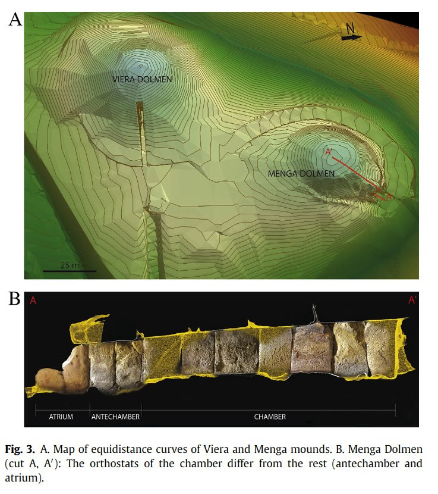
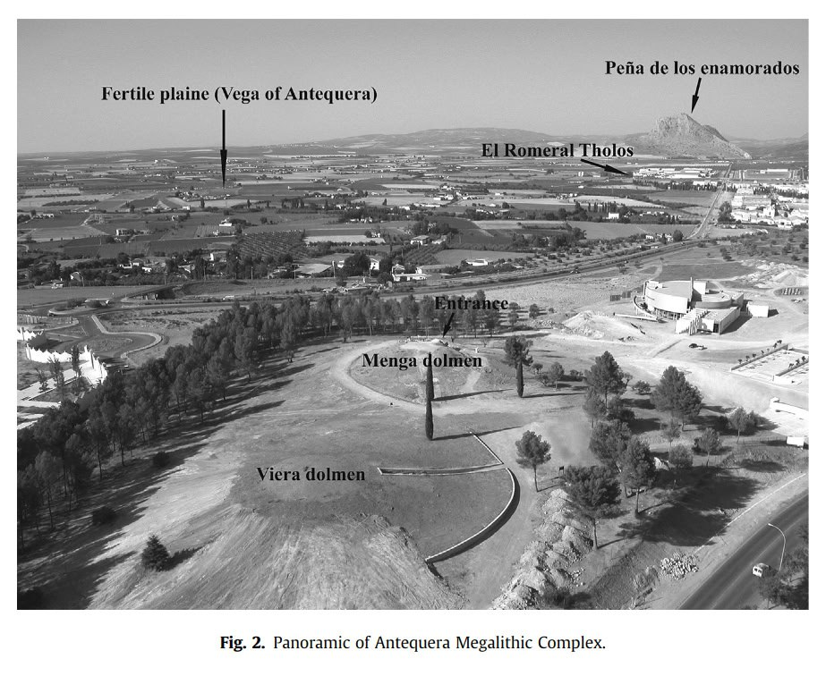
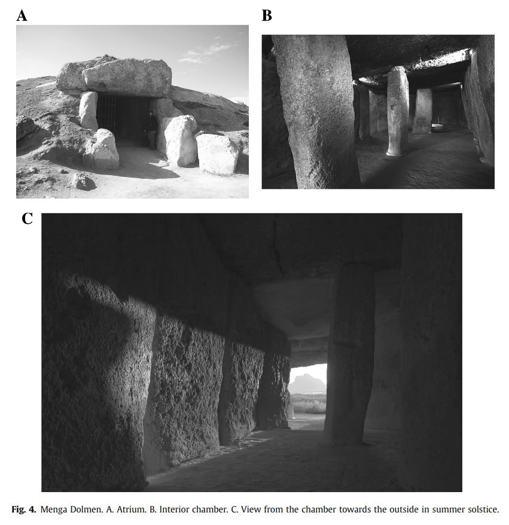
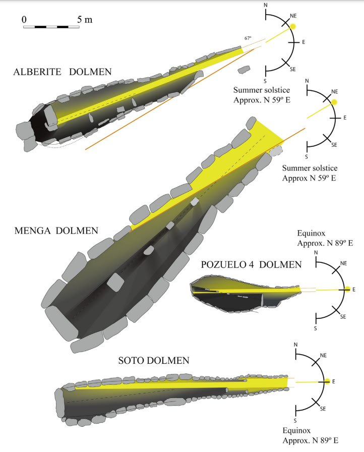

https://sci-hub.ru/10.1016/j.jas.2013.10.010

These markings are on the door at the Dolmen of Menga. One on the left reminds me of Knowth "magnets". A five pointed star is often symbolic of Venus.

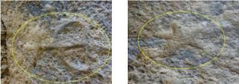

https://www.nuevaacropolismalaga.org/archives/malaga/dolmenes_de_antequera.php

We've also seen these [Skara Brae] markings before. These are from the Spain.

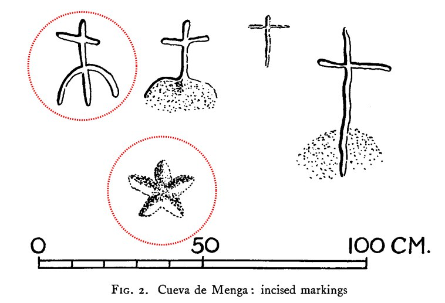
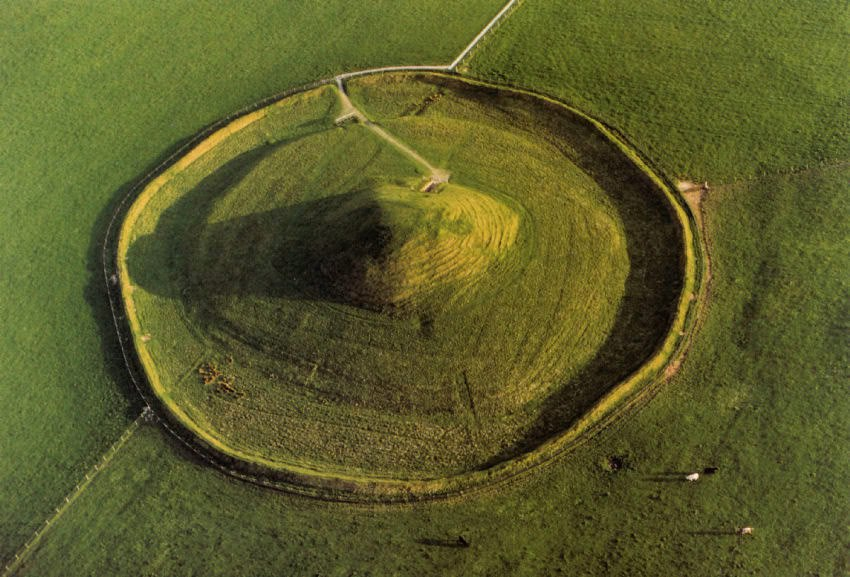

The entrance to Mayes Howe is approximately 225° to the SW. Not ideal, but possibly a compromise to serve for both directions.

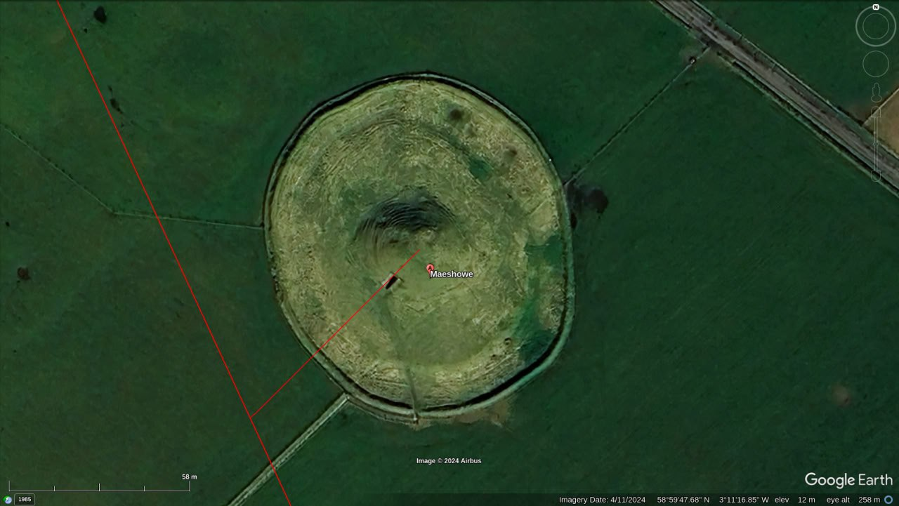

[1] https://sci-hub.ru/10.1017/s0003581500046837

This paper also contains a look as similar sites in Spain.

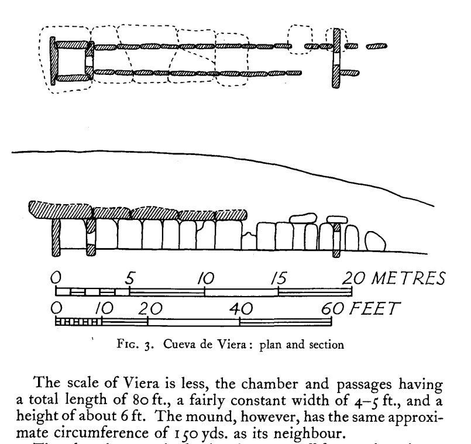
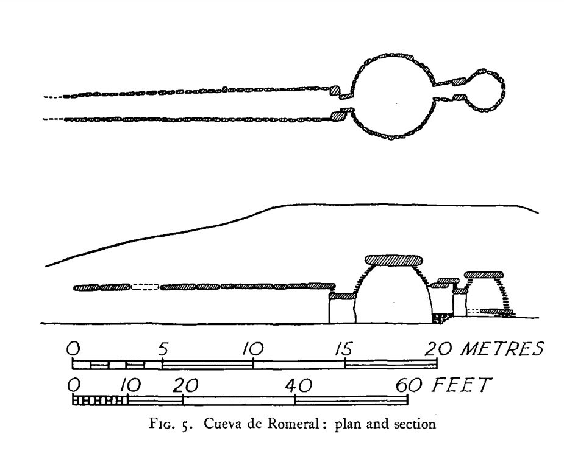
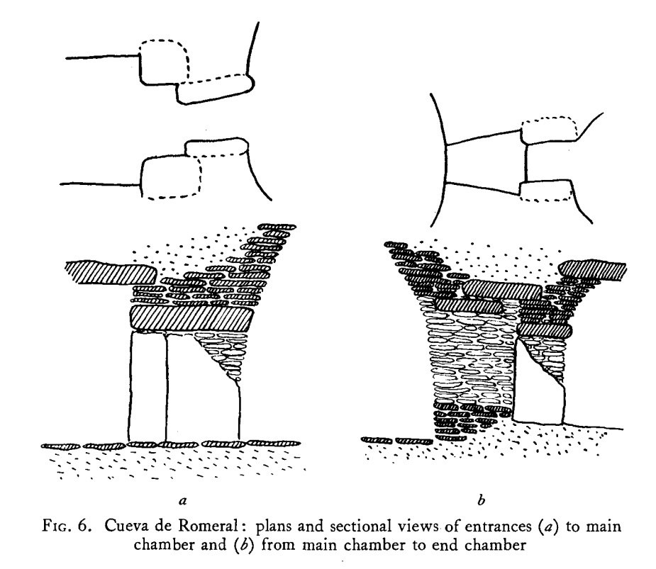

The Cuerva de Menga in Spain has its entrace pointing NE. Appropriate for water coming from the south. De Viera just to the south opens to the East.

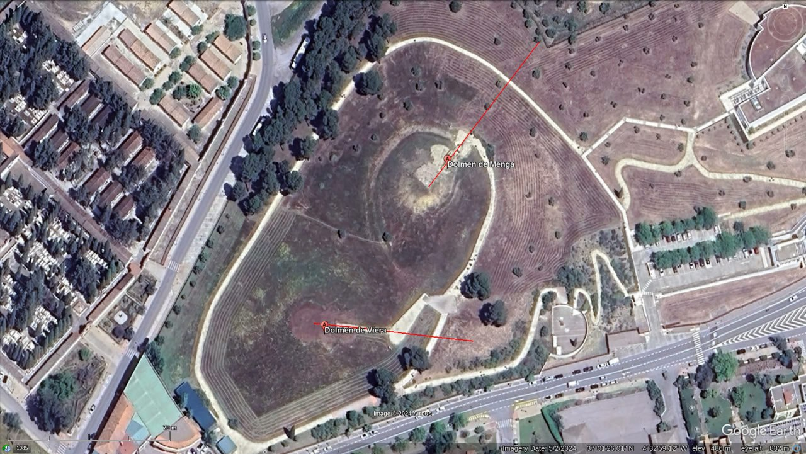

El Romerol nearby opens to the south. As far as these in Spain go, I see no astronomical purpose nor pattern to them whatsoever.

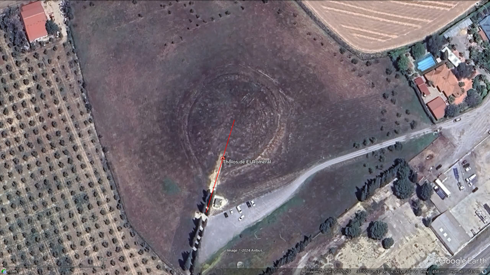