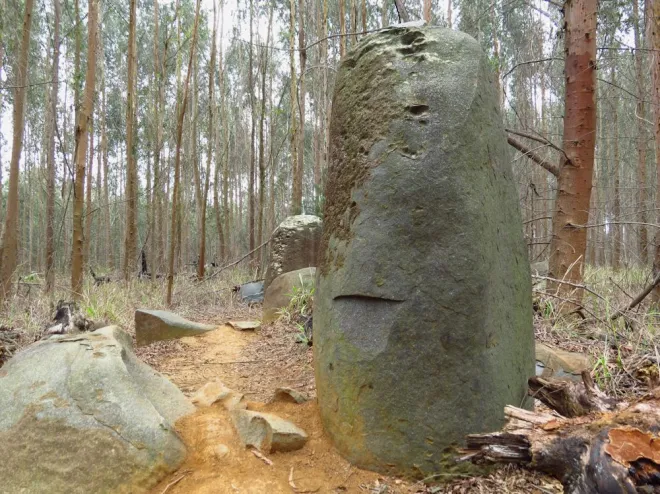

# Karkloof Standing Stones

## Standing Stones of Karkloof

"Someone else notices that the northern sides are pockmarked while the southern sides are smooth."

Would be good to know which side of the mountain these are on, to know which direction would be shielded somewhat from the wind.